# League of Legends Optimizer

[](https://img.shields.io/badge/license-UPL-green) [](https://sonarcloud.io/dashboard?id=oracle-devrel_leagueoflegends-optimizer)


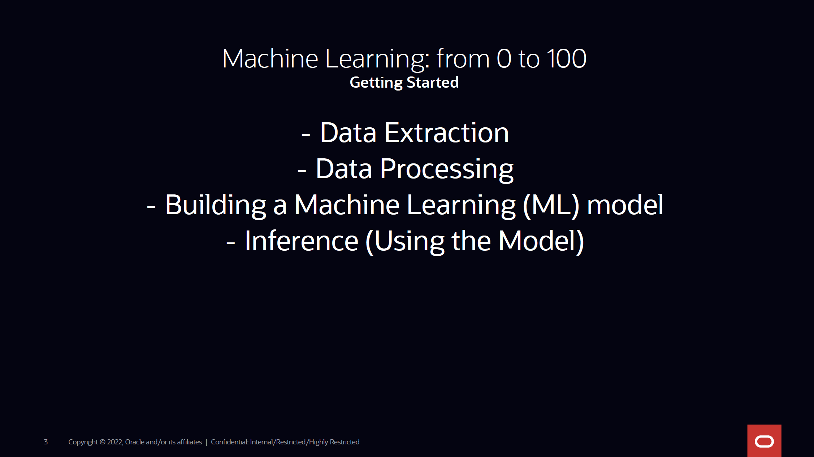
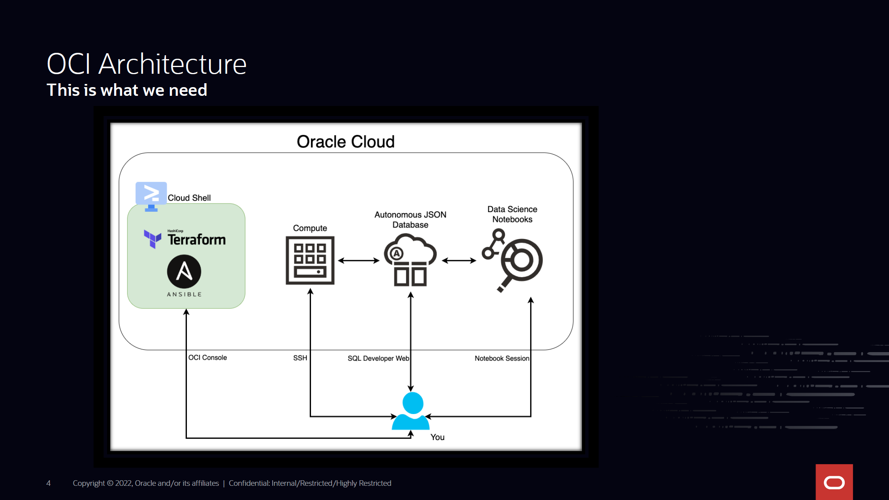
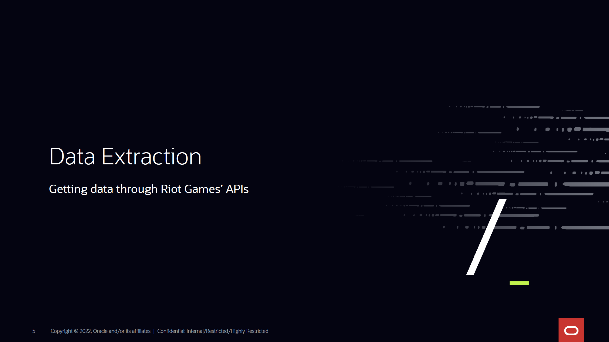
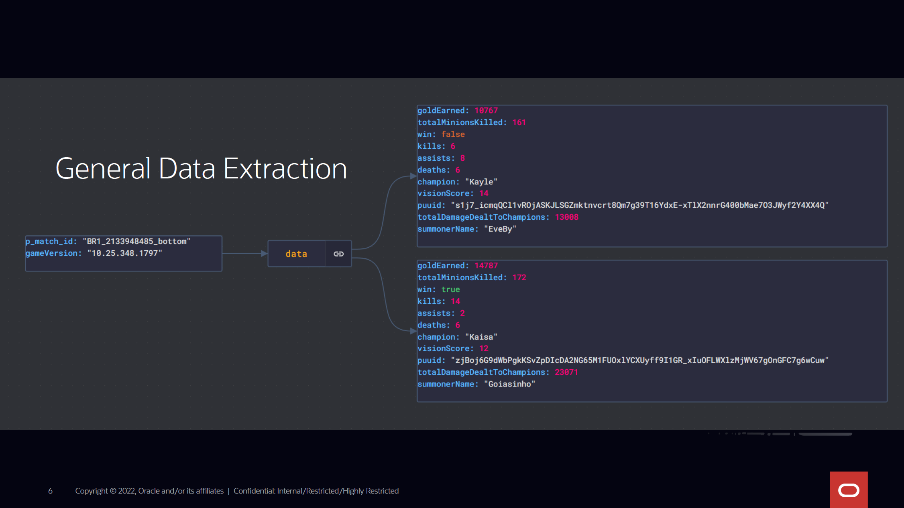
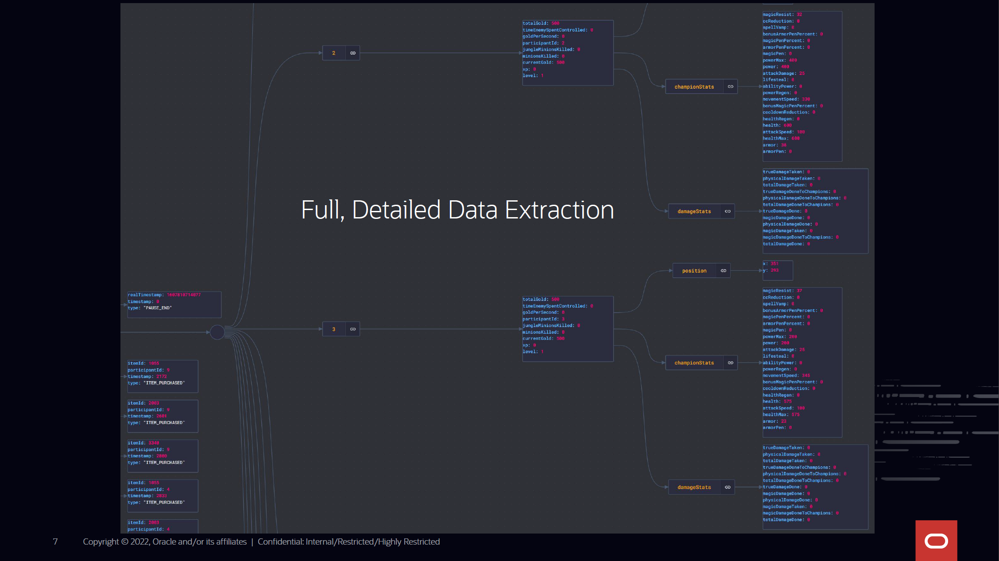
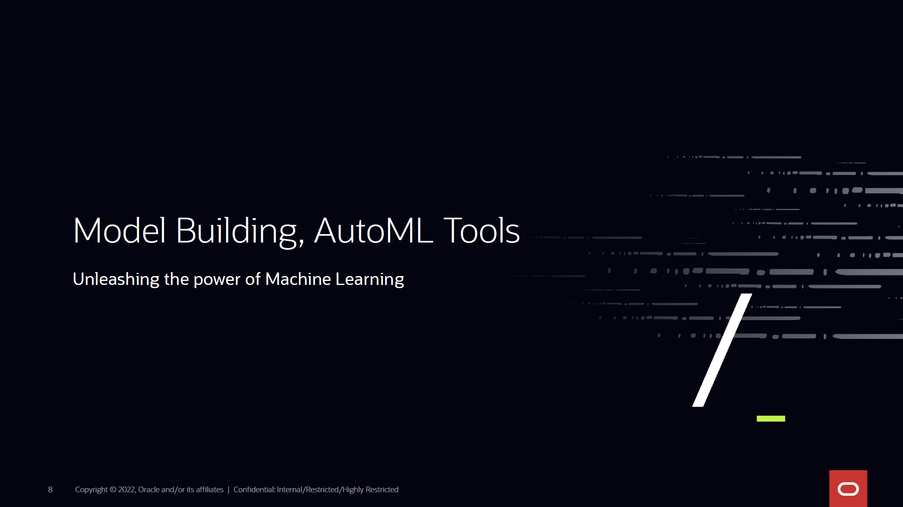
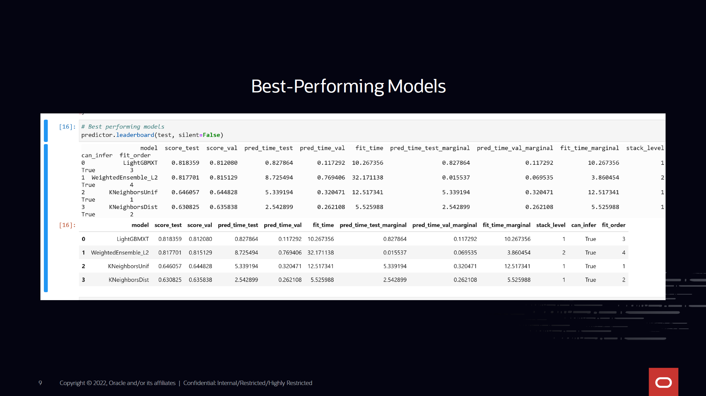
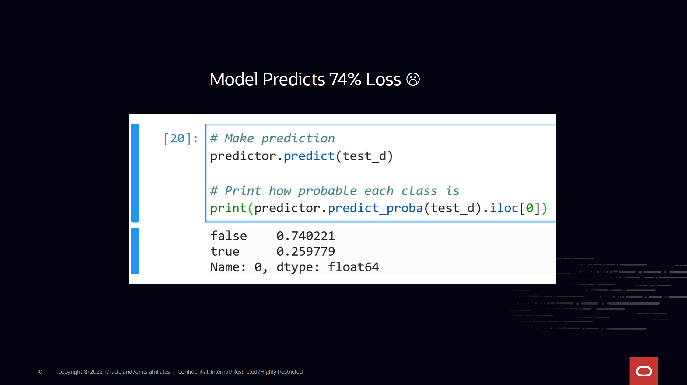
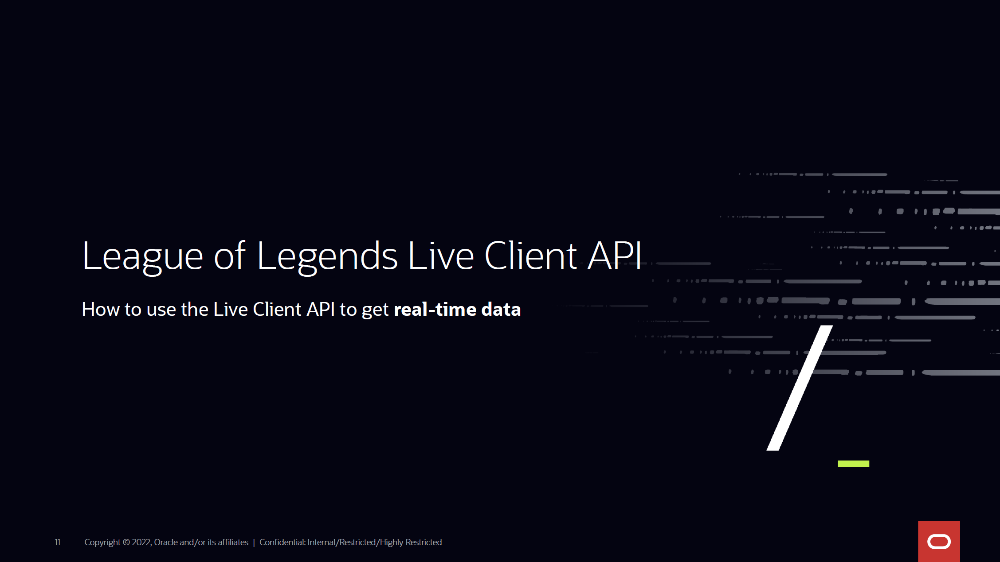
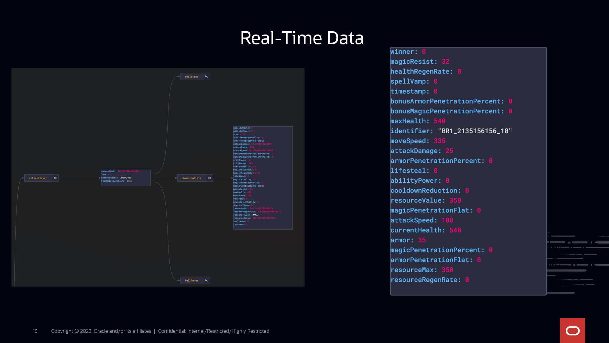

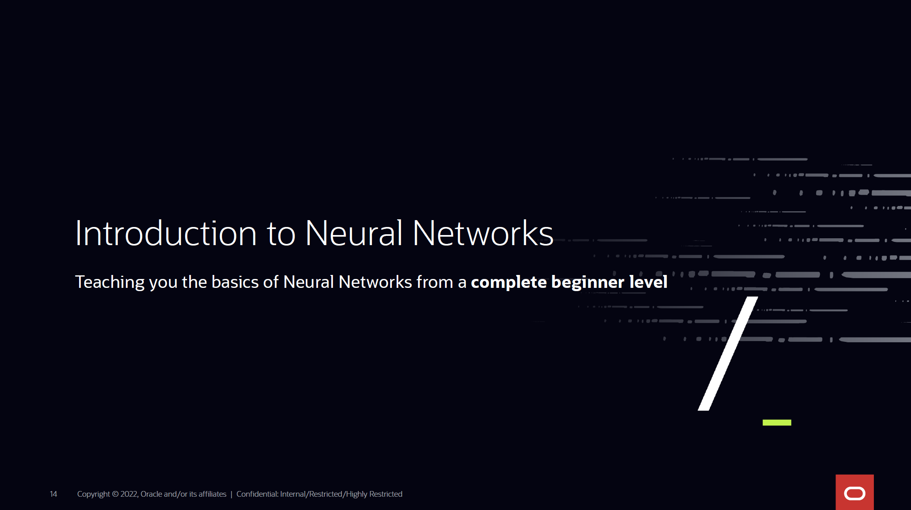
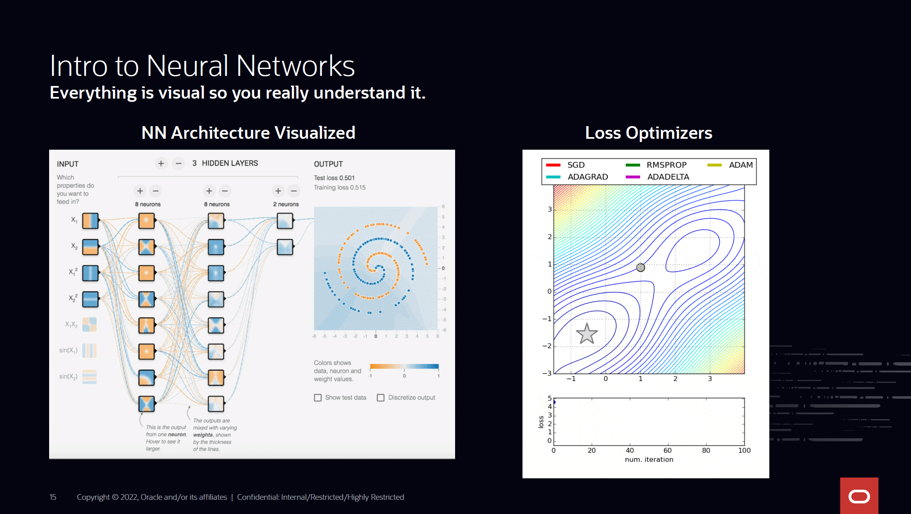
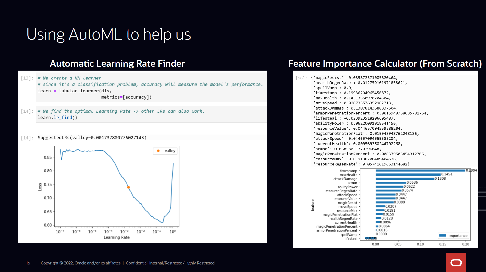
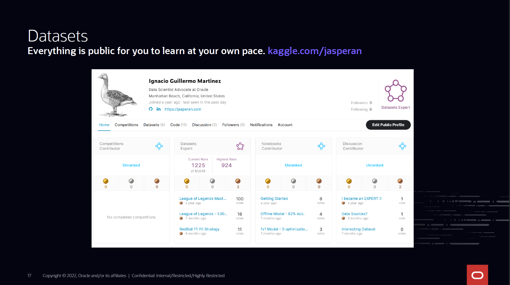
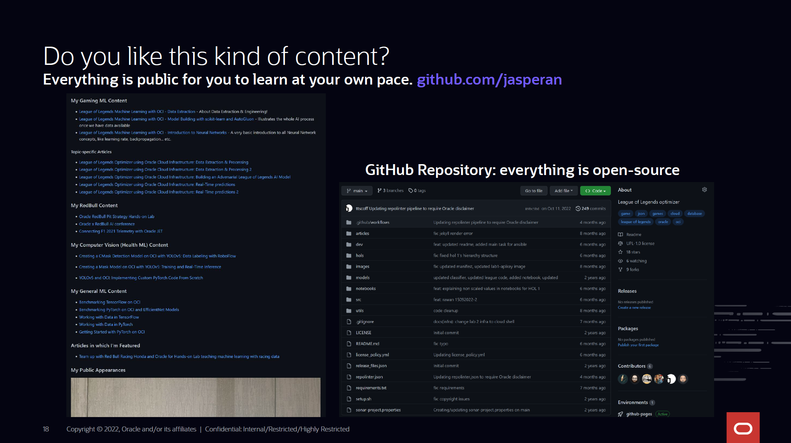
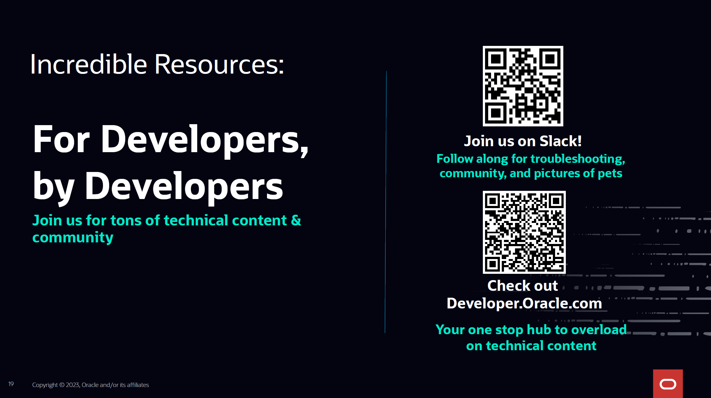


## Introduction

League of Legends optimizer is a project created for educational purposes that uses Riot Games' API to make real-time predictions in game. The project is able to extract data from professional players, store this information in an Oracle Autonomous JSON Database, and use this data to train ML models to accurately predict the winning probability of a player.

## Data Extraction

The data extraction process has been evaluated using the official Riot Games API. There's a lot of information available which we expand in the article series. [You can find the article series here.](./articles/)

From the initial set of tools to extract data (provided by Riot Games), there are two steps required to approach the problem:

1. Extract offline data from players, matches and accounts from the official (offline) API; and create a ML model to predict the outcome of games based on compositions and game versions.

    Note that there are loads of information about champion stats from each version, so training models for each game patch is a consideration to make.

    The information provided by the game can be complemented with external data, like tier lists of champions: this is beneficial to leverage the compositions depending on specific champions in a patch.


2. Extract live data using the [Live Client Data API](https://developer.riotgames.com/docs/lol#game-client-api_live-client-data-api) and see what we can do. We use the Live Client Data API in [article 5.](./articles/article5.md)

The following methods are permitted right now:

```python
parser.add_argument('-m', '--mode', help='Mode to execute',
	choices=['player_list', 'match_list', 'match_download_standard', 'match_download_detail', 'process_predictor', 'process_predictor_liveclient']
	required=False)
```

It's not required to specify an option. In case no option is specified, all commands will run sequentially.
This is the specification for each one of the commands:

```bash
python league.py --mode="player_list" # gets all players above masters' elo in all regions
```

This will begin extracting players from each one of the regions. For example:

```bash
Region: br1 | Tier: CHALLENGER | Queue: RANKED_SOLO_5x5 | Total Players: 200
Region: br1 | Tier: GRANDMASTER | Queue: RANKED_SOLO_5x5 | Total Players: 500
Region: br1 | Tier: MASTER | Queue: RANKED_SOLO_5x5 | Total Players: 3022
Total users obtained in region br1 and queue RANKED_SOLO_5x5: 3722
Obtained new summoner: micaOxD in region br1, queue RANKED_SOLO_5x5
Obtained new summoner: SSG Corëjj in region br1, queue RANKED_SOLO_5x5
Obtained new summoner: GIL DA ESFIRRA in region br1, queue RANKED_SOLO_5x5
Obtained new summoner: LOBO MAU LIBDGEL in region br1, queue RANKED_SOLO_5x5
Obtained new summoner: kadaki in region br1, queue RANKED_SOLO_5x5
Obtained new summoner: colorsflyinghigh in region br1, queue RANKED_SOLO_5x5
Obtained new summoner: Moeeb in region br1, queue RANKED_SOLO_5x5
Obtained new summoner: PATAKORÍ OGUM in region br1, queue RANKED_SOLO_5x5
Obtained new summoner: kaito in region br1, queue RANKED_SOLO_5x5
```

If we get one of these players, we check that their information is correct:


```bash
python league.py --mode="match_list" # for all users obtained in the previous step, obtain their last 990 matches (if available)


python league.py --mode="match_download_standard" # for each match ID obtained in the previous step, extract match information.
# extracts information on matchups. e.g. LeeSin played jungle vs. a Kha'Zix; and builds a JSON structure to store this for each lane.


python league.py --mode="match_download_detail" # a very detailed version of match_download_standard, where we get
# a match timeline with all events that happened in the match broken down.


python league.py --mode="process_predictor" # builds a structure to train a classifier model, with different
# column names as the ones provided by the Live Client Data API. -> less practical, but useful to learn

python league.py --mode="process_predictor_liveclient" # builds an affine structure to train a classifier model,
# with the same column names as the ones provided by the Live Client Data API. -> ideal.
```

## How to Begin

### Prerequisites

Requirements file can be found in [this file](./requirements.txt).

You will need to have installed Oracle Instant Client or other means of connectivity to the Oracle Autonomous JSON Database. [This is the official download site](https://www.oracle.com/database/technologies/instant-client/linux-x86-64-downloads.html) for Instant Client, there you also have configuration instructions on how to set this up on your local machine.

All sensitive information from the project, including Riot Games' API key is stored in a YAML file called __config.yaml__. This is a file only kept locally and not included in the repository. You will need to create your own config.yaml file in the root directory of the project, where you'll have to place credentials with a structure like this:

```yaml
riot_api_key: RGAPI-xxxxxx-xxxx-xxxx-xxxx-xxxxxxxxxx
db:
	username: xxxxxx
	password: xxxxxx
	dsn: xxxx
```


### Running the code

Run:
`python league.py` for the full process. You can modify your code to run all components or just the ones you need in the data_mine() function.

If we want to create our own model from scratch, we will need to:
1. Extract data
2. Process data (already done by [league.py](./src/league.py))
2. Train the model (done separately [in a notebook](./notebooks/league_classifier_liveclient.ipynb))
3. Deploy and test the model

We can extract data the following way:

```bash
python league.py --mode="player_list"
python league.py --mode="match_list"
# Then, once we have the data, we process this data using the process_predictor_liveclient option
python league.py --mode="process_predictor_liveclient"
```


## Additional Information

### Live Client Data API

The Live Client Data API provides a method for gathering data during an active game. It includes general information about the game as well player data.

It has a number of endpoints that return a subset of the data returned by the /allgamedata endpoint. This endpoint is great for testing the Live Client Data API, but unless you actually need all the data from this endpoint, we suggest one of the endpoints listed below that return a subset of the response. 

To extract live game information, we need to access the Live Client Data API from Riot Games. The API involves a set of protocols that CEF (Chromium Embedded Framework) uses to communicate between the League of Legends process and a C++ library.


Communications between the CEF and this C++ library happen locally, that's why we're obligated to use localhost as our connection endpoint. You can find additional information about this communication [here.](https://developer.riotgames.com/docs/lol)

You can also refer back to [article 4](./articles/article4.md), where I explain the most interesting endpoints that we encounter when using the Live Client Data API. 

We'll primarily use the following endpoint:

```python
# GET https://127.0.0.1:2999/liveclientdata/allgamedata
# Sample output can be found in the following URL, if interested. https://static.developer.riotgames.com/docs/lol/liveclientdata_sample.json
# This endpoint encapsulates all other endpoints into one.
```

When we join a League of Legends game, the League process opens port 2999. We'll use this to our advantage and we'll make recurring requests to localhost:2999 to extract live match information and incorporate it into our ML pipeline. The result from our ML model will tell us if we're likely to win or lose.

## Architecture

In order to make requests properly, we need to access localhost as the calling endpoint. However, we may not want to access data in a local computer where we are playing (as computer resources should be used to get maximum game performance). For that, I have created an architecture which uses **message queues** and would allow us to make requests from any machine in the Internet.

For this architecture proposal, I've created two files, which you can find in the [official repository for this article series](https://github.com/oracle-devrel/leagueoflegends-optimizer): [live_client_producer.py](./src/live_client_producer.py) and [live_client_receiver.py](./src/live_client_receiver.py).

### Producer

The producer is in charge of making requests to localhost and storing them, without making any predictions itself. The idea behind this is to allow the computer where we're playing League to offload and concentrate on playing the match as well as possible, without adding extra complexity caused by making ML predictions (which can take quite a lot of resources).

Therefore, we declare the main part of our producer this way:

```python
while True:
    try:
        response = requests.get('https://127.0.0.1:2999/liveclientdata/allgamedata', verify=False)
    except requests.exceptions.ConnectionError:
        # Try again every 5 seconds
        print('{} | Currently not in game'.format(datetime.datetime.now()))
        time.sleep(5)
        continue

    # Send to RabbitMQ queue.
    if response.status_code != 404:
        to_send = build_object(response.content)
        send_message('live_client', to_send)
    time.sleep(30) # wait 30 seconds before making another request
```

We need to consider that, if we're not inside a game, we'll get a ConnectionError exception. To avoid this hardware interrupt, we catch the exception and keep making requests to the endpoint until something useful comes in.

I've chosen **RabbitMQ message queues** a very simple and efficient solution to store our results into a queue. This ensures the following:
- Accessing and consuming the data present in the queues from any IP address, not only localhost
- Message order is guaranteed, should we ever need to make a time series visualization of our predictions.
Therefore, we declare our message queues. 

```python
_MQ_NAME = 'live_client'

credentials = PlainCredentials('league', 'league')
connection = pika.BlockingConnection(
pika.ConnectionParameters(
    '{}'.format(args.ip),
    5672,
    '/',
    credentials))

channel = connection.channel()
channel.queue_declare(queue=_MQ_NAME)
```

Note that, in the above code snippet, we need to create a __PlainCredentials__ object, otherwise authentication from a public network to our IP address where the producer is located would fail. [Check this article out](https://programmerall.com/article/92801023802/) to learn how to set up the virtual host, authentication and permissions for our newly-created user.

Additionally, every object that comes in needs to be processed and 'transformed' into the same structure expected by the ML pipeline:

```python
# We remove useless data like items (which also cause quotation marks issues in JSON deserialization)
def build_object(content):
    # We convert to JSON format
    content = response.json()
    for x in content['allPlayers']:
        del x['items'] # delete items to avoid quotation marks
    built_obj = {
        'activePlayer': content['activePlayer'],
        'allPlayers': content['allPlayers']
    }
    content = json.dumps(content)
    content = content.replace("'", "\"") # for security, but most times it's redundant.
    print(content)
    return content # content will be a string due to json.dumps()
```

And finally, we declare a function that takes the __message__ in string format, and inserts it into the message queue, ready to be consumed.

```python
def send_message(queue_name, message):
    channel.basic_publish(exchange='', routing_key=queue_name, body='{}'.format(message))
    print('{} | MQ {} OK'.format(datetime.datetime.now(), message))
```

As we've built our message queue producer, if we run this while in a game, our ever-growing message queue will store messages even if noone decides to "consume" them and make predictions. Now, we need to do exactly this through a **consumer**.

### Consumer

In the consumer, we'll connect to the RabbitMQ server (doesn't necessarily have to be located where we run our producer module, it can be anywhere as if it was an Apache web server, you just need to make sure connection in the producer and consumer both point to the same RabbitMQ server's IP address) and make predictions with the light model (trained with 50.000 rows from our original dataset, as using a bigger model would yield higher prediction times) we trained in [article 4](./articles/article4.md):

```python
# We load the AutoGluon model.
save_path = args.path  # specifies folder to store trained models
_PREDICTOR = TabularPredictor.load(save_path)

def main():
    try:
        # localhost if the rabbitmq server is located in the same machine as the receiver.
        connection = pika.BlockingConnection(pika.ConnectionParameters(host='localhost', heartbeat=600, blocked_connection_timeout=300))
        channel = connection.channel()

        # declare queue, in case the receiver is initialized before the producer.
        channel.queue_declare(queue='live_client')

        def callback(ch, method, properties, body):
            print('{} | MQ Received packet'.format(datetime.datetime.now()))
            process_and_predict(body.decode())

        # consume queue
        channel.basic_consume(queue='live_client', on_message_callback=callback, auto_ack=True)
        
        print(' [*] Waiting for messages. To exit press CTRL+C')
        channel.start_consuming() # we listen 24/7 for new messages in the live_client queue
    except pika.exceptions.StreamLostError:
        connection = pika.BlockingConnection(pika.ConnectionParameters(host='localhost', heartbeat=600, blocked_connection_timeout=300))
```

Note: if you run into 'connection reset' error, [check out this documentation piece on pika](https://pika.readthedocs.io/en/stable/examples/heartbeat_and_blocked_timeouts.html) which adds some parameters to the pika ConnectionParameters object to ensure well-behaved connections.

And, every time we consume a message from the queue, we predict the outcome using our AutoGluon model, by calling **process_and_predict**:

```python
def process_and_predict(input):

    json_obj = json.loads(input)
    team_color = str()
    for x in json_obj['allPlayers']:
        if x['team'] == 'ORDER':
            team_color = 'blue'
        else:
            team_color = 'red'
        
        print('Team {}: {}'.format(team_color, x['championName']))

    # Timestamp given by the Live Client API is in thousands of a second from the starting point.

    timestamp = int(json_obj['gameData']['gameTime'] * 1000)
    data = [
        json_obj['activePlayer']['championStats']['magicResist'],
        json_obj['activePlayer']['championStats']['healthRegenRate'],
        json_obj['activePlayer']['championStats']['spellVamp'],
        timestamp,
        json_obj['activePlayer']['championStats']['maxHealth'],
        json_obj['activePlayer']['championStats']['moveSpeed'],
        json_obj['activePlayer']['championStats']['attackDamage'],
        json_obj['activePlayer']['championStats']['armorPenetrationPercent'],
        json_obj['activePlayer']['championStats']['lifeSteal'],
        json_obj['activePlayer']['championStats']['abilityPower'],
        json_obj['activePlayer']['championStats']['resourceValue'],
        json_obj['activePlayer']['championStats']['magicPenetrationFlat'],
        json_obj['activePlayer']['championStats']['attackSpeed'],
        json_obj['activePlayer']['championStats']['currentHealth'],
        json_obj['activePlayer']['championStats']['armor'],
        json_obj['activePlayer']['championStats']['magicPenetrationPercent'],
        json_obj['activePlayer']['championStats']['resourceMax'],
        json_obj['activePlayer']['championStats']['resourceRegenRate']
    ]

    # We build the structure as our ML pipeline expects it (column names, and order).
    sample_df = pd.DataFrame([data], columns=['magicResist', 'healthRegenRate', 'spellVamp', 'timestamp', 'maxHealth',
        'moveSpeed', 'attackDamage', 'armorPenetrationPercent', 'lifesteal', 'abilityPower', 'resourceValue', 'magicPenetrationFlat',
        'attackSpeed', 'currentHealth', 'armor', 'magicPenetrationPercent', 'resourceMax', 'resourceRegenRate'])
    prediction = _PREDICTOR.predict(sample_df)
    pred_probs = _PREDICTOR.predict_proba(sample_df)

    expected_result = prediction.get(0)
    if expected_result == 0:
        print('Expected LOSS, {}% probable'.format(pred_probs.iloc[0][0] * 100))
    else:
        print('Expected WIN, {}% probable'.format(pred_probs.iloc[0][1] * 100))
    
    print('Win/loss probability: {}%/{}%'.format(
        pred_probs.iloc[0][1] * 100,
        pred_probs.iloc[0][0] * 100
    ))
```

And that's the last code piece we need for everything to work. Now, we can get into a game and run our producer code (in the machine where we play the League match) and the consumer (simultaneously, although not necessary) to get real-time predictions on the game.

## The Setup

We initialize our producer and consumer processes:

```bash
# producer must be run in the same server as where we're playing League
python live_client_producer.py --ip="RABBITMQ_IP_ADDRESS"
# in this case, receiver is running in localhost (in the same server as the rabbitmq server).
python live_client_receiver.py --ip="RABBITMQ_IP_ADDRESS" -p="MODEL_PATH" 
```

## The Game!

Since I'm using a lightweight model to make predictions, and training data is only 50000 rows, I'm expecting results to be roughly inaccurate. Therefore, to make things obvious and demonstrate the functionality, I've chosen to play a League match in the practice tool against an AI bot. This will allow me to level up quickly and buy items with lent out gold from the practice tool, something that would take me about 30 to 35 minutes in a real match. 

I chose to play Ezreal and bought a standard hybrid AD-AP build, which is especially good in lategame as cooldown reduction makes you a monster and it'd be really hard for enemies to catch me offguard with my E. 

From the producer's POV, we're making requests every 30 seconds and expecting a prediction. This is the kind of data we're storing in, and then consuming from our message queue:


As we start the game, we get a very average 60/40% winrate probability. This is due to the fact that Ezreal is usually superior in early game compared to Miss Fortune if we keep our distance. As training data comes from real Masters+ players, usually games are very quiet at the beginning and players perform very safely until mid game. Therefore, it makes sense that Ezreal starts with a bigger win percentage probability.


After starting the game, since we're in the practice tool, I chose to go full-build and buy all items from the shop (the standard AD-AP build).


Immediately after the next request, the HTTP request fed the model my current stats, which were severely overpowered for the beginning of the game. If we review the statistics that are taken into account by our model, they are:

```python
# Code from where we built the model
sample_df = pd.DataFrame([data], columns=['magicResist', 'healthRegenRate', 'spellVamp', 'timestamp', 'maxHealth',
        'moveSpeed', 'attackDamage', 'armorPenetrationPercent', 'lifesteal', 'abilityPower', 'resourceValue', 'magicPenetrationFlat',
        'attackSpeed', 'currentHealth', 'armor', 'magicPenetrationPercent', 'resourceMax', 'resourceRegenRate'])
```

Therefore, any statistic that's considered an outlier from the interquartile range with respect to a specific timestamp, will cause the model to consider it as an anomaly, and ultimately return a favorable prediction towards victory. In the case of my build, I'm deliberately increasing my movement speed, attack damage, armor penetration, lifesteal, ability power, attack speed, maximum mana (resourceMax) and magic penetration percentage. To make this clearer, I also added 17 levels to my match level, which in turn increased my magic resistance, armor and maximum health. This will "trick" my model into seeing all my values are way above average for the duration of the game I've been playing.

Consequently, the predicted winrate spiked to about 70% and stayed that way during the rest of the match:


As I'm only considering player statistics, killing my AI opponent didn't give me any additional win probability, as kills, assists, deaths, vision score... aren't considered in this model. Also note that the model that's making the predictions was trained with only 50.000 rows, instead of the millions of rows we had in our __bigger__ model. Surely predictions would yield better results if we used the bigger model; we just didn't do that since prediction times would increase significantly.


Currently, the information which can be extracted from the Live Client Data API contains:
- Current player statistics, abilities and their levels, gold and player level at any given time in the game. This can be considered a good approach to calculating the snowball effect, should we ever need to include this metric in our model.
- Equipped runes
- List of champions in the game and their stats (scores, skins, spells, position they are playing in, whether they're dead or alive, and current items of players).
- Current score for each player (assists, minion farm score, deaths, kills and ward score).
- Every player's runes, spells, items (in cooldown or not, slot placement)
- List of events that have happened since the beginning of the game (such as game start). [This list includes all events that we can find](https://static.developer.riotgames.com/docs/lol/liveclientdata_events.json).
- Basic data about the game (map, game time, type of queue in which the match is being played in, and map terrain information).


### Available endpoints
There are many available endpoints for the Live Client Data API, but the one that encapsulates the information from all sources is the following:

#### Get All Game Data

The Live Client Data API has a number of endpoints that return a subset of the data returned by the /allgamedata endpoint. This endpoint is great for testing the Live Client Data API, but unless you actually need all the data from this endpoint, it is suggested to use one of the endpoints listed below, which return a subset of the response.

GET https://127.0.0.1:2999/liveclientdata/allgamedata


## URLs
[Riot Games API](https://developer.riotgames.com/)

## Contributing
This project is open source. Please submit your contributions by forking this repository and submitting a pull request!  Oracle appreciates any contributions that are made by the open source community.

## License

Copyright (c) 2022 Oracle and/or its affiliates.

Licensed under the Universal Permissive License (UPL), Version 1.0.

See LICENSE for more details.

ORACLE AND ITS AFFILIATES DO NOT PROVIDE ANY WARRANTY WHATSOEVER, EXPRESS OR IMPLIED, FOR ANY SOFTWARE, MATERIAL OR CONTENT OF ANY KIND CONTAINED OR PRODUCED WITHIN THIS REPOSITORY, AND IN PARTICULAR SPECIFICALLY DISCLAIM ANY AND ALL IMPLIED WARRANTIES OF TITLE, NON-INFRINGEMENT, MERCHANTABILITY, AND FITNESS FOR A PARTICULAR PURPOSE. FURTHERMORE, ORACLE AND ITS AFFILIATES DO NOT REPRESENT THAT ANY CUSTOMARY SECURITY REVIEW HAS BEEN PERFORMED WITH RESPECT TO ANY SOFTWARE, MATERIAL OR CONTENT CONTAINED OR PRODUCED WITHIN THIS REPOSITORY. IN ADDITION, AND WITHOUT LIMITING THE FOREGOING, THIRD PARTIES MAY HAVE POSTED SOFTWARE, MATERIAL OR CONTENT TO THIS REPOSITORY WITHOUT ANY REVIEW. USE AT YOUR OWN RISK.
