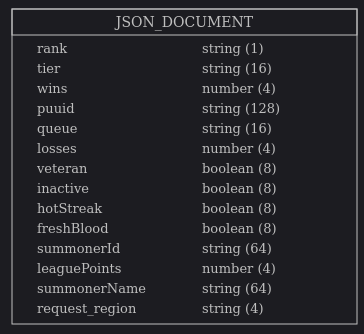

# League of Legends Optimizer using Oracle Cloud Infrastructure: Data Extraction & Processing

## Introduction
Welcome to the League of Legends Optimizer article series! 

In this series, we’ll create usable, real-world tools to showcase the power of Artificial Intelligence (AI) applied to videogames. I know there are a lot of developers out there who are gamers, and what better way to use AI than to create a Machine Learning (ML) model for one of the most popular videogames out there? We’ll use this opportunity to showcase the capabilities that Oracle products can give us in relation to the entire data science process (extracting, processing, storing and using this data seamlessly).

In this first article, we’ll dive deep into the Data Extraction step using the official Riot Games API. 

The purpose of these series of articles is to explain how I was able to construct an ML model able to predict the outcome of a game based on historical data, and how this data has been useful for coaches in the banning and drafting phase of League of Legends. For those of you who don’t know League deeply, it’s a popular multiplayer competitive game. In a LoL game, two teams of five players compete against each other to destroy the other team’s nexus. 

## First Steps

Using [Riot Games’ Developer Portal](https://developer.riotgames.com), I signed up for a personal application. I explored the API and found that there are many endpoints to extract data, not only for LoL, but also from Riot Games’ other games (Teamfight Tactics and Valorant). We will dive together into these other games in the future.
In LoL, 5 players choose among a wide variety of champions, which have their own synergies between each other. Champion powers are either buffed (improved) or nerfed (reduced) if their statistics are too overpowered or imbalanced compared to other champions, in what League calls patches. Team composition is a very important feature of the game, since exploiting compositions where champions have synergies gives teams a greater chance of winning. Since champion’s statistics are changed in patches, these team compositions change constantly, and pro teams spend a lot of time devising strategies on how to create powerful team compositions that will lead them to victory. 
Note that in LoL, players are rewarded gold when killing enemies, minions or jungle monsters, and with these items players may buy upgrades such as weapons that deal more damage. The intricacies of the videogame are very complex and it takes years to reach the highest level of play. Therefore, if you are not familiar with some of the concepts that I will talk about in this series, I will make sure to explain these advanced concepts in more detail when they come up. I am not a professional player, but I have been playing League of Legends since Season 1 at high Diamond level, which gives me more than enough knowledge to start fidgeting with some AI code related to League. 
Firstly, we should talk about the architecture for this project: 
•	Oracle Cloud Infrastructure, the official cloud provider for this project
•	a non-relational JSON database to store my data while I make my processing
•	[GitHub](https://github.com/oracle-devrel/leagueoflegends-optimizer) for version control and storing the code; it’s available in case you want to take a closer look at all code components

## Understanding the problem

To understand the problem, we must remember the concept of a _team composition_. If five players are extremely good at a champion, or a champion is severely overpowered in a specific patch, then there is a way to prevent these players from picking them. In the draft phase of a game, players can ban a specific champion if they anticipate that champion would be a major threat. Banning the champion prevents the enemy team from playing it. 
Here's a detailed explanation of how this process (usually) works:
1. **Pick Intent (15s)**: Players select their intended picks to show their team.
2. **Banning Phase (27s)**: All players simultaneously ban a champion from selection, opponents' bans are not revealed. 
3. **Ban Reveal (5s)**: Bans are revealed to all teams. It is possible for both teams to ban the same champion. 
4. **Champion Selection (27s in 6 turns)**: One team is allowed to make the first pick, then teams alternate and pick two at a time until each player has selected. No champion can be selected more than once in a game. 
5. **Finalization (30s)**: There is an opportunity to trade champions between teammates, both members must own both champions involved. One player can initiate the trade, and the other accepts to trade. 

Let’s start with the assumption that each team gets 5 bans each. So 10 bans total.
So, we will create an ML model to predict the best team compositions based on inputs. Therefore, if a player picks (for example) Lee Sin, our model will be able to respond to this input and suggest counter-picks (meaning, champions whose win percentage / win rate is very high against LeeSin), also considering possible synergies with teammates.
How about our training data? For this set, we wouldn’t want to include decisions made by less-skilled players, so we would want to only include data from professional players in our initial dataset. 
To do this, let’s only consider players in the Challenger, Grand Master, and Master leagues for regions all over the world. Ideally, this would be a collection of players above Master’s ELO and use their matches as reference.
So, with this idea in mind, let’s explore the API and see if it can help us in this.

## Exploring the API / Extracting Data

The standard development API key from Riot Games allows us to explore all 57 endpoints available. In this set of endpoints, I found an endpoint that can fetch Challenger players in a region, as well as Grandmaster and Master players, so I used this endpoint.

```python
def get_top_players(region, queue, connection):
	assert region in request_regions
	assert queue in ['RANKED_SOLO_5x5', 'RANKED_FLEX_SR', 'RANKED_FLEX_TT']

	total_users_to_insert = list()
	# master, grandmaster and challenger endpoints
	request_urls = [
		'https://{}.api.riotgames.com/lol/league/v4/challengerleagues/by-queue/{}'.format(
			region,
			queue
		),
		'https://{}.api.riotgames.com/lol/league/v4/grandmasterleagues/by-queue/{}'.format(
			region,
			queue
		),
		'https://{}.api.riotgames.com/lol/league/v4/masterleagues/by-queue/{}'.format(
			region,
			queue
		)
	]
	
	headers = {
		"User-Agent": "Mozilla/5.0 (X11; Ubuntu; Linux x86_64; rv:89.0) Gecko/20100101 Firefox/89.0",
		"Accept-Language": "en-US,en;q=0.5",
		"Accept-Charset": "application/x-www-form-urlencoded; charset=UTF-8",
		"Origin": "https://developer.riotgames.com",
		"X-Riot-Token": api_key
	}

```
In this screenshot, I create a set of request URLs to get challenger, grandmaster, and master players. I want to get all players in all available servers, as well as all queue types. So I will focus on getting data from Solo Queue (where a player can only play together or with a duo partner, and the remainder of the team is composed of random teammates) and Flex Queue (where teams of up to 5 people can be built). 

In order to expand my initial dataset I firstly considered getting all players above Master’s ELO, but as my dataset grew, I had enough active players, so after a while I decided to only consider new challenger players as an addition to my player collection.

Note that if you want to reproduce this code, you will need your own API key and insert it as a header parameter.

```python
for x in request_urls:
	response = requests.get(x, headers=headers)
	if response.status_code == 200:
		try:
			print('Region: {} | Tier: {} | Queue: {} | Total Players: {}'.format(region, response.json()['tier'],
				response.json()['queue'], len(response.json()['entries'])))
		except KeyError as e:
			pass
		for y in response.json()['entries']:
			try:
				y['tier'] = response.json()['tier']
				y['request_region'] = region
				y['queue'] = queue
				y['puuid'] = get_summoner_information(y['summonerName'], region) # insert their puuid as well.
				total_users_to_insert.append(y)
			except KeyError as e:
				pass
	else:
		print('Request error (@get_top_players). HTTP code {}: {}'.format(response.status_code, response.json()))
		continue

	print('Total users obtained in region {} and queue {}: {}'.format(region, queue, len(total_users_to_insert)))
```
In this code, I make the requests using the requests Python library, and process the outputs by parsing the response into JSON and traversing through the JSON object.

```python
# Insert into the database.
soda = connection.getSodaDatabase()

# this will open an existing collection, if the name is already in use
collection_summoner = soda.createCollection('summoner')
 ```
Finally, the last step is to insert this information in the database. I used an Autonomous JSON Database for this, since I didn’t want to bother with processing JSON objects too much. If you have experience with both relational and non-relational databases, you probably know it’s very complex to work with JSON objects and store them in a relational database schema. It’s much better to use a non-relational approach for this. I also didn’t want to bother with database performance, so that’s why I chose Oracle’s Autonomous JSON DB. (It’s very convenient in this case because it was really easy to setup and you can configure some visualizations in the future for your data which are publicly available through a URL. I definitely recommend checking out the advantages of the Autonomous JSON Database in more detail [here](https://blogs.oracle.com/jsondb/autonomous-json-database).

In order to use Oracle’s Autonomous JSON DB, we use the SODA protocol (Simple Oracle Document Access). To find out more and to read about the library I used for this step above, visit [this user guide](https://cx-oracle.readthedocs.io/en/latest/user_guide/soda.html).


The connection parameters for the database have been established in a config.yaml file with the following structure:
 ```yaml
 riot_api_key: apikey_123123123
 db:
 	username: myuser
 	password: mypw
 ```

In order to use this database’s username and password in the code, information for the Data Source Name needs to be passed. Connecting to the Autonomous JSON database requires three things: the username, password, and DSN, which contains the URL and port of the database to connect to. To find out more about how to get your Python code to run and be able to connect into your own Autonomous JSON database, please refer to the [official documentation for the cx_Oracle library](https://cx-oracle.readthedocs.io/en/latest/user_guide/connection_handling.html).

```python
# Insert the users.
for x in total_users_to_insert:
	qbe = {'summonerId':x['summonerId']}
	x['request_region'] = region
	x['queue'] = queue
	# We get the PUUID for the user in case they change their name.
	overall_region, tagline = determine_overall_region(region)
	x['puuid'] = get_puuid(overall_region, x['summonerName'], tagline)
	try:
		collection_summoner.insertOneAndGet(x)
		time.sleep(1) # rate limiting purposes
	except cx_Oracle.IntegrityError:
		print('Summoner {} already inserted'.format(x['summonerName']))
		continue
	print('Inserted new summoner: {} in region {}, queue {}'.format(x['summonerName'], region, queue))
```
Here I inserted the player’s data into a collection called summoner. 

This collection will store all the players’ identifying information. Note that in order to unequivocally identify a player or _summoner_ as we will call them from now on, a summoner name is not enough. Why? Because players can change their summoner name in the Riot Games store, so storing their username would not guarantee the access to their data permanently. Therefore, to identify users, we make an additional API call to get the PUUID (Personal UUID) for all players so that in case these users change username, we will still be able to use their PUUIDs to get additional information about them.
```json
{
    "tier": "CHALLENGER",
    "veteran": false,
    "wins": 229,
    "request_region": "br1",
    "rank": "I",
    "inactive": false,
    "summonerId": "dKMYAJhqPpBuI9hSfIon_a4zSbtCwTFep-DA6Lq9YwqlIQ",
    "hotStreak": true,
    "queue": "RANKED_SOLO_5x5",
    "losses": 198,
    "freshBlood": true,
    "puuid": "aRjqIYDtBMBU2j-8EfHY6dJ0RZ9TqXgWLeNvpcjRWlCBaP8HGBAWFRAiehRM4Jo-lgJXXrjTCOcIKg",
    "summonerName": "Qats",
    "leaguePoints": 922
}
```
This is an example of data obtained for a European challenger player and their associated data. We can store this information efficiently in the _summoner_ collection with a schema like this:



We will primarily care about the summoner’s PUUID and their request region in order to know the geographical location of the player and make requests to the Riot Games API accordingly.

And, what is the kind of information that we want from our extracted players? Well, in reality we wouldn’t want to get summoners’ information above a Masters’ ELO if we wouldn’t use this data somewhere else, or to produce something useful for our model. So, if we want to predict optimal team compositions, we need some League games to analyze. 

After looking into the API a bit more, I found an endpoint which extracts the latest number of matches played by any summoner at any time (the limit for every request is 100, but we can use pagination to chain several requests and retrieve many more games). We will store these match IDs into an auxiliary collection in order to further process them. We could do this in only one step, but since this is a data mining process designed to run for long periods of time (even 24 hours a day), I decided that it would be best to simplify and use highly decoupled functions, each separate from the other.

```json
{
    "match_id": "BR1_2133968346"
}
```
So, we insert only these match IDs for further processing into an auxiliary collection called _match_. 

## Where is this going?
Now that we have our match IDs downloaded into our match collection, we need to analyze what information to extract from a match. Looking at the API endpoint, I found that  there are huge amounts of information for every match. Ideally, we would like to have, at least, the following information from every match:
- A match identifier, so that we don’t insert the same match twice into our dataset
- Each team’s compositions
- Each team’s bans
- The outcome of the game (win or loss)
- Additionally, we can also calculate the outcome of each one of the matchups. For example, calculate whether the player in middle lane lost their own matchup against the enemy middle laner, and so on. This can also be useful to create another ML model, which will consider individual matchups and make predictions to help out in the individual component of a match.

In the end, we would like to feed a player’s champion into the model, and the model will give us the best possible choices (either for the ally or enemy team). So, we would tell the model something like: “I want to know the best synergy to pick together with X champion and I also want to know their worst matchups.” 

We will start exploring this in the third article in this series, where we will dive deep into AI code on how to create these models, train them and improve them.  

I hope to see you in the next article of this series, where together we will:
- Establish a stable architecture for our code
- Optimize our code, which is good, but once the dataset grows, the code starts being inefficient
- Process our data further and get it ready for our ML pipeline


## DataSets

I have published my datasets into Kaggle for everyone to use, in case you don't have as much as time to complement them and process them. The process of data collection is arduous and took me a very long time since the beginning of this project. I will keep updating the datasets with the progress I make in the following articles. You can find them in here:

- [Master+ Matches Collection (1.000.000+)](https://www.kaggle.com/jasperan/league-of-legends-1000000-master-matches)
- [Master+ Players Collection (30.000+)](https://www.kaggle.com/jasperan/league-of-legends-master-players)
- [Master+ Matchups Collection (1.000.000+)](https://www.kaggle.com/jasperan/league-of-legends-1v1-matchups-results) (a dataset that we'll use in the forthcoming articles).

Stay tuned for the next articles!

## License
Copyright (c) 2021 Oracle and/or its affiliates.

Licensed under the Universal Permissive License (UPL), Version 1.0.

See [LICENSE](../LICENSE) for more details.

Written by [jasperan](https://github.com/jasperan), edited by [GreatGhostsss](https://github.com/GreatGhostsss)