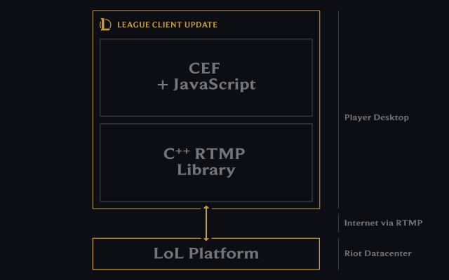
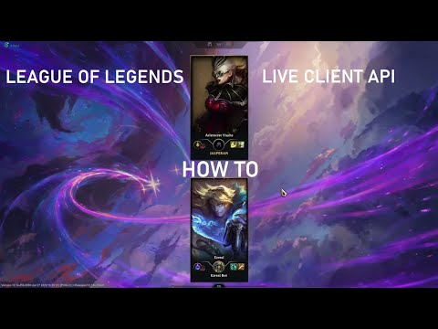
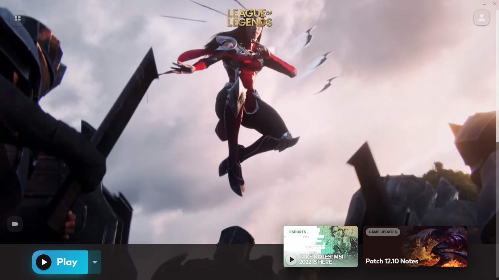
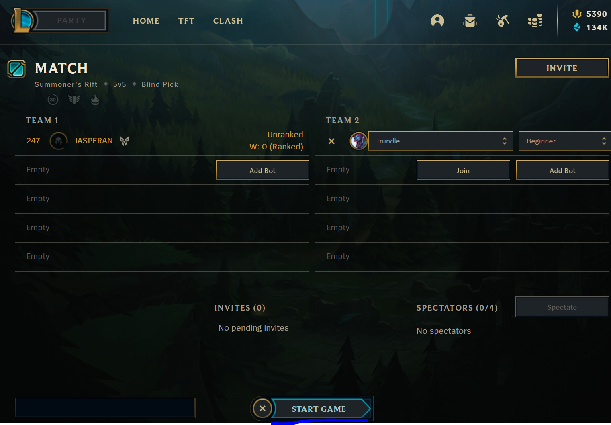

# Getting Started

## Introduction
To extract live game information, we need to access the Live Client Data API from Riot Games.

Estimated Time: 15 minutes

### Prerequisites

* An Oracle Free Tier, Paid or LiveLabs Cloud Account
* Active Oracle Cloud Account with available credits to use for Data Science service.
* [League of Legends Client](https://signup.leagueoflegends.com/en-gb/signup/redownload) installed in your computer, and an updated version of the game.
* (Optional) If you want to make real-time tests with the Live Client API, you will need to have a Python environment set up in your **local** machine (not OCI Cloud shell) and install liveclient dependencies. More explained below.

## Task 1: Live Client API - Introduction

As an introduction, here's a sneak peek of what the Live Client API looks like, and how it works on the inside.

The API features a set of protocols that CEF (Chromium Embedded Framework) uses to communicate between the League of Legends process and a C++ library, as shown in the below figure.



Communication between the CEF and C++ libraries **happens automatically when we run the program**. Since we're running the League client in our computer, the IP being used is localhost (127.0.0.1). If you're interested in seeing how this communication works in more detail, check out [this//developer.riotgames.com/docs/lol).

> (Optional) You can also refer to [article 4](https://github.com/oracle-devrel/leagueoflegends-optimizer/blob/livelabs/articles/article4.md), where we dive into the most interesting endpoints in the Live Client Data API.


## Task 2: Test the Live Client API

Check out this video where we explain how to connect to the Live Client API:

[](https://www.youtube.com/watch?v=SlG0q4oWGsk)


When we join a League of Legends game, the League process automatically opens port 2999. We'll use this to our advantage and we'll make recurring requests to localhost:2999 to extract live match information.

The HTTP endpoint being used to get data while we're in a League of Legends match is the following:

```
<copy>
# GET https://127.0.0.1:2999/liveclientdata/allgamedata
</copy>
# Sample output can be found in the following URL, if interested. https://static.developer.riotgames.com/docs/lol/liveclientdata_sample.json
# This endpoint is the most complete one of all.
```

1. If you want to test the Live Client API, you'll need to join a League of Legends match:
    
2. After clicking on "play", we'll create a custom match and set to play against an AI bot:
    
3. Now, we'll add an AI bot to play against us in the enemy team and start the game. Afterwards, we'll be in the champion select screen, where we'll have the option to select any champion.
    
4. Now, we are inside the game after loading.
    
5. After joining the game, we can start making HTTP requests to check our live champion statistics, score, cooldowns, etc. [To make the requests automatically, you can use this code](https://github.com/oracle-devrel/leagueoflegends-optimizer/blob/livelabs/src/livelabs/making_requests.py).

    > **Note**: you should run this code (`making_requests.py`) in your local machine, as we need to make HTTP requests through **localhost**. This means that, in the computer where you're playing, you must have a Python environment configured and be able to run the abovementioned code.<br>
    > If you'd rather just see an example of the data returned, [check the contents of this file](https://static.developer.riotgames.com/docs/lol/liveclientdata_sample.json). You can observe the kind of information we can access from a player. Attached is a sample JSON returned by the game [in this file](https://github.com/oracle-devrel/leagueoflegends-optimizer/blob/livelabs/src/aux_files/example_live_client.txt).

    ```json
    <copy>
    {
        "magicResist": 32,
        "healthRegenRate": 0,
        "spellVamp": 0,
        "timestamp": 0,
        "bonusArmorPenetrationPercent": 0,
        "bonusMagicPenetrationPercent": 0,
        "maxHealth": 540,
        "moveSpeed": 335,
        "attackDamage": 25,
        "armorPenetrationPercent": 0,
        "lifesteal": 0,
        "abilityPower": 0,
        "cooldownReduction": 0,
        "resourceValue": 350,
        "magicPenetrationFlat": 0,
        "attackSpeed": 100,
        "currentHealth": 540,
        "armor": 35,
        "magicPenetrationPercent": 0,
        "armorPenetrationFlat": 0,
        "resourceMax": 350,
        "resourceRegenRate": 0
    }
    </copy>
    ```

    > We'll use all of this champion information as input in our ML model. To that end, we need to harmonize column names and amount of variables in our pre-trained models, with the information we have available in real-time so that the ML model can make predictions with everything that we have available. This is achieved thanks to the __`process_predictor_liveclient`__ function.


## Conclusions

Congratulations, you have completed the Workshop! 

A recap of what we've learned:

- &check; How to provision resources in OCI for Data Science purposes
- &check; How to create a datastore architecture for our problems
- &check; How to data mine League of Legends through an API
- &check; How to build and structure the data
- &check; How to load data, preprocess it, visualize the dataset
- &check; How to create a model
- &check; How to deploy this model, and make real-time predictions with it from new data
- &check; How to connect to the Live Client API
- &cross; How to have a **robust** model with higher baseline accuracy -> to be done in the next workshop.

In the next workshop, we'll learn how to extend and improve the model we've created __significantly__. At the end, we'll improve the accuracy of the model from a mere 51% accuracy to about 83% accuracy after finalizing the whole process.


## Acknowledgements

* **Author** - Nacho Martinez, Data Science Advocate @ DevRel
* **Contributors** - Victor Martin, Product Strategy Director
* **Last Updated By/Date** - February 20th, 2023
