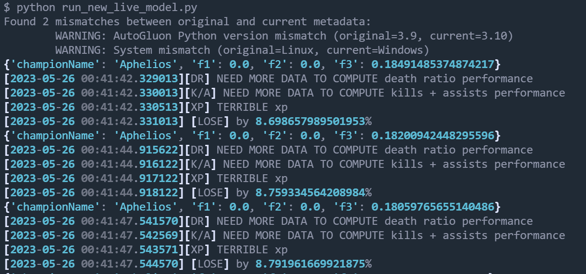

# Getting Started

## Introduction
To extract live game information, we need to access the Live Client Data API from Riot Games.

Estimated Time: 15 minutes

### Prerequisites

* An Oracle Free Tier, Paid or LiveLabs Cloud Account
* Active Oracle Cloud Account with available credits to use for Data Science service.
* [League of Legends Client](https://signup.leagueoflegends.com/en-gb/signup/redownload) installed in your computer, and an updated version of the game.
* (Optional) If you want to make real-time tests with the Live Client API, you will need to have a Python environment set up in your **local** machine (not OCI Cloud shell) and install liveclient dependencies. More explained below.

## Task 1: Live Client API - Introduction

As an introduction, here's a sneak peek of what the Live Client API looks like, and how it works on the inside.

The API features a set of protocols that CEF (Chromium Embedded Framework) uses to communicate between the League of Legends process and a C++ library, as shown in the below figure.


Communication between the CEF and C++ libraries **happens automatically when we run the program**. Since we're running the League client in our computer, the IP being used is localhost `(127.0.0.1)`. If you're interested in seeing how this communication works in more detail, check out [this link](https://developer.riotgames.com/docs/lol).

> (Optional) You can also refer to [article 4](https://github.com/oracle-devrel/leagueoflegends-optimizer/blob/livelabs/articles/article4.md), where we dive into the most interesting endpoints in the Live Client Data API.


## Task 2: Test the Live Client API

Check out this video where we explain how to connect to the Live Client API:

[](https://www.youtube.com/watch?v=SlG0q4oWGsk)
> **Note**: you can now run [this file](https://github.com/oracle-devrel/leagueoflegends-optimizer/tree/livelabs/src/live_client/run_new_live_model.py) instead, which will allow you to perform inference on the models you have created.

When we join a League of Legends game, the League process automatically opens port `2999`. We'll use this to our advantage and we'll make recurring requests to `localhost:2999` to extract live match data.

The most complete HTTP endpoint you can find in the Live Client API is the following `/allgamedata` endpoint:

```
<copy>
# GET https://127.0.0.1:2999/liveclientdata/allgamedata
</copy>
# Sample output can be found in the following URL, if interested. https://static.developer.riotgames.com/docs/lol/liveclientdata_sample.json
# This endpoint is the most complete one of all.
```

1. If you want to test the Live Client API, you'll need to join a League of Legends match:
    
2. After clicking on "play", we'll create a custom match and set to play against an AI bot:
    
3. Now, we'll add an AI bot to play against us in the enemy team and start the game. Afterwards, we'll be in the champion select screen, where we'll have the option to select any champion.
    
4. Now, we are inside the game after loading.
    
5. After joining the game, we can start making HTTP requests to check our live champion statistics, score, cooldowns, etc.

You can use two Python scripts, depending on what you want to do (testing / production):
- [Making requests without using your ML model](https://github.com/oracle-devrel/leagueoflegends-optimizer/blob/livelabs/src/live_client/making_requests.py)
- [Using your ML model (recommended)](https://github.com/oracle-devrel/leagueoflegends-optimizer/tree/livelabs/src/live_client/run_new_live_model.py)

Remember to run the code you choose in your local machine, as we need to make HTTP requests through **localhost**. This means that, in the computer where you're playing, you must have a Python environment configured and being able to run the abovementioned code.

If you'd rather just see an example of the data returned, [check the contents of this file](https://static.developer.riotgames.com/docs/lol/liveclientdata_sample.json). You can observe the kind of information we can access from a player.

In [this file](https://github.com/oracle-devrel/leagueoflegends-optimizer/blob/livelabs/src/aux_files/example_live_client.txt), you can find a a sample JSON returned by the game.

If you're using your own ML model after training it, and you have successfully joined a game, you should see some stats and recommendations from the ML model start to appear when you run the file:


> **Note**: at the beginning of the match, and until you have at least one kill and one death, it will just tell you that you're missing some data to start calculating your current performance (as 0 divided by any natural number is 0, and I didn't want to depress you telling you that you have a terrible amount of kills at the beginning.)

Also note it's recommended to run `run_new_live_model.py` with a Python version equal to the one that you used during the **Model Building** phase. Otherwise you will run into warnings, or even errors if the Python versions are too different.

## Conclusions

Congratulations, you have completed the Workshop!

A recap of what we've learned:

* How to provision resources in OCI for Data Science purposes
* How to create a datastore architecture for our problems
* How to data mine League of Legends through an API
* How to build and structure the data
* How to load data, preprocess it, visualize the dataset
* How to create a model
* How to deploy this model, and make real-time predictions with it from new data
* How to connect to the Live Client API
* How to have a **robust** model with higher baseline accuracy -> to be done in the next workshop.
* How to use this model in real-time to get some feedback on how well you're playing


## Acknowledgements

* **Author** - Nacho Martinez, Data Science Advocate @ DevRel
* **Contributors** - Victor Martin, Product Strategy Director
* **Last Updated By/Date** - May 26th, 2023
