# Creating the Model

## Introduction
In this lab, we're creating a very primitive ML model. This model will use very few variables and will only have one target variable. It'll be useful to us as it introduces the most basic and fundamental ML concepts.

Estimated Time: 45 minutes

### Prerequisites

* An Oracle Free Tier, Paid or LiveLabs Cloud Account
* Active Oracle Cloud Account with available credits to use for Data Science service.
* [Previously created](https://github.com/oracle-devrel/leagueoflegends-optimizer/blob/livelabs/hols/dataextraction/infra/infra.md) OCI Data Science Environment


## Task 1: Set up OCI Data Science Environment

[Having previously created our OCI Data Science environment](https://github.com/oracle-devrel/leagueoflegends-optimizer/blob/livelabs/hols/dataextraction/infra/infra.md), we need to install the necessary Python dependencies to execute our code. For that, we'll access our environment.

1. We open the notebook that was provisioned:

    

    > **Note**: You may find the Data Science section by also searching in the top left bar, or in the Analytics & AI tab, if it doesn't appear in "Recently visited" for you:

    

    Now, we have access to a [list of our Data Science projects launched within OCI.](https://cloud.oracle.com/data-science/projects) We access our project, and inside our project we'll find the notebook.

    > **Note**: The name of the notebook may be different than shown here in the screenshot.

    

    

    You should now see the Jupyter environment

    

2. We now need to load our notebook and datasets into our environment. For that, we open a new terminal inside our environment:

    

    Then, we execute the following command, which will download all necessary datasets:

    ```
    <copy>
    wget https://objectstorage.eu-frankfurt-1.oraclecloud.com/p/Va9g94bf5GQgMsquZqnSc_lEkpGow4-UteUwlEbU1MS3cjTZNQwiVE63EL2ft3ow/n/axywji1aljc2/b/league-hol-1/o/archive.zip && unzip archive.zip -d /home/datascience/.
    </copy>
    ```

    This process should take about a minute.

    

    Now, we'll download the repository:

    ```
    <copy>
    git clone --branch livelabs https://github.com/oracle-devrel/leagueoflegends-optimizer.git
    </copy>
    ```

    After this, we will open the notebook called _`hol1_offline_analysis.ipynb`_ located in _`leagueoflegends-optimizer/notebooks`_ by double clicking it.

3. We run the first code cell in [the notebook](https://github.com/oracle-devrel/leagueoflegends-optimizer/blob/livelabs/notebooks/hol1_offline_analysis.ipynb) to install the dependencies. In order to run the code cell, you can press the following button:

    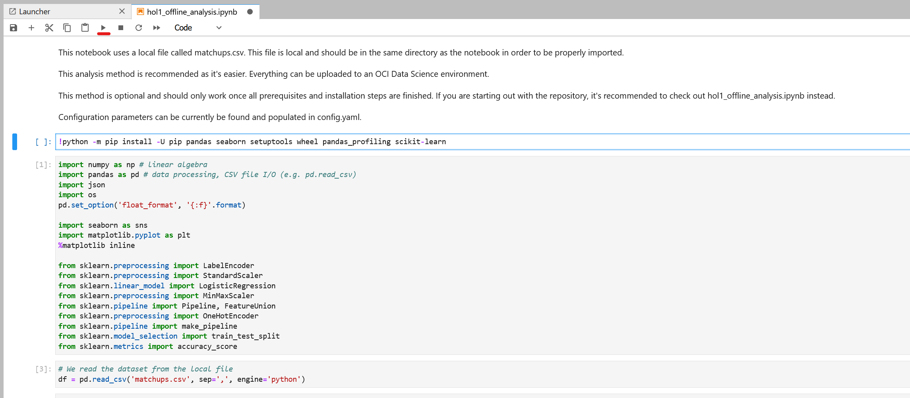

    Or simply press SHIFT + Enter for running the selected cells. We should see the libraries / dependencies being installed:

    


## Task 2: The Data Structure

From our dataset, we can observe an example of the data structure we're going to use to build our model:

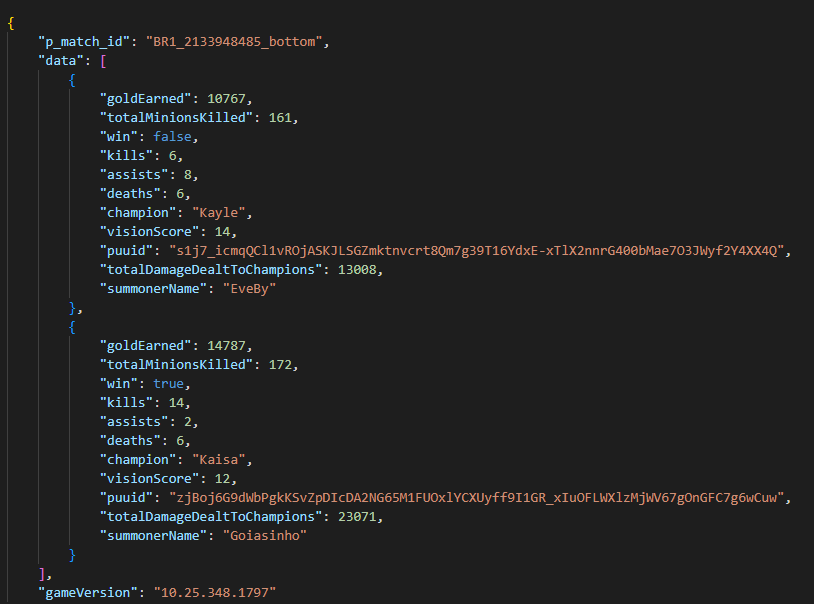


The intricacies of how we built the data structure and derived the result from it are explained in [a previous article](https://github.com/oracle-devrel/leagueoflegends-optimizer/blob/livelabs/articles/article2.md). It is important to remember that structuring and manipulating data in the data science process takes about 80 to 90% of the time, according to expert sources (image courtesy of [“2020 State of Data Science: Moving From Hype Toward Maturity.”](https://www.anaconda.com/state-of-data-science-2020)), and we shouldn't be discouraged when spending most of our time processing and manipulating data structures. The ML algorithm is the easy part if you've correctly identified the correct data structure and adapted it to the structure ML algorithms expect.


For our first model, we're going to simplify the present data structure even more and get something like this:


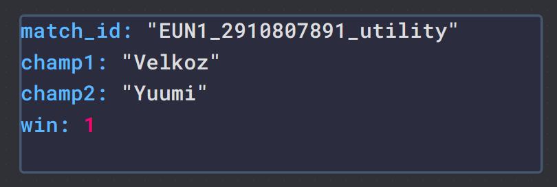


Where `win` is a boolean variable that represents whether `champ1` won or not. So, in this example, Velkoz won the game.

## Task 3: Load Data / Generate Dataset

We begin with simple data exploration of our initial dataset.

> **Note**: This code corresponds to cell #2 of the above mentioned notebook.


We see that the _`matchups.csv`_ file contains information from every game, based on a `P_MATCH_ID`. In this case, we'll have the following ID structure:

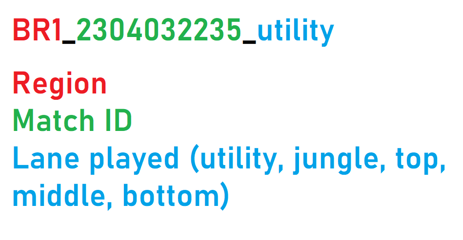

After exploring the dataset, we observe that, in order to create a meaningful model, and with the purpose of trying to make the model decide which champion should win in every matchup, we will modify this initial structure and adapt it to predict whether a champion won or not.

This assimilates the structure we want to have:

| match_id	| champ1 | champ2 |	win |
| :----------:	| :------:	| :------:	| :----: |
| `EUN1_2910807891_utility` |	Velkoz | Yuumi | 1 |
| `EUN1_2910807891_jungle` | Shaco |	Nidalee	| 1 |
| `EUN1_2909987530_top` | Riven |	Sett |	0 |
| `EUN1_2909987530_middle` | Lissandra |	Kassadin |	0 |
| `EUN1_2909987530_bottom` | Ashe | Ezreal | 0 |


For this, we create a function that, for each `match_id`, finds whether the player won or not, and adds it as a boolean variable (True/False). It will also find the enemy player (in the same match and lane) and pair it against each other in the same row.

Therefore, we'll have one row per lane, per match.

> **Note**: the below code and processing must only be done if working with [the online analysis notebook](https://github.com/oracle-devrel/leagueoflegends-optimizer/blob/livelabs/notebooks/hol1_online_analysis.ipynb), since [the offline analysis notebook](https://github.com/oracle-devrel/leagueoflegends-optimizer/blob/livelabs/notebooks/hol1_offline_analysis.ipynb) already has this processing implemented into the original dataset.

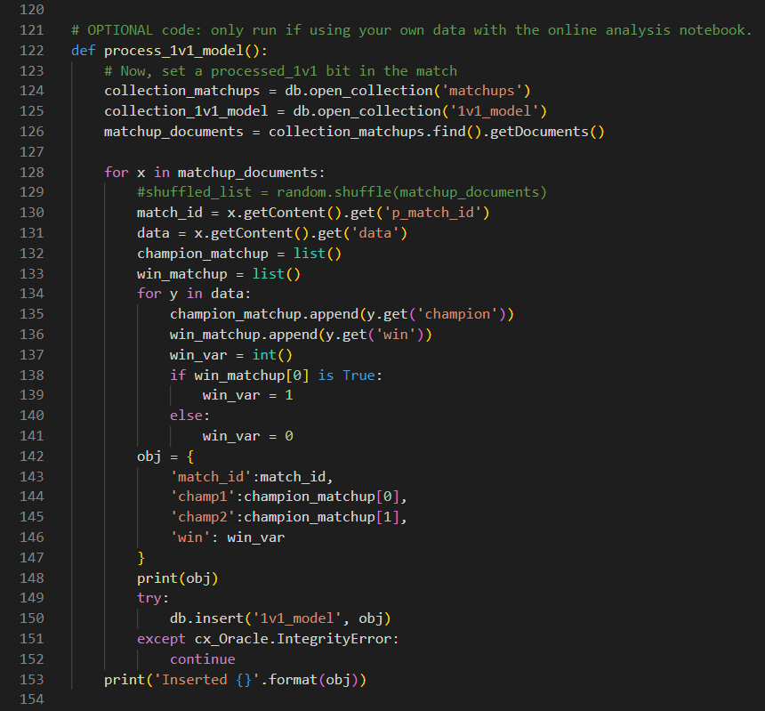

After creating this function and invoking it, we will obtain a resulting CSV file or dataframe object. We'll use this new object to create our model.

## Task 4: Load Processed Dataset

After doing this initial processing and understanding why variables are included, we load the new CSV file:

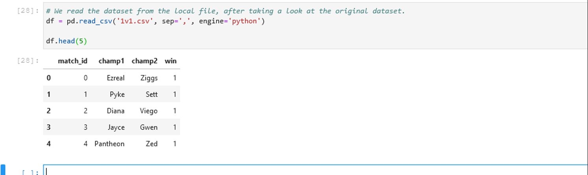

## Task 5: Explore Data

We can check the list of champions in the game:


> **Note**: The result is exactly the same if we run _`df['champ2'].unique()`_ instead, as we have enough rows that cause all champions in the game to appear in both __champ1__ and __champ2__ columns.
<br>
> (Optional) It could be interesting to make an analysis of this data to see which champions were played the most, depending on the patch number (column __GAMEVERSION__).

To make sure we have all desired columns in our dataset, we print the columns:

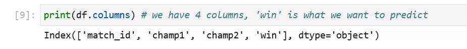


Finally, we print information about the dataset, to check whether we have any null / empty values in any of the columns:

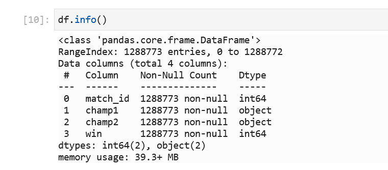


In this case we don't have any null-values, otherwise we'd drop these null values or replace them with filler values / placeholders. This is especially important to check if the dataset hasn't been curated by anyone else before; checking for **data consistency** is very important if the dataset is produced by ourselves.

## Task 6: Drop ID columns

We drop columns that represent identifiers.


> **Note**: the inplace=True option persists the __drop__ operation in the __df__ object. This basically means that we don't need to assign this operation back to the dataframe, as the operation is performed directly on the same dataframe.

## Task 7: Split into Train-Test

To perform ML properly, we need to take the dataset we're going to work with, and split it into two:

- A training dataset, from which our ML model will learn to make predictions.
- A testing dataset, from which our ML model will validate the predictions it makes, and check how accurate it was compared to the truth.

In ML, it's very typical to find a 80% train / 20% test structure, as it provides enough data for the model to be trained, and enough data to check the accuracy of the model without having too much / too little data in either of the datasets.


We split our data into train-test sets:

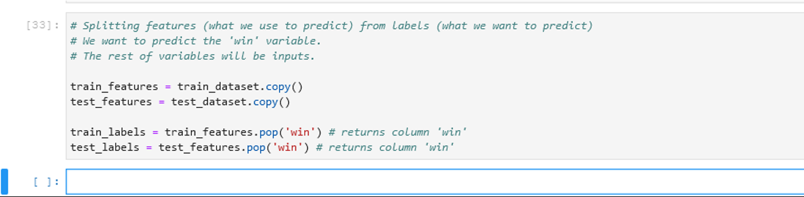

## Task 8: Encode Data

In order for an ML model to accept "words", or as we call them, "Strings" or categorical variables, we need to make a conversion from a String into a meaningful thing for the model. We have to understand that a ML model is just a result of a computer making millions of operations per second; and all these operations are made with numbers.

Therefore, we'll always need to modify our String columns into numerical columns in one way or the other. There are mainly **two** ways to do this:

- Label encoding: each distinct String / word will be represented by a distinct number.

    > So, imagine we have 5 different Strings, we'll end up with an encoded column with values in the range of [0, 4].

- One-Hot encoding: this technique creates additional features / columns, based on the number of unique values in the column we're trying to convert. In computer terms, it performs a "binary representation" of any String.

    > Therefore, for the previous example where we have 5 different Strings, we'd end up with 3 additional columns (2^2=4 (not enough), 2^3=8 (enough)), and every String would be represented in its binary form. E.g. String 1 would be 000 (0 in decimal), the last String would be 101 (4 in decimal).

One-hot encoding is typically more complex and requires some knowledge about binary calculus, if you want to fully understand it. It's much easier to use **label encoding**. 


So, that's what we do here. We encode the data following the Data Science process:

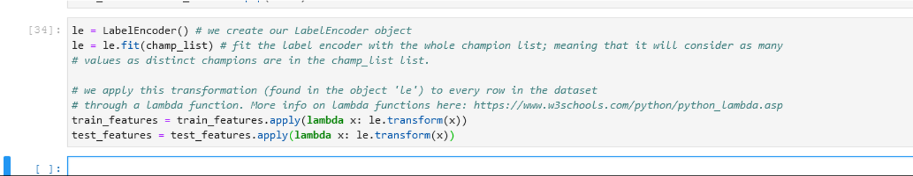

## Task 9: Scale Data

Now that we have our categorical variables properly encoded into numerical variables, we need to apply **scaling** to all variables.
Why is this important? Because, depending on which ML model to train, each of them will behave differently; and some of these models may consider "bigger" values as more important; this isn't what we want.

Therefore, we need to scale all variables in these numerical columns, into variables with similar values, which ML models like more.

There are several ways to apply scaling:
- [Min/max scaling](https://scikit-learn.org/stable/modules/generated/sklearn.preprocessing.MinMaxScaler.html): transforms a variable by scaling each value into a given range (modifiable, by default in the range [0, 1]).
- [Standard scaling](https://scikit-learn.org/stable/modules/generated/sklearn.preprocessing.StandardScaler.html): it applies the following formula:
    z = (x - u) / s
    where z = scaled value, x = original value, u = feature mean/average, s = feature standard deviation


We'll apply standard scaling in this case, and apply the transformation to the datasets.


After scaling the data, we can fit our model. We choose a Logistic Regression model as an example:

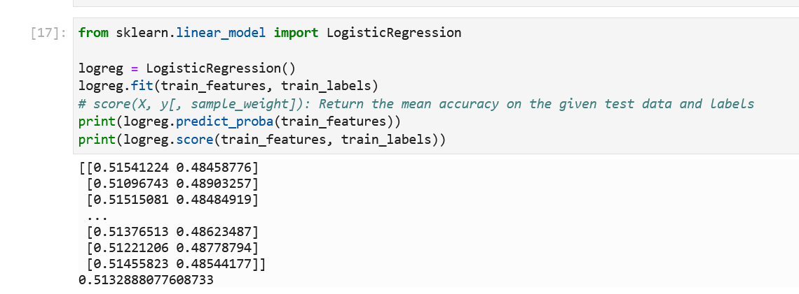

> **Note**: find additional documentation on [available sklearn linear models here.](https://scikit-learn.org/stable/modules/linear_model.html)

The accuracies obtained for the logistic regression classifier are 0.51. With so few variables, this is expected. We could be making better assumptions by having a bit of knowledge about the game and champion performances. We need to improve our model in some way. There are different ways to do this:

- Adding meaningful variables to the model
- Testing new regression / classification algorithms, other than Logistic Regression
- Having a more specific target variable. This target variable is only a boolean and doesn't allow for fine-grained predictions, it's either 0 or 1.

## Task 10: Make New Predictions

However, we can still make predictions using our model. The code to make a prediction needs to consider new data, encode it and then make a prediction.

First:

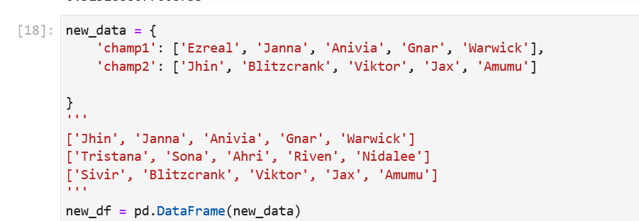


Now, we transform our data.


> **Note**: the data we create, we also have to apply the same transformations as we did to the original model, otherwise the model wouldn't understand the input!

And we get our label-encoded columns:


As we can see, our champion input variables have been properly label-**encoded**. In this specific case, since these are the two only variables we have for our model (feature variables, variables we use to predict), applying a standard scaler will not make a difference, because all variables have a standard deviation of 1 between each other (all champions are translated into distinct integer numbers).
> **Note**: in other cases, after applying label encoding, it's also beneficial to scale values, so that decision trees / ML models don't consider this variable to be more important than others with smaller values.

In our model, as it is very __limited__ in regards to input variables and accuracy, we'll make assumptions / calculations of our own: we'll calculate a team's winning chances by calculating the winning probability of each lane, and seeing how much these probabilities differ.


If we make the prediction:

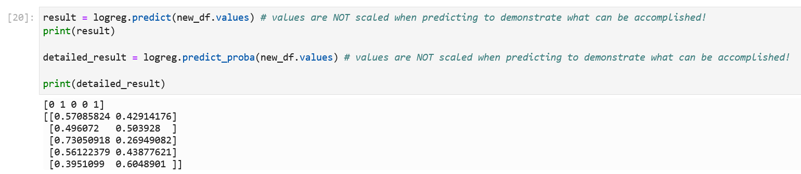

Finally, we create an auxiliary function to tell us which team is more likely to win. We calculate any probability that exceeds 50% and sum them all.

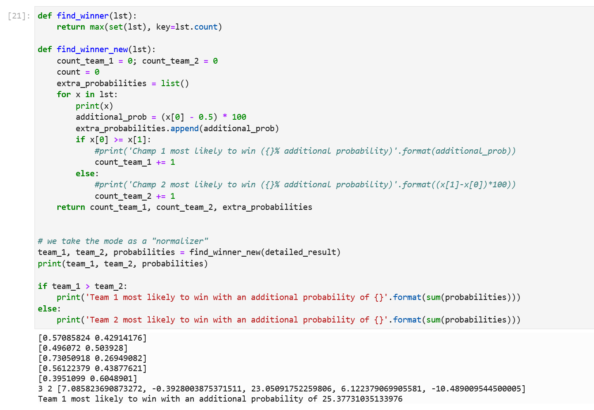


The results of the prediction indicates the predicted winning team in each case. In this case, it's predicting `champ1` to win in three out of five. Adding this to the ML model actually improves the conclusions we can extract from our model, but not of the model itself: we're simply combining a **51% accuracy** ML model with additional statistics to attempt a better prediction. 

Finally, to see the results in a human-readable way, we need to apply the `inverse_transform()` function to our still-encoded data:


We can see which champions are from each team, and return human-readable results, which makes our model more understandable.

You may now [proceed to the next lab](#next).


## Annex: Using your Own DataSets

If you're using your own data instead of the datasets provided by default (having generated them by following the workshop), and you have [all the aforementioned prerequisites](https://github.com/oracle-devrel/leagueoflegends-optimizer/blob/livelabs/hols/dataextraction/intro/intro.md) installed, you can check out the notebook called _`notebooks/hol1_online_analysis.ipynb`_ which connects directly to the Autonomous DB through Instant Client and the database's wallet and creates a model from scratch.

> **Note**: this notebook is already downloaded to your Data Science environment if you've followed all steps. The path is _`/home/datascience/leagueoflegends-optimizer/notebooks/hol1_online_analysis.ipynb`_.


## Acknowledgements

* **Author** - Nacho Martinez, Data Science Advocate @ DevRel
* **Contributors** -  Victor Martin, Product Strategy Director
* **Last Updated By/Date** - February 20th, 2023
