# Creating the Model

## Introduction

In this lab, we'll be creating all Machine Learning Models. This model will attempt to use as many variables as possible, whilst taking advantage of the power of AutoML (remember, work smart, not hard!). It'll be useful to us as it introduces the most basic and fundamental ML concepts.

Estimated Time: 45 minutes

### Prerequisites

* An Oracle Free Tier, Paid or LiveLabs Cloud Account
* Active Oracle Cloud Account with available credits to use for Data Science service.
* [Previously created](https://github.com/oracle-devrel/leagueoflegends-optimizer/blob/livelabs/hols/dataextraction/infra/infra.md) OCI Data Science Environment

## Task 1: Set up OCI Data Science Environment

[Having previously created our OCI Data Science environment](https://github.com/oracle-devrel/leagueoflegends-optimizer/blob/livelabs/hols/dataextraction/infra/infra.md), we need to install the necessary Python dependencies to execute our code. For that, we'll access our environment.

1. We open the notebook that was provisioned:

    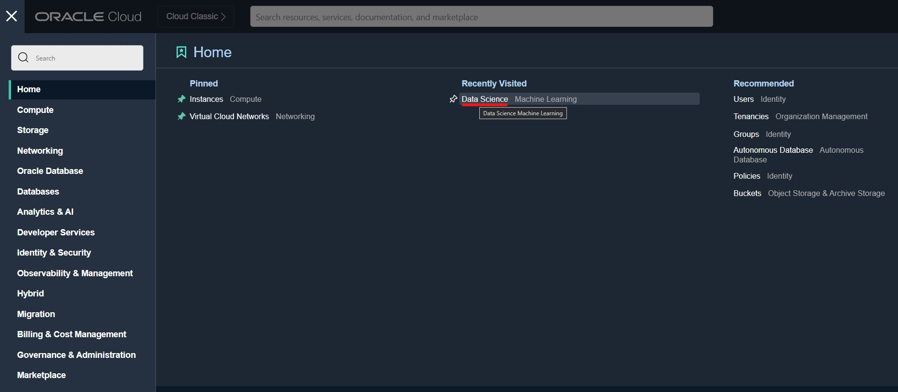

    > **Note**: You may find the Data Science section by also searching in the top left bar, or in the Analytics & AI tab, if it doesn't appear in "Recently visited" for you:

    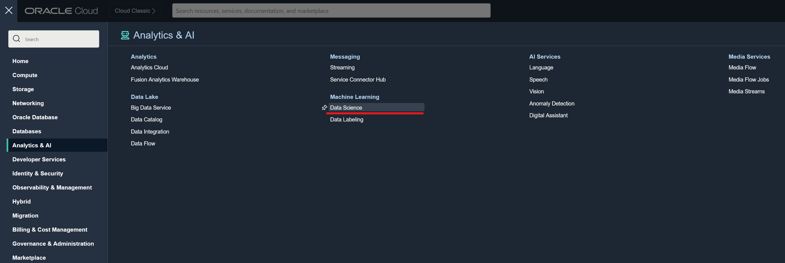

    Now, we have access to a [list of our Data Science projects launched within OCI.](https://cloud.oracle.com/data-science/projects) We access our project, and inside our project we'll find the notebook.

    > **Note**: The name of the notebook may be different than shown here in the screenshot.

    

    

    You should now see the Jupyter environment

    

2. We now need to load our notebook and datasets into our environment. For that, we open a new terminal inside our environment:

    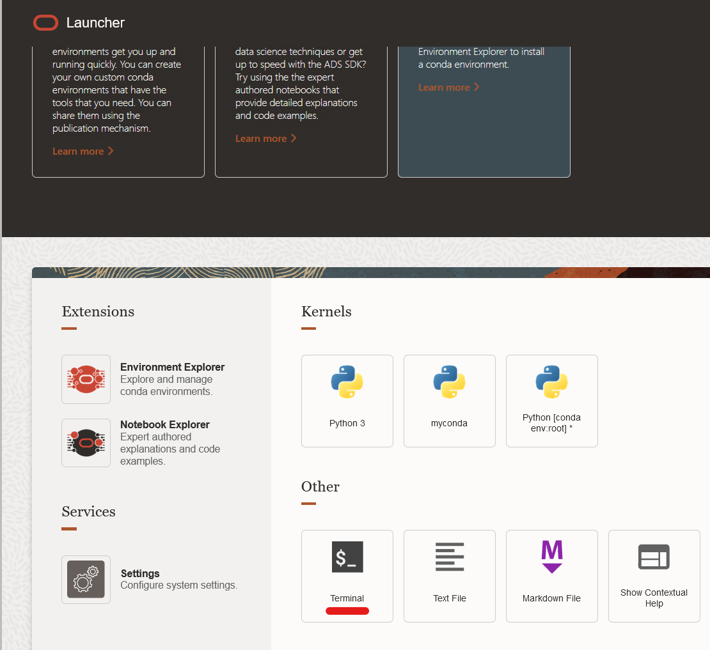

    Then, we execute the following command, which will download all necessary datasets:

    ```bash
    <copy>
    wget https://objectstorage.eu-frankfurt-1.oraclecloud.com/p/FcwFW-_ycli9z8O_3Jf8gHbc1Fr8HkG9-vnL4I7A07mENI60L8WIMGtG5cc8Qmuu/n/axywji1aljc2/b/league-hol-ocw-datasets/o/league_ocw_2023.zip && unzip league_ocw_2023.zip -d /home/datascience/.
    </copy>
    ```

    This process should take about a minute.

    

    Now, download the repository (if you haven't already):

    ```bash
    <copy>
    git clone --branch livelabs https://github.com/oracle-devrel/leagueoflegends-optimizer.git
    </copy>
    ```

    After this, we will open the notebook called _`models_2023.ipynb`_ located in _`leagueoflegends-optimizer/notebooks`_ by double clicking it.

3. Now, with our Python dependencies installed and our repository and notebook ready, we're ready to run it from the first cell. Make sure to select the correct Kernel (the one that you have configured and has all Python dependencies installed within it) from the Kernel dropdown menu:

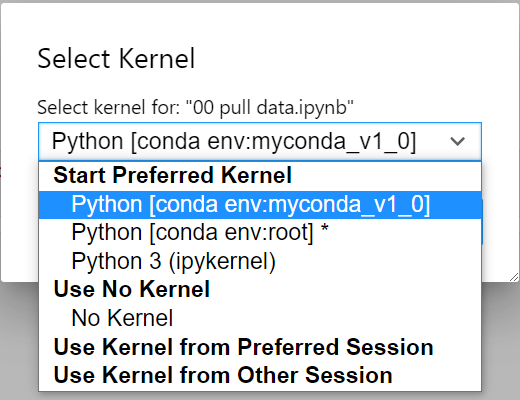

## Task 2: The Data Structure

From our dataset, we can observe an example of the data structure we're going to use to build our model:


It is important to remember that structuring and manipulating data in the data science process takes about 80 to 90% of the time, according to expert sources (image courtesy of [“2020 State of Data Science: Moving From Hype Toward Maturity.”](https://www.anaconda.com/state-of-data-science-2020)), and we shouldn't be discouraged when spending most of our time processing and manipulating data structures. The ML algorithm is the easy part if you've correctly identified the correct data structure and adapted it to the structure ML algorithms and pipelines expect.


## Task 3: Load Data / Generate Dataset

First, we load the model and train-test split it.

To perform ML properly, we need to take the dataset we're going to work with, and split it into two:

* A **training** dataset, from which our ML model will learn to make predictions.
* A **testing** dataset, from which our ML model will validate the predictions it makes, and check how accurate it was compared to the truth.

In ML, it's very typical to find values around 80% train / 20% test proportions, as it provides enough data for the model to be trained, and enough data to check the accuracy of the model without having too much / too little data in either of the datasets.

After this split, we divide the whole dataset into two separate files, one containing training data (85% of the original dataset) and testing data (15%).

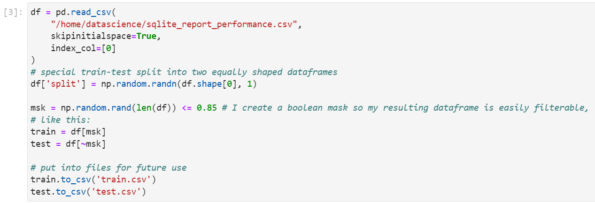

Then, we begin with simple data exploration of our initial dataset. Histograms are particularly useful to find the distribution of one (or many!) variables in our dataset and see if they follow any known statistical distribution.

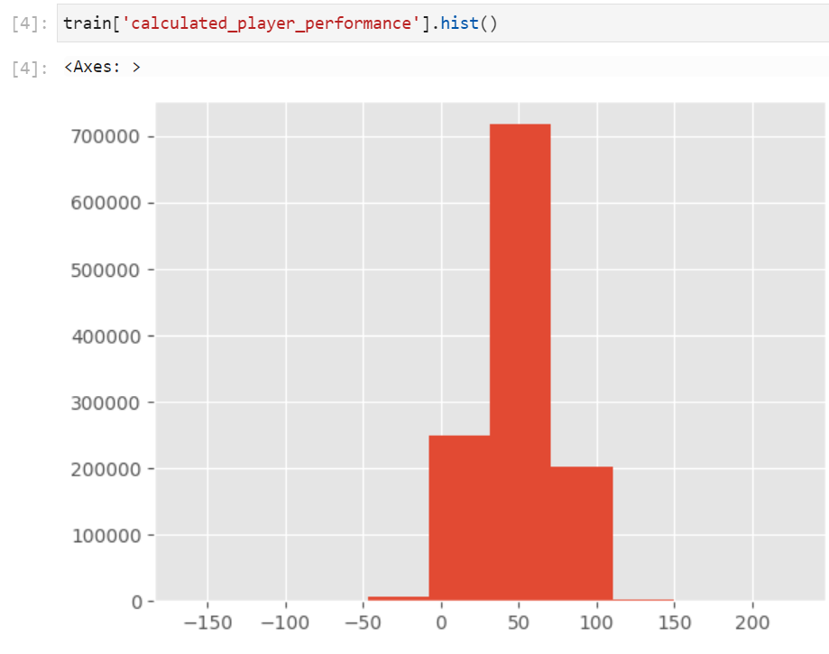

It's also good to look at our new variables `f1...f3` and their minimum, average, maximum:

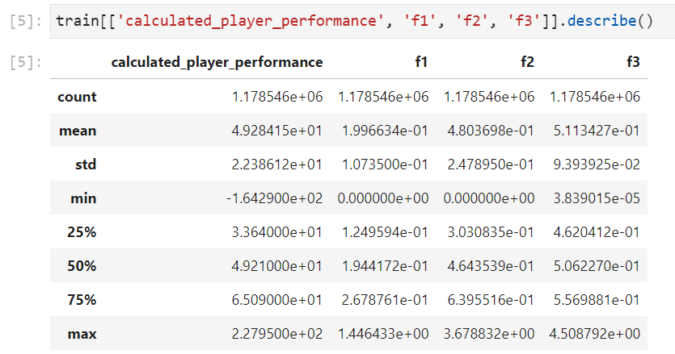

This will also help us determine what to return to the user when they're playing a game in the end: the closer they are to the maximum, the better they will have performed, and we also need to adjust that accordingly.

We're also interested in other variables' histograms, especially the ones around people getting multiple kills in a row, number of wards, big jungle objectives, match durations... Basically statistics that I find personally interesting after finishing a League match myself.

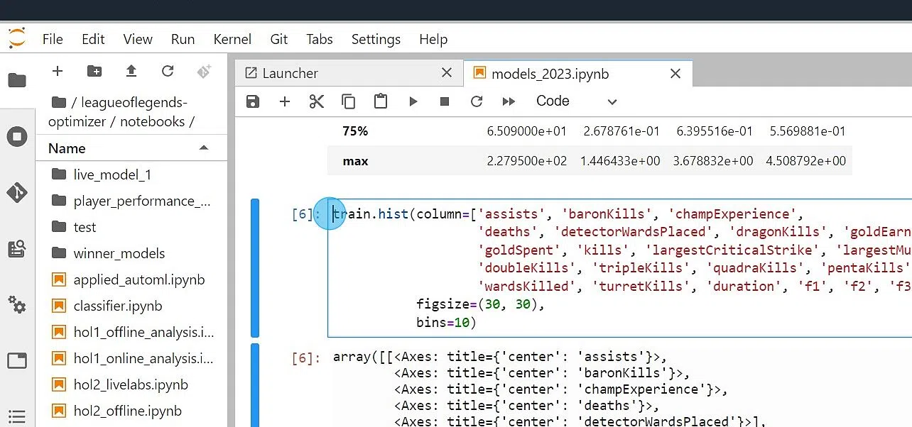

After getting a rough idea of what our dataset and some of our variables contain, it's time to tell the ML model which variables we want as input and which ones as output.

For this example (in the notebook, we create several models), we'll first drop those columns we don't want to use as inputs or outputs - in this first model, we don't want to use any `f1...f5` variables in our dataset, as we're going to create a model with League's original data to begin with:

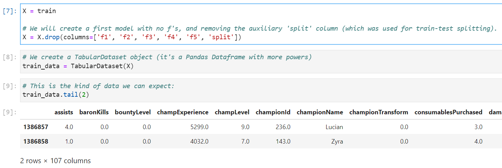

After we create our `TabularDataset()` object (which extends a pandas dataframe and therefore has most of panda's functions available), we're ready to start training.

## Task 4: Model Training

Now that we've seen the shape of our dataset and we have the variable we want to predict (in this case, calculated_player_performance), we train as many models as possible for 10 minutes. We can instantiate a `TabularPredictor()` which takes most of the difficulties of usually writing this kind of code out of the equation:

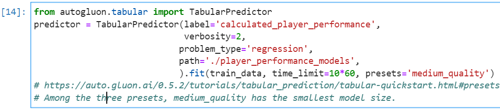

We need to specify that this problem is a regression problem (we're predicting numerical, continuous values (not integers)) and we specify which variable it is we're trying to predict through the `label` parameter.

The preset is a pre-configuration that restraints the amount of iterations, models, and time dedicated to train each model, to achieve some "quality" defined as a preset.
> **Note**: find all available presets [here](https://auto.gluon.ai/0.5.2/tutorials/tabular_prediction/tabular-quickstart.html#presets).

After our training is done (about 10 minutes), we can display some results:

First, we display a leaderboard of the best trained models ordered by decreasing RMSE. If you're not familiar with this concept, don't worry, we'll revisit all metrics right below, in our Model Testing task. This will help us see which models perform better against the target variable that we specified before:

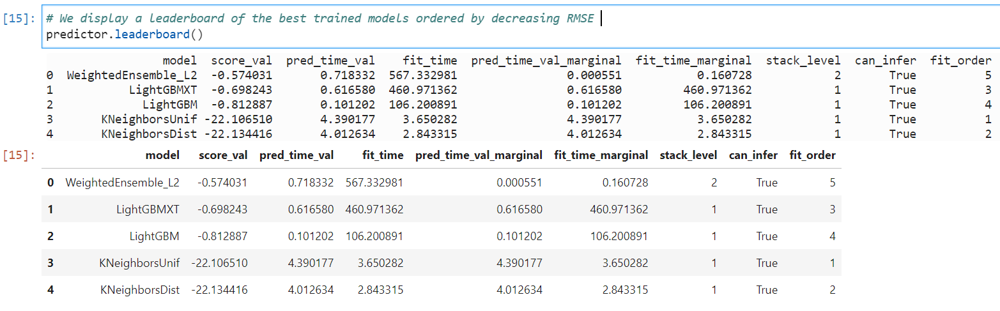

Note that our Level 2 Weighted Ensemble has the lowest RMSE of all: we'll probably want to use this model.


> **Note**: this is an example of an weighted ensemble model, in which decisions are taken using a technique called **bagging**: every model makes a prediction, and the best models will weigh more upon the final decision.

## Task 5: Model Testing

After training is done, we need to check whether the training we did was actually useful or a waste of time. To achieve this, we make use of some metrics, which depend on the type of problem we're dealing with.

For example, in a binary classification problem (where we're trying to predict if something is either 0 or 1), I typically use **accuracy, precision, recall and f1-score** as standard evaluation metrics:


> **Note**: an example on how each one of these 4 metrics are calculated just by looking at the Confusion Matrix.

However, as we're dealing with a regression problem, the most popular metrics are: the MSE, MAE, RMSE, R-Squared and variants of these coefficients.

The MSE, MAE, RMSE, and R-Squared metrics are mainly used to evaluate the prediction error rates and model performance in regression analysis.

* MAE (Mean absolute error) represents the difference between the original and predicted values extracted by averaged the absolute difference over the data set.
* MSE (Mean Squared Error) represents the difference between the original and predicted values extracted by squared the average difference over the data set.
* RMSE (Root Mean Squared Error) is the error rate by the square root of MSE.
* R-squared (Coefficient of determination) represents the coefficient of how well the values fit compared to the original values.
    The value from 0 to 1 interpreted as percentages. The higher the value is, the better the model is.
* The Pearson correlation coefficient is a descriptive statistic, meaning that it summarizes the characteristics of a dataset
    Specifically, it describes the strength and direction of the linear relationship between two quantitative variables.

Note that, in our code, we need to use our **testing dataset** as the one to validate our metrics (we'll have the testing data to check against).

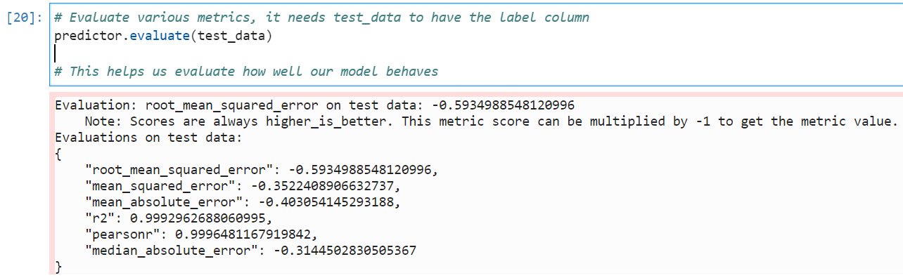

We're also able to extract the feature importance of our model. This is an awesome calculation provided to us automatically by the AutoML library.
Feature importance is an index that represents the measure of contribution of each feature in our ML model.
> **Note**: it's important to note that feature importance depends on the model and dataset used, and different algorithms may assign different importance values to the same set of features.

For more advanced Machine Learning practicioners, there's a caveat I need to make here about certain types of regularization (like *L1*/*Lasso* regularization) - a technique that's used to often prevent overfitting and improve the generalized performance of a model -: it can force some coefficients to become zero, rendering those coefficients' variables useless in a model.

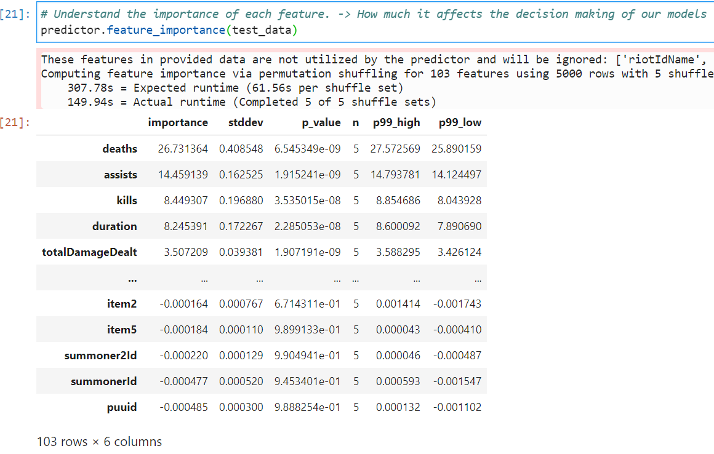
> **Note**: if I have two variables with importances N and M, the first variable will have an importance N/M times higher than the second variable, and viceversa.

This means that our model takes `deaths, assists, kills` as the three most important variables, and the fourth most important variable is the game duration.

After creating this function and invoking it, we will obtain a resulting CSV file or dataframe object. We'll use this new object to create our model.

## Task 6: Creating Extra Models

The rest of the notebook is similar to the process we've followed until now, with a few changes, which shall be mentioned here for clarity.

### Win Prediction Model (2nd Model)

The second model we create is a winning predictor (a binary classifier that tries to predict whether the player won or lost, based on all input variables). We specify that this is a binary classification problem this way:

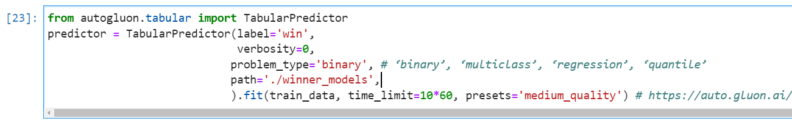

The results from this model are very promising, reaching up to 99.37% accuracy:


> **Note**: if you're planning to run inference (deploy your model and make predictions) on a low-end computer, you might be better off with the Light Gradient Boosted Model, as it's prediction times are about 100 times faster than our L2 Weighted Ensemble.

### Live Client API Compatible Model

And now that we have one model for each, we attempt to create a model only using our `f1...f3` variables as discussed during the workshop. We call this model _Live Client API Compatible Model_ as it utilizes as much temporal data as possible from the API return object.

These variables were calculated like this:

* Kills + assists / gameTime ==> kills + assists ratio ==> `f2`
* Deaths / gameTime ==> death ratio ==> `f1`
* xp / gameTime ==> xp per min ==> `f3`

In our dataset, we also had two other variables that I was hoping I could also calculate with Live Client API data, but these variables weren't possible to accurately calculate:

* `f4`, which represented the total amount of damage per minute, wasn't present in the Live Client API in any field
* `f5`, which represented the total amount of gold per minute, wasn't either. You can only extract the **current** amount of gold, which doesn't add any real value to the model.

So, the idea now is to create a model that, given f1, f2 and f3, and the champion name, is **able to predict any player's performance**.

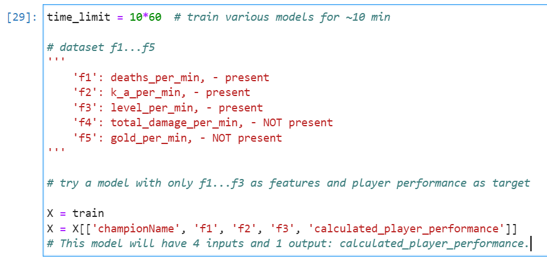

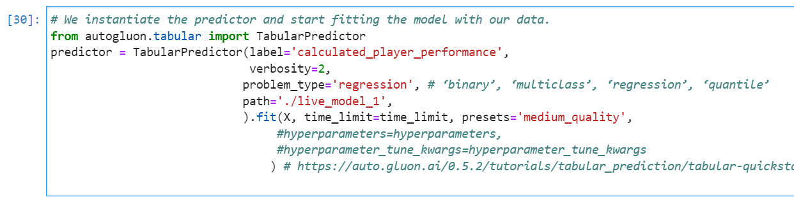


> **Note**: the RMSE in this third experiment, compared to the first model (both models predict the same target variable `calculated_player_performance`) is higher, which I expected, since we're using only 4 input variables for this model instead of 100+. However, as our leaderboard indicates, all these models are able to properly **infer** a player's performance, even if the RMSE is a bit more elevated.

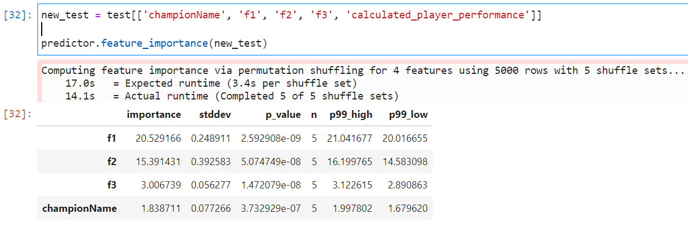

Just as an interesting observation, our model's importance is mostly based around `f1` and `f2`, being `f3` about 5-8 times less important than the other two.

## Task 7: Downloading Models

If you want to use these models in your computer, while you play League, you will need to *zip* all generated models into a file and download it to your computer. 

In a terminal, you can run the following command to bundle all directories into one file:

```bash
<copy>
zip -r all_models.zip /home/datascience/leagueoflegends-optimizer/notebooks/live_model_1/ /home/datascience/leagueoflegends-optimizer/notebooks/player_performance_models /home/datascience/leagueoflegends-optimizer/notebooks/winner_models/
</copy>
```

Then go to the file explorer and download the selected file:

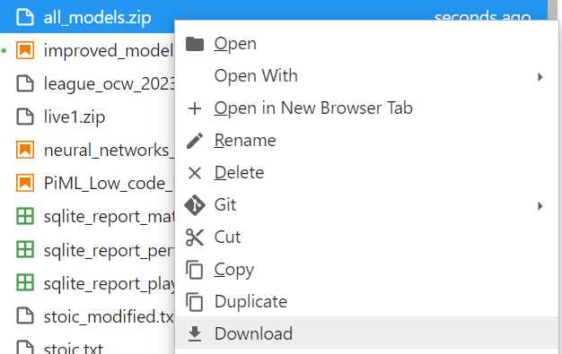

Now, we have successfully completed the Data Science process! We have:

* Loaded and Explored the dataset
* Created some useful visualizations through histograms and `.describe()`
* Created some TabularPredictors to help us autotrain models
* Evaluated each model's performance against a **test** dataset
* Saved these models for future deployment -

You may now [proceed to the next lab](#next).

## Acknowledgements

* **Author** - Nacho Martinez, Data Science Advocate @ DevRel
* **Contributors** -  Victor Martin, Product Strategy Director
* **Last Updated By/Date** - May 28th, 2023
