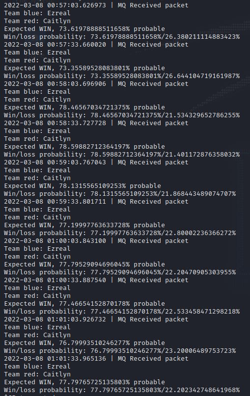
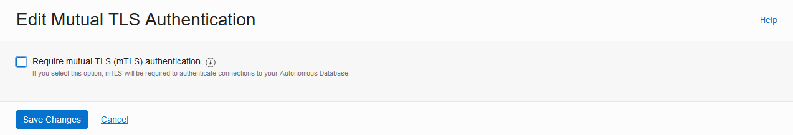
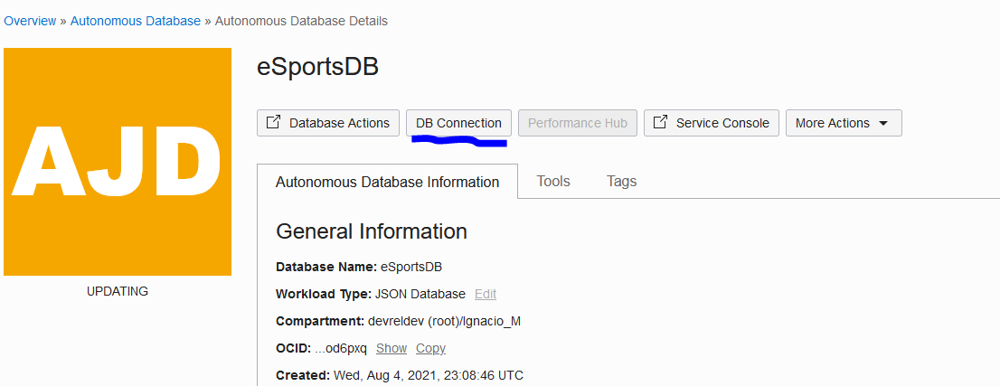
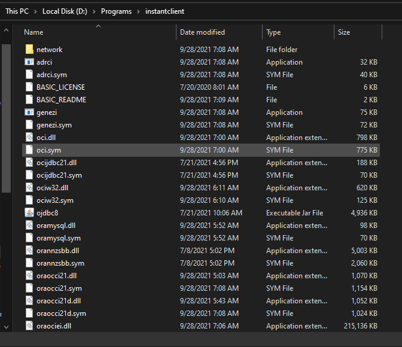

# Infrastructure

## Introduction
Welcome to this hands-on lab, where we'll talk about how we can leverage the power of AI with League of Legends in a unique an innovative way. We'll do a deep dive into the extractable data through the game's API, as well as how to structure this data, and how to use it to train our own Machine Learning model to generate real-time predictions about any match.



The above image represents the final functionality of this workshop, where we're able to use our already-trained ML model to make real-time predictions about our in-game performances. 

Estimated Lab Time: xx minutes

### Prerequisites

* An Oracle Free Tier, Paid or LiveLabs Cloud Account
* Active Oracle Cloud Account with available credits to use for Data Science service.

## Task 1: Get yourself familiar with League of Legends

We'll also need to create an autonomous database. We'll use it as our storage for our generated datasets and access points as a whole.

1. FIXME In this Hands-On Lab (HOL), we'll start from the assumption that people know about how League of Legends' matchmaking system works. If you have time and don't know a lot about League of Legends, I recommended reading these lists of articles (included in the repository as well) to get a feel of what we'll talk about in the HOL:

  - [Article 1](https://github.com/oracle-devrel/leagueoflegends-optimizer/blob/main/articles/article1.md): League of Legends Optimizer using Oracle Cloud Infrastructure: Data Extraction & Processing
  - [Article 2](https://github.com/oracle-devrel/leagueoflegends-optimizer/blob/main/articles/article2.md): League of Legends Optimizer using Oracle Cloud Infrastructure: Data Extraction & Processing II
  - [Article 3](https://github.com/oracle-devrel/leagueoflegends-optimizer/blob/main/articles/article3.md): League of Legends Optimizer using Oracle Cloud Infrastructure: Building an Adversarial League of Legends AI Model
  - [Article 4](https://github.com/oracle-devrel/leagueoflegends-optimizer/blob/main/articles/article4.md): League of Legends Optimizer using Oracle Cloud Infrastructure: Real-Time predictions
  - [Article 5](https://github.com/oracle-devrel/leagueoflegends-optimizer/blob/main/articles/article5.md): League of Legends Optimizer using Oracle Cloud Infrastructure: Real-Time predictions II

## Task 2: Generate SSH key pair

1. Go to Cloud Shell

2. On the Cloud Shell terminal run this command:

    ```
    $ <copy>ssh-keygen -t rsa -b 2048
    ```

3. TODO

## Task 3: Create an Autonomous Database

We'll also need to create an autonomous database. We'll use it as our storage for our generated datasets and access points as a whole.

1. TODO

2. After creating the autonomous database, you should have access to this panel in OCI:
    

3. At the panel, we're going to modify a couple of network settings to allow us to connect using TLS instead of m-TLS (mutual TLS). Long story short, using TLS instead of mTLS will make the task of connecting to the database easier (and additionally, it makes it possible to connect and use the __python-oracledb__ thin client if we want to, instead of only using the Thick client).

    >Note that activating TLS as the authentication mechanism doesn't restrict us from connecting using mTLS still, it just expands our possibilities of connecting
    >**Note**: mTLS will use port 1522 by default and TLS will use port 1521. If you're in a machine with firewall activated, make sure that in/egress firewall rules are suited for those ports.
4. So, we will need to modify the Access Control List (ACL) to allow our own IP address to connect to the database (or whichever IP you want). In my case, I've added the most unrestrictive CIDR block, so that anyone can make a request with the proper username/password/connection string, by adding the CIDR block 0.0.0.0/0 (all IPs):
    
5. And finally, disable the parameter that "requires" us to connect through mTLS, and make TLS authentication also possible:
    
6. Finally, after the database has finished updating, we can access the "DB Connection" section on top, and get our connection strings:
    
7. Note that we want our TLS connection strings (not mTLS connection strings) as they are different.
    
8. You can use any of the connection strings available, just note that the __tpurgent__ connection strings supports parallel calls and many more operations per second compared to all other connection strings. It's reserved for urgent operations, but since we're the only ones who are going to use the database, and just for this use case, let's not worry about prioritizing our tasks for now.
9. So, in my case, an example connection string would be:
    ```bash
    (description= (retry_count=20)(retry_delay=3)(address=(protocol=tcps)(port=1521)(host=XXXXXXXXXXXX))(connect_data=(service_name=XXXXXXXXXXXXXXXX))(security=(ssl_server_dn_match=yes)(ssl_server_cert_dn="CN=XXXXXXXXXXXXX, OU=XXXXX, O=XXXXX XXXXXX, L=Redwood XXXXX, ST=XXXX, C=XXXX")))
    ```
10. Let's make note of this as well, as we'll need to add this to our configuration file later on.

## Task 4: Download Instant Client and Wallet

As we're going to want to connect to our newly created Autonomous Database, we also need to consider the supporting Oracle packages required to support this connection. This is facilitated by Oracle Instant Client, which we'll need to install. 

1. Depending on the Operating System where you are, you'll need to download your respective binary files from [this link](https://www.oracle.com/database/technologies/instant-client/downloads.html). After installing Instant Client, we'll need to unzip the file into a directory (and remember the directory in which we put the unzipped file, we'll need to use it as a configuration parameter).

2. In the end, your installation should look something like this:
    

3. And, in my case, my path to my instant client installation would be:
    ```bash
    D:\Programs\instantclient
    ```
4. Which is what we'll use in our configuration file.
5. After setting up the Autonomous Database, we need to download the client credentials (required by design for mTLS connections).
6. After downloading it, we'll copy all the contents that we found inside our Instant Client installation folder.
7. Recalling the directory:
    ```bash
    D:\Programs\instantclient
    ```
8. So, in my case, I'd paste the contents of the wallet into:
    ```bash
    D:\Programs\instantclient\network\admin\
    ```
9. Finally, I'll modify the contents of **sqlnet.ora** to make sure that the Python thick client can find the files it needs to connect through mTLS. 
10. By default, the file has these contents:
    ```bash
    WALLET_LOCATION = (SOURCE = (METHOD = file) (METHOD_DATA = (DIRECTORY="?/network/admin")))
    SSL_SERVER_DN_MATCH=yes
    ```
11. I'll replace this with the specified directory where my wallet has been placed, and leave no place for error:
    ```bash
    WALLET_LOCATION = (SOURCE = (METHOD = file) (METHOD_DATA = (DIRECTORY="D:/Programs/instantclient/network/admin")))
    SSL_SERVER_DN_MATCH=yes
    ```

You may now [proceed to the next lab](#next).


## Acknowledgements

* **Author** - Nacho Martinez, Data Science Advocate @ DevRel
* **Contributors** -  Victor Martin, Product Strategy Director
* **Last Updated By/Date** - 
