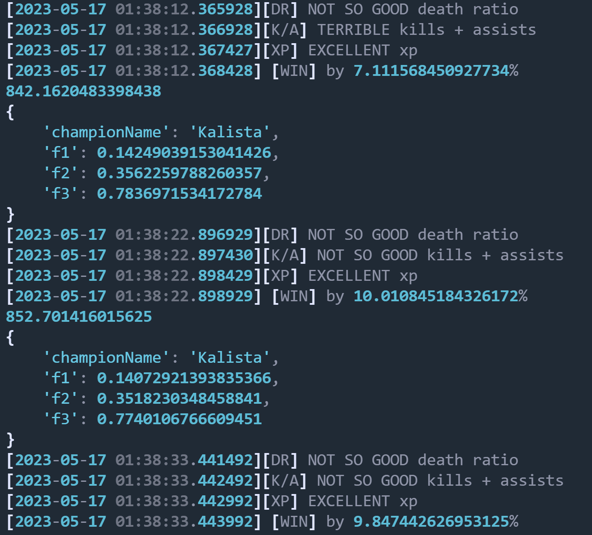
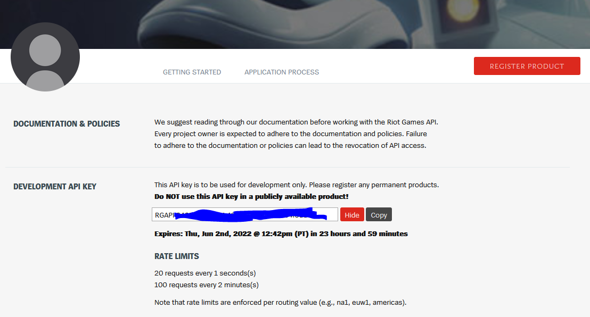
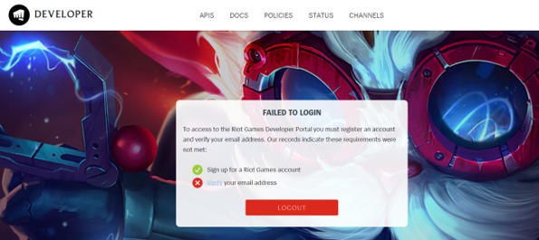
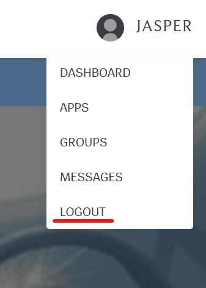

# Lab 1: Understand and Sign Up for League of Legends 

Estimated Time: 5-10 minutes

## Overview
League of Legends is a team-based strategy game in which two teams of five powerful champions face off to destroy the other’s base. As a player, you can choose from over 140 champions to make epic plays, secure kills, and take down towers as you battle your way to victory. To win, you'll need to destroy the enemy’s Nexus—the heart of each team's base.

Access and mobility play an important role in LoL. Your team needs to clear at least one lane to access the enemy Nexus. Blocking your path are defense structures called turrets and inhibitors. Each lane has three turrets and one inhibitor, and each Nexus is guarded by two turrets. In between the lanes is the jungle, where neutral monsters and jungle plants reside. The two most important monsters are Baron Nashor and the Drakes. Killing these units grants unique buffs for your team and can also turn the tide of the game.

Team composition depends on five positions. Each lane lends itself to certain kinds of champions and roles—try them all or lock in to the lane that calls you. Champions get stronger by earning experience to level up and buy more powerful items as the game progresses. Staying on top of these two factors is crucial to overpowering the enemy team and destroying their base.

In this lab, we'll leverage the power of AI with League of Legends in a unique and innovative way. We'll dive deep into extractable data (accessible through the game's API), how to structure this data, and how to use it to train our own Machine Learning model to generate real-time predictions about any match.

> **Note**: this image represents the functionality in 2022. You only got a winning chance probability.

> **Note**: this image represents the **new** functionality (2023). You get detailed insights about specific parts of your performance, such as your death ratio, your kill+assist ratio and your xp per minute. This allows you to get more information about what you could be doing right or wrong. Notice that in this screenshot, after getting a kill, my winning probabilities increase notably, and my kill + assist ratio, which was terrible until that moment, becomes "not so good". Last year's model had a lot of difficulties in detecting changes like these.

By the end of this workshop series, you will be able to use our already-trained ML model to make real-time predictions about our in-game performances. You will also get the chance to train your own model (with your own tuning hyperparameters) and use it while you play League.

We'll also need to create an autonomous database, which will serve as storage for our generated datasets and access points as a whole.

In this Hands-On Lab (HOL), we'll start with the assumption that users know about how League of Legends' matchmaking system works. If you have time and don't know a lot about League of Legends, we recommend reading these lists of articles (included in the repository as well) to get a feel for what we've done in the past, and what we'll partially cover in this Hands-on Lab:

1. [Article 1](https://github.com/oracle-devrel/leagueoflegends-optimizer/blob/livelabs/articles/article1.md): League of Legends Optimizer using Oracle Cloud Infrastructure: Data Extraction & Processing
2. [Article 2](https://github.com/oracle-devrel/leagueoflegends-optimizer/blob/livelabs/articles/article2.md): League of Legends Optimizer using Oracle Cloud Infrastructure: Data Extraction & Processing II
3. [Article 3](https://github.com/oracle-devrel/leagueoflegends-optimizer/blob/livelabs/articles/article3.md): League of Legends Optimizer using Oracle Cloud Infrastructure: Building an Adversarial League of Legends AI Model
4. [Article 4](https://github.com/oracle-devrel/leagueoflegends-optimizer/blob/livelabs/articles/article4.md): League of Legends Optimizer using Oracle Cloud Infrastructure: Real-Time predictions
5. [Article 5](https://github.com/oracle-devrel/leagueoflegends-optimizer/blob/livelabs/articles/article5.md): League of Legends Optimizer using Oracle Cloud Infrastructure: Real-Time predictions II

### Prerequisites

* An [Oracle Free Tier, Paid or LiveLabs Cloud Account](https://signup.cloud.oracle.com/?language=en&sourceType=:ow:de:ce::::RC_WWMK220210P00063:LoL_handsonLab_introduction&intcmp=:ow:de:ce::::RC_WWMK220210P00063:LoL_handsonLab_introduction)
* Active Oracle Cloud Account with available credits to use for Data Science service.
* Creating a League of Legends account and completing the in-game tutorial, as we'll need an account to get an API key and perform in-game tests. Also, you'll need to [download the game and register](https://www.leagueoflegends.com/en-gb/). 

## Task 1: Get Started

This instructional video explains what needs to be done to get an API key necessary to what we will explain in the next lab. 

[Watch the video](youtube:HUJgYfrHhYI)

1. First, you'll need to obtain a Riot Games API key [from the official Riot Games Developer website.](https://developer.riotgames.com/) For that, you need to create a League of Legends account (if you don't have one already) and request a development API key. Note that if you're planning to develop a League of Legends project out of this repository, you can also apply for a production API key which has a longer expiration date, as well as more requests per minute.
    
2. After creating the account, we [access the development website](https://developer.riotgames.com/) to find our development API key. Note that by default, the development API key expires every 24 hours. So, if you're planning to generate a dataset for more than 24 hours at a time, in the end you'll start getting HTTP unauthorized errors. To fix this, just regenerate the API key and use the new one.
    

If you do run into issues while you're obtaining the API key / you're not able to login to [the developer portal](https://developer.riotgames.com) like in this image:

Then make sure to sign out of your newly created account, at the top right corner of your screen:

And login back again. 
> **Note**: if you still get the error message "waiting for email confirmation" wait a couple of minutes and try again.

You may now [proceed to the next lab](#next).

## Acknowledgements

* **Author** - Nacho Martinez, Data Science Advocate @ DevRel
* **Editor** - Erin Dawson, DevRel Communications Manager
* **Contributors** -  Victor Martin, Product Strategy Director
* **Last Updated By/Date** - May 17th, 2023