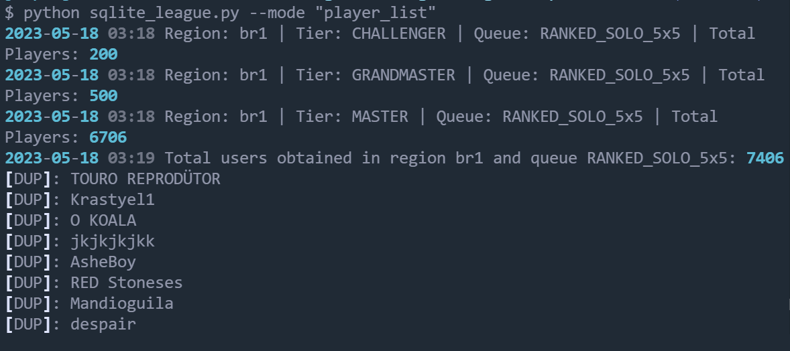
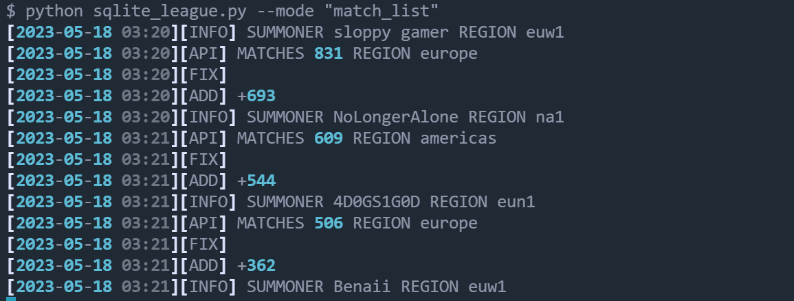

# Interacting with leagueoflegends-optimizer

Estimated Time: 30 minutes

## Introduction

If we want to build an AI/ML model, we need data. Lots and lots of data.

For that, Riot Games has provided us with several HTTPs endpoints to make requests and obtain this data. Through the [cloudshell_league.py](https://github.com/oracle-devrel/leagueoflegends-optimizer/src/cloudshell_league.py) file, we'll be able to make all the kinds of requests we want. This Python file has been programmed to allow input parameters and determine the execution mode.

All tools mentioned in this lab are designed to allow parallel and continuous execution, meaning that, if you don't stop execution of the optimizer, it will keep collecting data **indefinitely**. You're free to explore with how much data you want to extract using the optimizer.

This means that there's no "end" to the optimizer, it will keep running until you stop it, achieving more and more data if you keep it running.

We recommend going through each task and running each task for **5 minutes** or so if you're getting started; you're free to execute any command at any point afterwards, it won't interfere with already existing data.

### Prerequisites

* An [Oracle Free Tier](https://signup.cloud.oracle.com/?language=en&sourceType=:ow:de:ce::::RC_WWMK220210P00063:LoL_handsonLab_optimizer&intcmp=:ow:de:ce::::RC_WWMK220210P00063:LoL_handsonLab_optimizer), Paid, or LiveLabs Cloud Account
* Active Oracle Cloud Account with available credits to use for Data Science service.

### Objectives

In this lab, you will learn how to:

* Learn about what an API is and how it's accessed
* Extract different data types from Riot Games' API
* Manipulate the data to make it ML-ready
* Use this data to generate CSV datasets to later process
  
## Task 1: Extract Data / Generate Dataset

There are some things to consider. In League of Legends, and since there are several endpoints, in order to extract data, we will need to:

1. Get some players' information (their unique identifiers). Note that we will only operate with players above Masters elo, to reduce variability of finding mistakes in play in our dataset.
2. For each player, obtain their most recently played matches
3. For each match, extract its detailed report from the API
4. Format this data properly and store it
5. Repeat forever

The more you repeat this process, the more data your dataset will have. If you want to use my dataset, [check out this Kaggle dataset](https://www.kaggle.com/datasets/jasperan/league-of-legends-optimizer-dataset?select=sqlite_report_performance.csv) or refer to the Infrastructure lab to download it (step 6) if you haven't already.

0. Before executing anything, we need to create a local sqlite3 database by running:

    ```bash
    λ <copy>python src/init_db.py</copy>
    ```  

1. To extract player data, we can run:

    ```bash
    λ <copy>python src/cloudshell_league.py</copy>
    ```  

    
    > **Note**: note that in this case, since my dataset is already big enough, most players I extract are already in my database. It's recommended to run this every few months to get newer players, but variability above Masters elo is low.

    This execution option will iteratively look for League of Legends leaderboards in every region in the world, and insert these players' information into our database. If the user has already been inserted, it will prevent re-insertion.

2. To extract previously played matches' IDs from our pool of players in the database, we can do this:

    ```bash
    λ <copy>python src/cloudshell_league.py --mode="match_list"</copy>
    ```

    

    This command finds matches played by every player in our database, in every region. This allows us to obtain more matches per player, in case the player travels abroad from their original region, e.g. to compete internationally.

    > **Note**: This only extracts Match IDs. Processing these IDs is done in the next section

## Task 2: Process Player Performance

```bash
<copy>python src/process_player_performance.py</copy>

# it will then start extracting individual player matches' info and processing their performance.
```


## Task 3: Creating Final Dataset

Now that we have loads of players' performances calculated, we just have to pass this to a `csv` format.

```bash
<copy>python src/read_data.py</copy>


# this script will generate 3 csv files:

#   - performance_report.csv, with the processed data ready for ML
#   - player_report.csv, with various player information (Masters+)
#   - match_report.csv, with every player's extracted matches.
```

From `performance_report.csv`, we'll be able to create our Machine Learning pipeline in the next chapter.

You may now [proceed to the next lab](#next).

## Acknowledgements

* **Author** - Nacho Martinez, Data Science Advocate @ DevRel
* **Contributors** -  Victor Martin, Product Strategy Director
* **Last Updated By/Date** - July 20th, 2023
