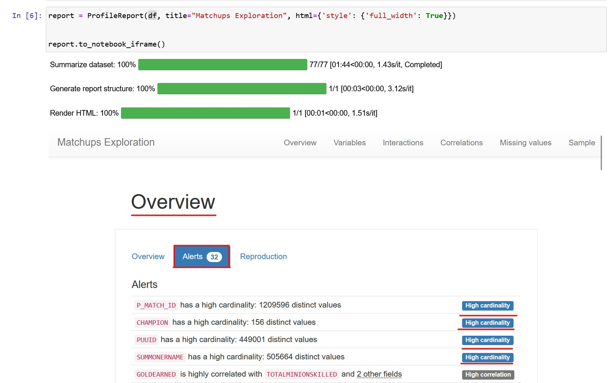

# Improving the model

In the past workshop, we created [a very simple model](https://github.com/oracle-devrel/leagueoflegends-optimizer/blob/livelabs/hols/dataextraction/creatingmodel/creatingmodel.md) with an accuracy of 51%. There are several ways in which we could improve the accuracy of the model: by adding more variables to our model, changing the approach to the model, hyperparametrization... However, having such a low accuracy from the start makes hyperparametrization not an option at this point, it's usually used when the baseline accuracy of a model is usually higher (generally speaking).


We're going to create a model that considers all variables in our **matchup** data structure, and reduce the complexity of our ML code by using AutoML open-source tools for data exploration and model training.

## Using pandas_profiling

By importing and using **`pandas_profiling`**, we get detailed, graphical insights into our dataset.

```python
# Read the dataset from local file
df = pd.read_json('matchups.json', orient='records')

# HTML report for Exploratory Data Analysis
report = ProfileReport(df, title="Matchups Exploration", html={'style': {'full_width': True}})

report.to_notebook_iframe()
```

This simple code generates a dynamic report that shows the data types, missing values, and other information about the data. We explore the Pearson's r correlation coefficient between the variables:


```python
# a simple look into our data
df.head(2)
```

| P_MATCH_ID | 	GOLDEARNED | 	TOTALMINIONSKILLED | 	WIN | 	KILLS | 	ASSISTS | 	DEATHS | 	CHAMPION | 	VISIONSCORE | 	PUUID | 	TOTALDAMAGEDEALTTOCHAMPIONS | 	SUMMONERNAME | 	GAMEVERSION |
| :--------: | :----------: | :---------------------: | :----: | :-----: | :------: | :------: | :--------: | :---------: | :--------: | :--------: | :--------: | :--------: |
| BR1_2309470512_jungle | 7670 | 37 | False | 4 | 2 | 7 | Graves | 23 | b1ZVlTG630NWh8Hgc7H-_-SErq3E3OkV50XSBuz_uzkIuA... |11215 | tired blessed | 	11.14.385.9967 |
| EUN1_2809958230_top | 11108 | 202 | False | 1 | 9 | 8 | Gwen | 28 | 19ii6j4OOWmkUaw_yAXhMOhcgUvZaK8M1yVT0I3HwBYQka... | 17617 | ozzyDD 	| 11.8.370.4668 |

## Choosing the right Variables

Hopefully, by using more variables, we'll give the underlying ML models more choices to predict from. However, not all variables are automatically interesting just by being in a dataset. We have to make this distinction. 

By exploring the data with `pandas_profiling`, we can easily observe which variables can be useful or not:



In this case, we have the columns  `summonername`, `p_match_id` and `puuid` with more than 400.000 values each, ranging up to 1.2 million distinct values). Considering that our dataset consists of 2.4 million rows, having a high cardinality probably means that the information stored in the column has many distinct values, and will not add value to our model.
> We know for a fact that these variables represent identifiers (either from a match or a player), so we can safely remove them. If we didn't remove them, AutoML tools would perform an encoding for the variables (probably one-hot encoding or label encoding) and conclude in the end that the variables were uselss.

```python
# drop columns we don't want (identifiers)
df = df.drop(columns=['summonername', 'p_match_id',
    'puuid'])
```

> Below is a screenshot of what happens when we don't remove these variables, and train a model with them as input variables. The result is having a feature importance very close to 0% for each variable.


## Creating + Fitting AutoML Model

We proceed to train our model with all variables, taking into consideration that most of the variables in our model are highly correlated. This is especially true for the amount of gold earned with respect to the number of kills and minions killed (which makes sense, as these are two of the actions that give out the most gold in-game). We also see that the vision score highly correlates with the amount of assists a player makes in a game.

```python
from autogluon.tabular import TabularPredictor, TabularDataset
# Create AutoGluon Tabular Dataset 
# https://auto.gluon.ai/stable/tutorials/tabular_prediction/index.html
df = TabularDataset(df)

train = df.sample(frac=0.8, random_state=200) # 80-20% train-test splitting
test = df.drop(train.index)
```

With the help of AutoGluon, we'll determine which label it is that we want to predict:

```python
# Determine the label in our TabularDataset we want to predict
label = 'win' # name of the target column / variable.
```

And then create a TabularPredictor object, by referencing the target label:

```python


# Create the tabular predictor with the target label by passing the training test
predictor = TabularPredictor(label=label,
                path='./autogluon_trained_models_liveclient_classifier').fit(train, time_limit=None)
```


We can now make predictions on our test data:

```python
# Make a test prediction from original test dataset
y_test = test[label] # we want 'win' column to be predicted


test_data_nolabel = test.drop(columns=[label])  # delete label column, also drop identifier column
# We have the testing dataset ready
test_data_nolabel.head(5)
```

## Making Predictions

After having our fitted model, we can make predictions to incoming data. First, we need to load the model, then make some predictions (in our case, we'll make predictions for each row in the testing dataset):

```python
# We load the model 
predictor = TabularPredictor.load('./model_file_name')

# Predict test values
y_pred = predictor.predict(test_data_nolabel)
print("Predictions:  \n", y_pred)

# Evaluate prediction performance
perf = predictor.evaluate_predictions(y_true=y_test, y_pred=y_pred, auxiliary_metrics=True)
```

We make a list of the best performing models, with descending accuracy:

```python
predictor.leaderboard(test, silent=True)
```

| model | score_test | score_val | pred_time_test | pred_time_val | fit_time | pred_time_test_marginal | pred_time_val_marginal | fit_time_marginal | stack_level | can_infer | fit_order |
| :----: | :---------: | :---------: | :-------------: | :-------------: | :--------: | :-------------: | :-------------: | :-------------: | :-------------: | :-------------: | :----------: |
| NeuralNetMXNet | 0.836975 |	0.836461 |	33.964055 | 2.709942 |	6597.902246 |	33.964055 |	2.709942 | 6597.902246 | 1 | True | 12 |
| NeuralNetFastAI | 0.835870 |	0.839318 |	5.002273 | 0.199540 |	823.687658 |	5.002273 | 0.199540 | 823.687658 | 	1 |	True |	10 |
| LightGBMXT |	0.835717 |	0.833317 | 	12.957499 | 0.471436 |	82.666493 | 	12.957499 |	0.471436 | 82.666493 | 	1	| True |	3 |
| LightGBMLarge | 0.835348 | 	0.831603 | 22.367250 | 1.271694 | 136.043589 | 22.367250 | 1.271694 | 136.043589 |	1 |	True |	13 |
| WeightedEnsemble_L2 | 0.833629 | 0.966949 | 53.280581 | 4.445315 | 7548.607457 | 0.009523 | 0.044953 | 8.442531 |	2 |	True |	14 |
| LightGBM | 0.832460 |	0.829127 | 5.237847 | 0.278245 | 57.027379 | 5.237847 | 0.278245 |	57.027379 |	1 |	True |	4 |
| RandomForestEntr | 0.824462 | 0.822840 | 21.206490 | 0.434653 | 396.571945 | 21.206490 |	0.434653 |	396.571945 |	1 |	True |	6 |
| RandomForestGini | 0.823243 | 0.821697 | 29.693281 | 0.436249 | 256.947097 | 29.693281 |	0.436249 |	256.947097 |	1 |	True |	5 |
| XGBoost |	0.823159 | 0.823602 | 2.646490 | 0.696468 |	27.096065 | 2.646490 | 0.696468 |	27.096065 |	1 |	True |	11 |
| ExtraTreesGini | 0.817348 | 0.817602 | 22.973135 | 0.235120 | 40.649245 | 22.973135 |	0.235120 |	40.649245 |	1 |	True |	8 |
| ExtraTreesEntr | 0.817314 | 0.817316 | 10.118013 | 0.233918 | 47.698864 | 10.118013 |	0.233918 |	47.698864 |	1 |	True |	9 |
| CatBoost | 0.789888 |	0.956377 | 1.347230 | 1.019444 | 35.908529 | 1.347230 |	1.019444 |	35.908529 |	1 |	True |	7 |
| KNeighborsUnif | 0.637996 | 0.641109 | 3.568800 | 0.234611 | 5.264223 | 3.568800 |	0.234611 |	5.264223 |	1 |	True |	1 |
| KNeighborsDist | 0.637668 | 0.640442 | 3.253163 | 0.237193 | 5.326229 | 3.253163 |	0.237193 |	5.326229 |	1 |	True |	2 |

> As we can see, including more variables in the model greatly improved the accuracy and reduced MAE and MSE of our model. We can also see that the model is able to predict the outcome of the game in the test data given the features in our data structure. This proves that a simple model is not always the best solution. We can achieve better results by using more advanced models, in this case about 83% accuracy, which is pretty good for a real-world problem.

> Also, note that we don't really care how the models are trained as long as they make good predictions. Of course, it's important to know the basics of ML to see how data is structured, but the most important lesson to take away is that the hardest part about data science and data engineering is not coding the ML model, but **understanding the data and the problem**, and **structuring** the data accordingly to satisfy our needs.

## The Problem and Next Steps

In short, in the first model, we didn't consider enough variables. The results of this ML model were no better than using simple statistics, and heavily relied on additional statistics support to make a bit more sense.

After expanding the model further, we saw that the model could make predictions much more accurately (about 83% accuracy). However, we needed to ask ourselves if this model is useful. Are we, as players of League of Legends, able to have this amount of data in the middle of a game? The answer is **no**. We're just given simple statistics like the gold from the team and KDA ratio. Only programatically through the API do we have the possibility to access all this data. So, while the model is pretty good, it doesn't have a practical side that we can use and take advantage of. This is what we'll explore in the fourth article in this series: integrating such a model (or a similar one) with data that we can actually use in real-time to make accurate predictions; data aligned with what players have at hand. Stay tuned for article 4!

## How can I get started on OCI?

Remember that you can always sign up for free with OCI! Your Oracle Cloud account provides a number of Always Free services and a Free Trial with US$300 of free credit to use on all eligible OCI services for up to 30 days. These Always Free services are available for an **unlimited** period of time. The Free Trial services may be used until your US$300 of free credits are consumed or the 30 days has expired, whichever comes first. You can [sign up here for free](https://signup.cloud.oracle.com/?source=:ex:tb:::::WWMK211125P00027&SC=:ex:tb:::::WWMK211125P00027&pcode=WWMK211125P00027).

## License

Written by [Ignacio Guillermo Martínez](https://www.linkedin.com/in/ignacio-g-martinez/) [@jasperan](https://github.com/jasperan)

Copyright (c) 2021 Oracle and/or its affiliates.

Licensed under the Universal Permissive License (UPL), Version 1.0.

See [LICENSE](../LICENSE) for more details.

