# Lab 3: Model Improvement with AutoGluon

## Introduction

In the past workshop, we created [a very simple model](https://github.com/oracle-devrel/leagueoflegends-optimizer/blob/livelabs/hols/dataextraction/creatingmodel/creatingmodel.md) with an accuracy of 51%. There are several ways in which we could improve the accuracy of the model: by adding more variables to our model, changing the approach to the model, hyper-parametrization... However, having such a low accuracy from the start makes hyper-parametrization not an option at this point, it's usually used when the baseline accuracy of a model is usually higher (generally speaking).

### Objectives

We're going to create a model that considers all variables in our **matchup** data structure, and reduce the complexity of our ML code by using AutoML open-source tools for data exploration and model training.

Downloading data from professional games, we built the dataset contained within `matchups.json`. 
    
For each match, we have 5 matchups (5 players play against each other in different roles and different places on the map), just like this one:
    
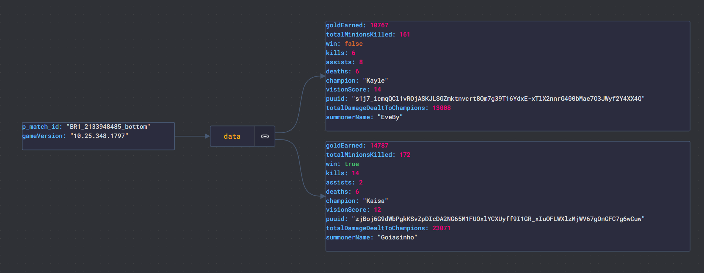

Estimated Time: 30 minutes

### Prerequisites

* An Oracle Free Tier, Paid or LiveLabs Cloud Account
* Active Oracle Cloud Account with available credits to use for Data Science service.
* (Optional) Having completed [the first workshop](../../workshops/dataextraction/index.html)

## Task 1: Offline DataSet Analysis

### Using pandas_profiling

By importing and using _`pandas_profiling`_, we get detailed, graphical insights into our dataset:

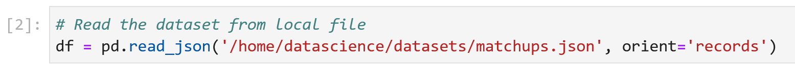

We then generate an HTML report for Exploratory Data Analysis:

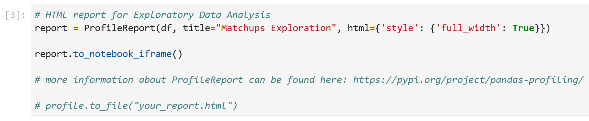

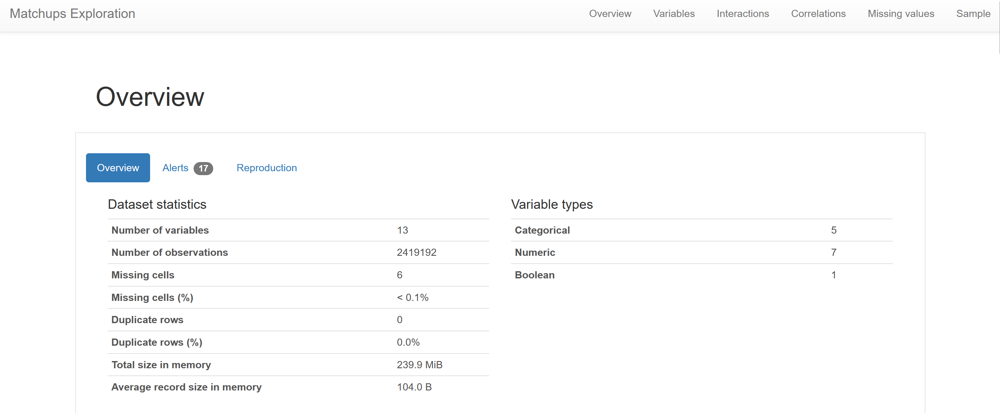

This simple code generates a dynamic report that shows the data types, missing values, and other information about the data. We explore correlation coefficients between the variables:

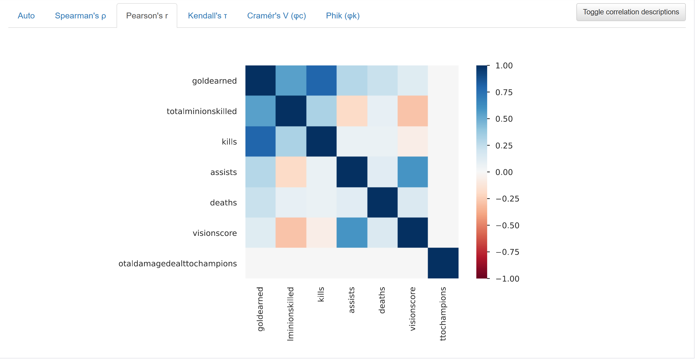

Now, we take a look at the data from our dataset, once we have transformed it to "tabular" format after reading it from the JSON file:

| _`P_MATCH_ID`_ | 	_GOLDEARNED_ | 	_TOTALMINIONSKILLED_ | 	_WIN_ | 	_KILLS_ | 	_ASSISTS_ | 	_DEATHS_ | 	_CHAMPION_ | 	_VISIONSCORE_ | 	_PUUID_ | 	_TOTALDAMAGEDEALTTOCHAMPIONS_ | 	_SUMMONERNAME_ | 	_GAMEVERSION_ |
| :--------: | :----------: | :---------------------: | :----: | :-----: | :------: | :------: | :--------: | :---------: | :--------: | :--------: | :--------: | :--------: |
| `BR1_2309470512_jungle` | 7670 | 37 | False | 4 | 2 | 7 | Graves | 23 | `b1ZVlTG630NWh8Hgc7H-_-SErq3E3OkV50XSBuz_uzkIuA...` |11215 | tired blessed | 	11.14.385.9967 |
| `EUN1_2809958230_top` | 11108 | 202 | False | 1 | 9 | 8 | Gwen | 28 | `19ii6j4OOWmkUaw_yAXhMOhcgUvZaK8M1yVT0I3HwBYQka...` | 17617 | ozzyDD 	| 11.8.370.4668 |

We display the number of all columns in the dataset:

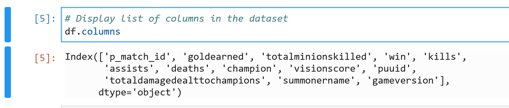

Additionally, we display some basic statistics _only from numerical columns_ within our dataset:

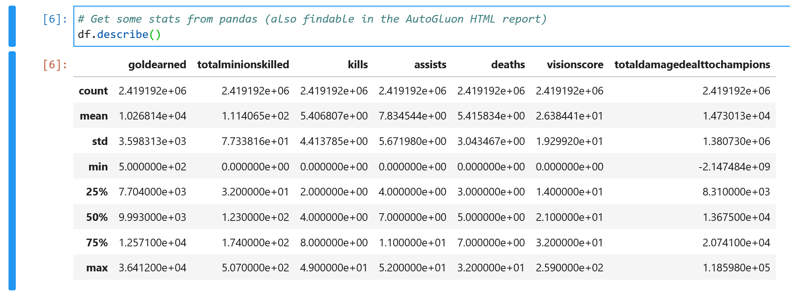

Finally, we take a very quick look into one data point from the dataset and what each variable contains:

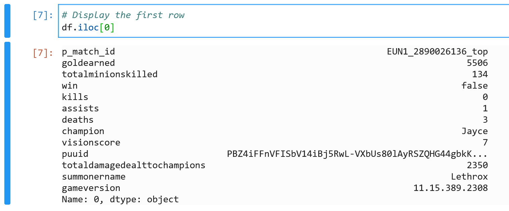

### Choose the Right Variables

Hopefully, by using more variables, we'll give the underlying ML models more choices to predict from. However, not all variables are automatically interesting just by being in a dataset. We have to decide which variables are worth it and which ones aren't.

By exploring the data with _`pandas_profiling`_, we can easily observe which variables can be useful or not:

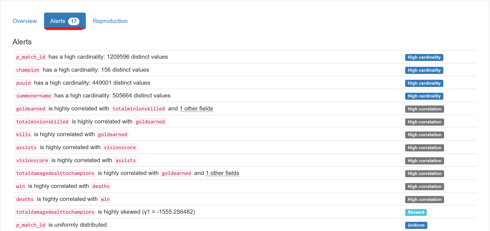

In this case, we have the columns _`summonername`_, _`p_match_id`_ and _`puuid`_ with more than 440.000 values each, ranging up to 1.2 million distinct values). Considering that our dataset consists of 2.4 million rows, having a high cardinality probably means that the information stored in the column has many distinct values, and will not add value to our model

> **Note**: We know for a fact that these variables represent identifiers (either from a match or a player), so we can safely remove them. If we didn't remove them, AutoML tools would perform an encoding for the variables (probably one-hot encoding or label encoding) and conclude in the end that the variables were uselss.

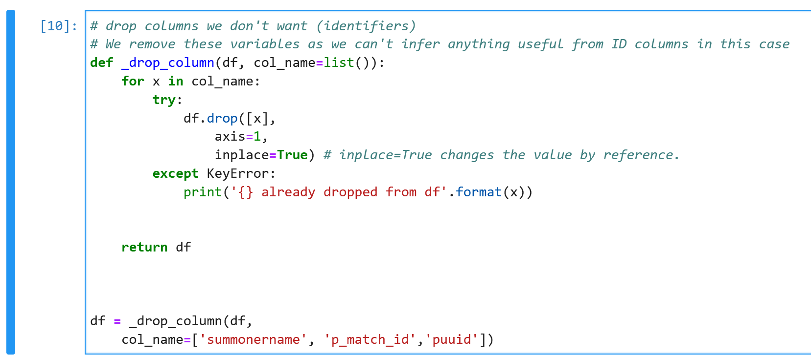

> **Note**: Below is a screenshot of what happens when we don't remove these variables, and train a model with them as input variables: they become useless to the model. The result is having a feature importance very close to 0% for each variable:   

### Split the Dataset

Now, we perform a very simple 80-20% train-test split to our dataset. 80% will go for training and the remaining 20% will be used to validate the accuracy of the model.

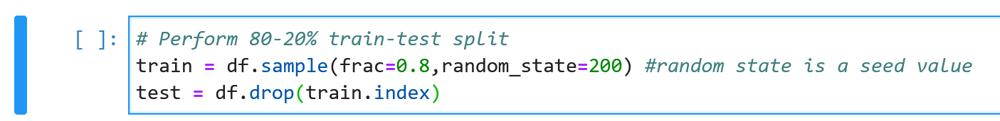

### Creating + Fitting AutoML Model

We proceed to train our model with all variables but the ones that we've discarded in the previous step, taking into consideration that most of the variables in our model are highly correlated. This is especially true for the amount of gold earned concerning the number of kills and minions killed (which makes sense, as these are two of the actions that give out the most gold in-game). We also see that the vision score highly correlates with the number of assists a player makes in a game.

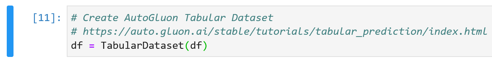

We determine which label is that we want to predict, and then create a TabularPredictor object, by referencing the target label:

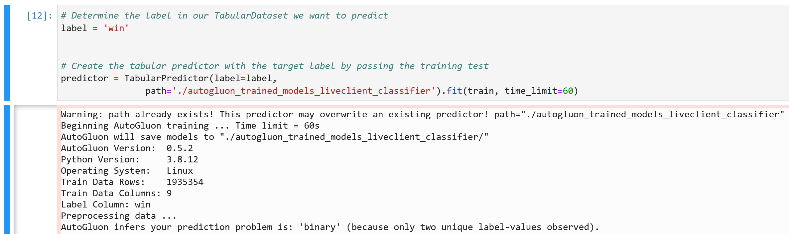

> **Note**: I have specified a time limit of 60 seconds for each model's training to allow my notebook and calculations to be done in linear time. However, this parameter can be changed for convenience with the purpose of achieving a higher model's accuracy.

### Making Predictions and Inference

After having our fitted model, we can make predictions for incoming data.
We do this in two steps:
- Load the model
- Make test predictions (in our case, we'll make predictions for each row in the testing dataset):

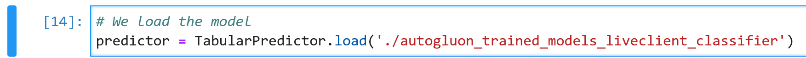

> **Note**: through the _`.load()`_ function we can re-use the trained model elsewhere (another notebook, or even in Python classes). We'll see more about how to _exploit_ this characteristic to our advantage in this workshop's next chapter.

We predict test values:

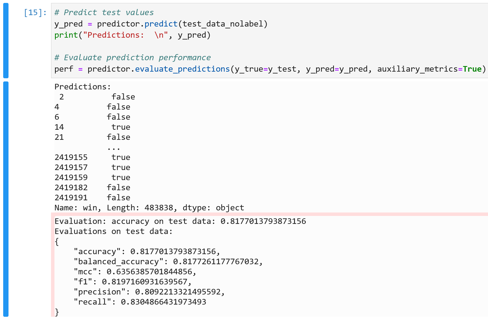

> **Note**: result will be either True or False as we're training a classifier model.

And now, we can evaluate prediction performances by displaying a list of the best-performing models, with descending accuracy:

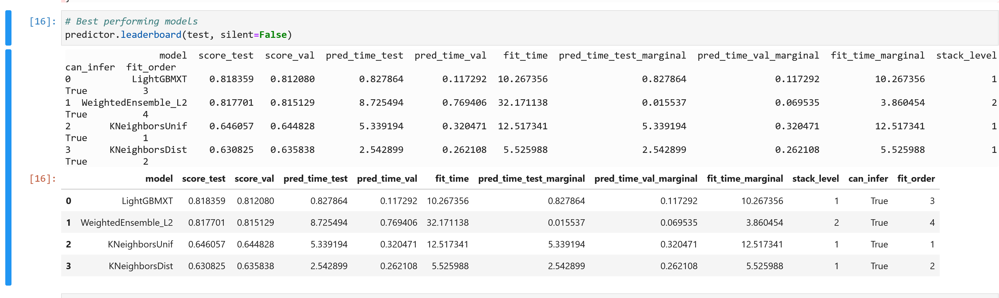

> **Note**: apart from the usual accuracy (found in the _`score_test`_ column), we need to consider some other data found here. Whenever I'm thinking of reusing my models in the future, I take long consideration on trying to find a model that has a consistent metric that I like to call **prediction efficiency**, which measures the ratio between *accuracy* and *prediction time*. Meaning that, I want a good model with high accuracy, but I wouldn't want to wait 10 minutes for the next prediction; so I also look at the _`pred_time_test_` and _`pred_time_val`_ columns when deciding which of all these models I'm going to use. In this case, the best-performing model is also the most time-efficient one, so the decision wasn't hard.

We extract the feature importances and see which variables are considered more important from our model's perspective, and which ones are more useless:

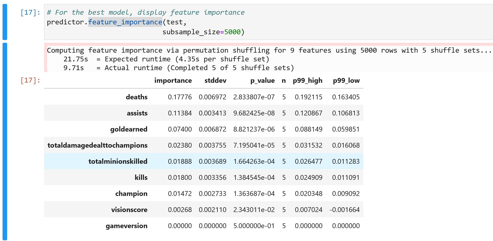

It's also convenient to look at the prediction probabilities returned for each class:

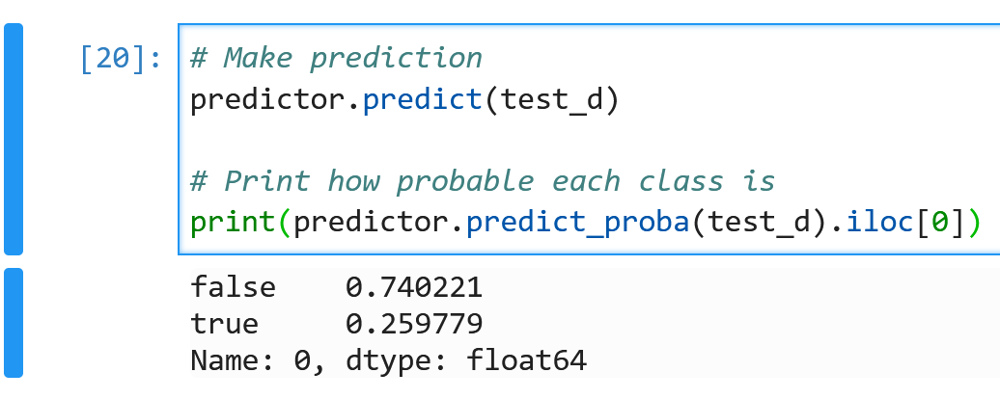

> **Note**: in classification tasks, some _`sklearn`_ or _`sklearn-based`_ estimators also implement the predict_proba method, which returns the class probabilities for each data point. In our case, since we only have two options, we'll only have two probabilities, one for each class.

### Some Observations
As we can see, including more variables in the model greatly improved the accuracy and reduced the MAE and MSE of our model. We can also see that the model can predict the outcome of the game in the test data given the features in our data structure. This proves that a simple model is not always the best solution. We can achieve better results by using more advanced models, in this case about 83% accuracy, which is pretty good for a real-world problem.

Also, we don't care how the models are trained on the inside as long as they make good predictions, and the corresponding metrics like *precision, recall, f1-score, and residual analysis_... are all in order. Of course, it's important to know the basics of ML to see how data is structured, but the most important lesson to take away is that the hardest part about data science and data engineering is not coding the ML model, but **understanding the data and the problem**, and **structuring** the data accordingly to satisfy our needs.

## Task 2: Online DataSet Analysis

In this second part of the lab, we're going to focus on data that can be obtained from League of Legends **in real-time**. Our data structure will be different, but it will help us create a "live companion" integration to help us while we're playing the game.

This dataset (_`live_client_dataset.csv`_) uses [this function](https://github.com/oracle-devrel/leagueoflegends-optimizer/blob/livelabs/src/league.py#L487) to download previous professional matches' timelines, with all kinds of events, and extracts. The Riot Games API endpoint used is _`https://MATCHID.api.riotgames.com/lol/match/v5/matches/REGION/timeline`_.

The process that we'll follow is very similar to the one that we followed in the first part of this lab: we'll reuse much of the code and adapt it to the new dataset.

### Using pandas_profiling

We get detailed, graphical insights into our dataset:

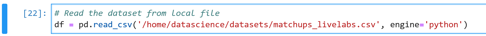

We then generate an HTML report for Exploratory Data Analysis:

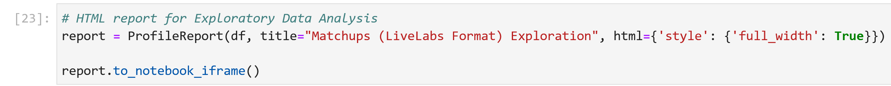

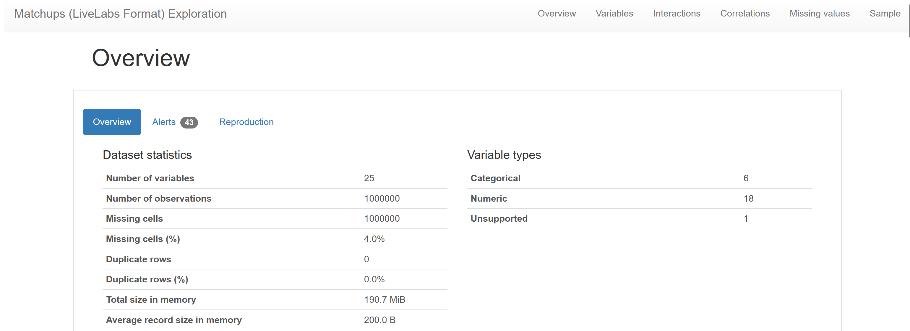

With the dynamic report, we take a look at correlations again: 

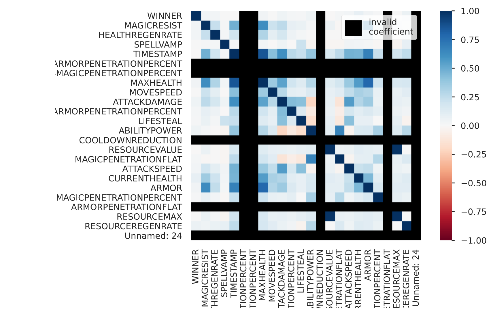

> **Note**: here we have some invalid coefficients being displayed, this is caused by some of these variables not being suitable for the model (always constant). We'll take a look at these variables in the explorer below.

Now, we take a look at the data from our dataset:

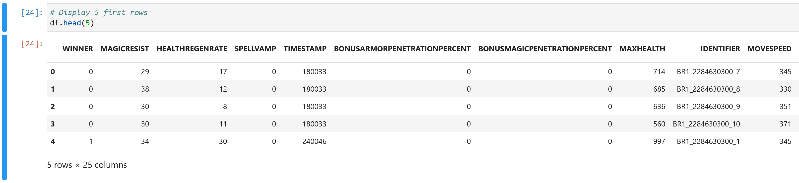

We display the number of all columns in the dataset:

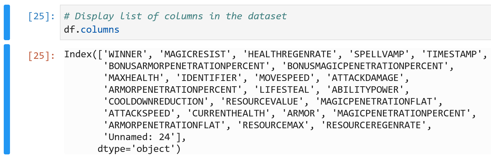

We describe the dataset again:

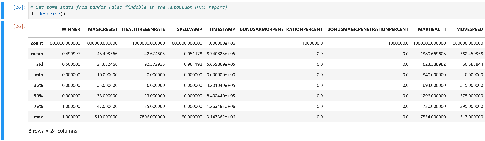

We take a very quick look into one data point from the dataset and what each variable contains:

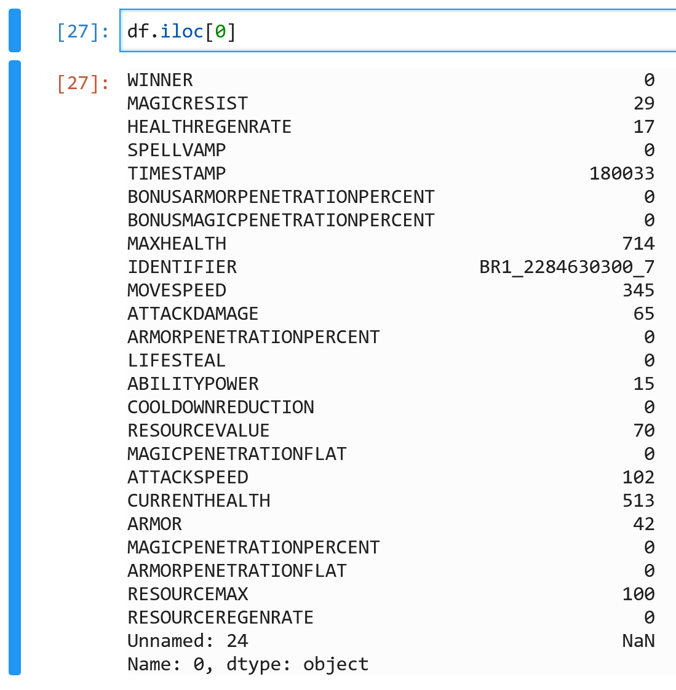

> **Note**: we observe a column called _`Unnamed: 24`_. This is most likely caused by the dataset containing an additional comma at the end. This column will contain invalid numbers and can thoughtlessly be taken out of the dataset.

### Choose the Right Variables

We observe which variables will be useful to us with _`pandas_profiling`_:

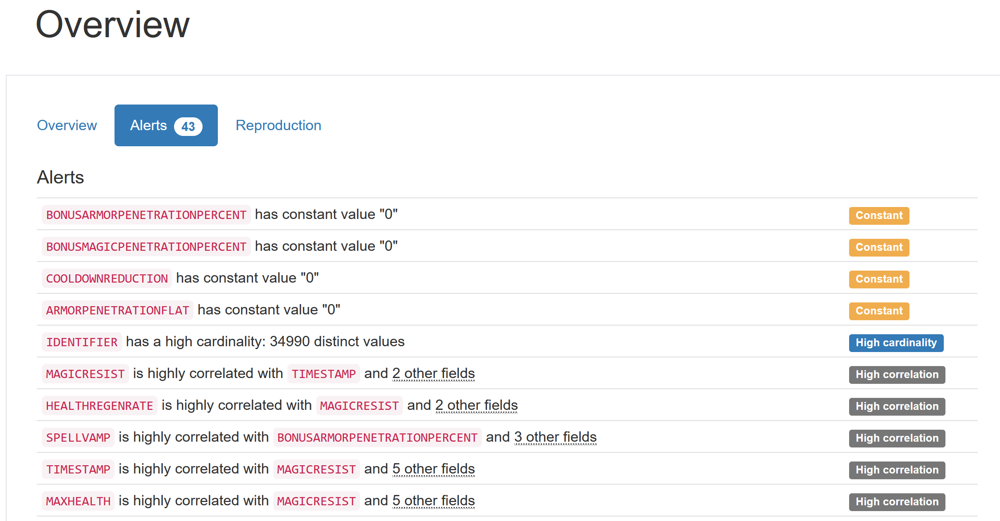

> **Note**: we take out of our dataset all *identifying* variables like before, and **constant** values. Constant values don't add any value to the ML model as they will always be the same; these variables will only add noise in the long run or make the training time of a model be higher, and will never contribute positively towards any of our goals.

In this case, we have the columns _`BONUSARMORPENETRATIONPERCENT`_, _`BONUSMAGICPENETRATIONPERCENT`_ ,_`COOLDOWNREDUCTION`_ and _`ARMORPENETRATIONFLAT`_ as *constants*, and _`IDENTIFIER_` as an *identifier*: we will remove all these variables without further analysis.

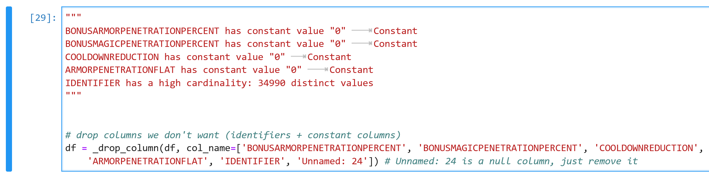

### Split the Dataset

Now, we perform a very simple 80-20% train-test split to our dataset. 80% will go for training and the remaining 20% will be used to validate the accuracy of the model.

### Creating + Fitting AutoML Model

We fit and train the model the same way before, except now the target feature is called _`WINNER`_.

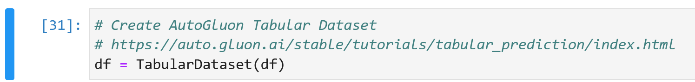

We specify the new label/target variable name easily with AutoGluon, and then create a TabularPredictor object, by referencing the target label:

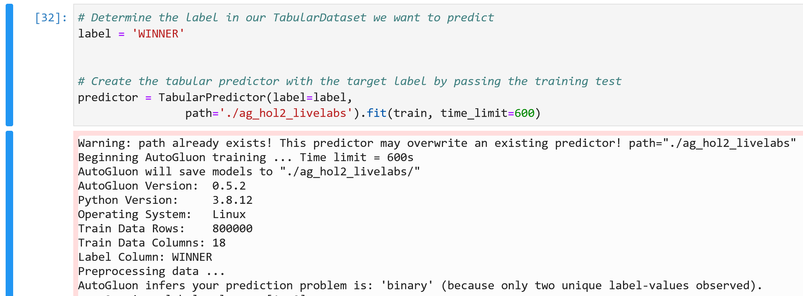

### Making Predictions and Inference

Let's make some predictions to test the model. First, we load our model:

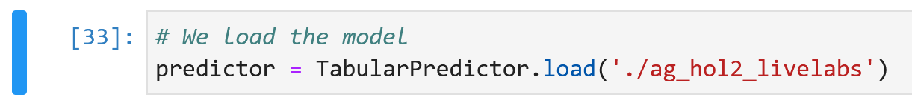

And now, we can evaluate prediction performances by displaying a list of the best-performing models, with descending accuracy:

| _`model`_ | _`score_test`_ | _`score_val`_ | _`pred_time_test`_ | _`pred_time_val`_ | _`fit_time`_ | _`pred_time_test_marginal`_ | _`pred_time_val_marginal`_ | _`fit_time_marginal`_ | _`stack_level`_ | _`can_infer`_ | _`fit_order`_ |
| :----: | :---------: | :---------: | :-------------: | :-------------: | :--------: | :-------------: | :-------------: | :-------------: | :-------------: | :-------------: | :----------: |
| 0 |  WeightedEnsemble_L2 |    0.654190 |   0.660375 |       24.157087 |       1.045460 |  133.281287 |                 0.205917 |                0.011569 |           1.601757 |            2 |       True |          9 |
| 1 |     RandomForestGini |    0.652915 |  0.655500 |        5.636409 |       0.319412 |   41.471444 |                 5.636409 |                0.319412 |          41.471444 |            1 |       True |          5 |
| 2 |     RandomForestEntr |    0.652505 |   0.653125 |        6.867869 |       0.319005 |   46.061942 |                 6.867869 |                0.319005 |          46.061942 |            1 |       True |          6 |
| 3 |       ExtraTreesGini |    0.649865 |   0.650125 |       10.769314 |       0.320502 |   23.003199 |                10.769314 |                0.320502 |          23.003199 |            1 |       True |          8 |
| 4 |             LightGBM |    0.621760 |   0.627375 |        0.658143 |       0.050014 |   16.291640 |                 0.658143 |                0.050014 |          16.291640 |            1 |       True |          4 |
| 5 |           LightGBMXT |    0.599970 |   0.601375 |        0.295755 |       0.032918 |    7.066734 |                 0.295755 |                0.032918 |           7.066734 |            1 |       True |          3 |
| 6 |             CatBoost |    0.580605 |   0.583750 |        0.019436 |       0.024960 |    4.851306 |                 0.019436 |                0.024960 |           4.851306 |            1 |       True |          7 |
| 7 |       KNeighborsUnif |    0.531445 |   0.535000 |     4558.441928 |     177.424999 |    0.414970 |              4558.441928 |              177.424999 |           0.414970 |            1 |       True |          1 |
| 8 |       KNeighborsDist |    0.531130 |   0.536250 |     4378.428705 |     174.572771 |    0.410502 |              4378.428705 |              174.572771 |           0.410502 |            1 |       True |          2 |

> **Note**: apart from the usual accuracy (found in the _`score_test`_ column), we need to consider some other data found here. Whenever I'm thinking of reusing my models in the future, I take long consideration on trying to find a model that has a consistent metric that I like to call **prediction efficiency**, which measures the ratio between *accuracy* and *prediction time*. Meaning that, I want a good model with high accuracy, but I wouldn't want to wait 10 minutes for the next prediction; so I also look at the  and _`pred_time_val`_ column when deciding which of all these models I'm going to use. In this case, the best-performing model is also the most time-efficient one, so the decision wasn't hard.

> **Note**: also note that each model has only been trained for **120 seconds**, and with a dataset of 1.2M rows. It's not a crazy idea to improve the model's accuracy even further (>65%) with a bigger dataset, or other techniques like trying Deep Learning. We will talk about Neural Networks and improving this model in the next workshop, where we'll build a custom Neural Network to get people introduced into Neural Networks as a whole. 

## Task 3: What Now?

In short, the first model that we developed in the first workshop of this workshop series, didn't consider enough variables. The results of the first ML model were no better than using simple statistics and heavily relied on additional statistics support to make a bit more sense.

After expanding the model further, we saw that our models can make predictions much more accurately (**80-85% accuracy** with a relatively low maximum fit time).

While the model is pretty good, it doesn't have a practical side that we can use and take advantage of. This is what we're going to explore in the next workshop's lab.

## Acknowledgements

* **Author** - Nacho Martinez, Data Science Advocate @ DevRel
* **Contributors** -  Victor Martin, Product Strategy Director
* **Last Updated By/Date** - April 20th, 2023