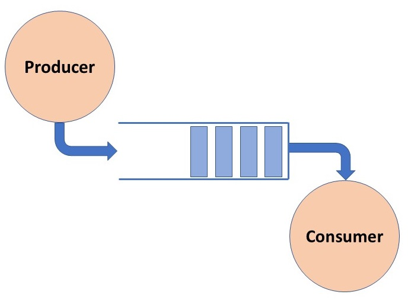
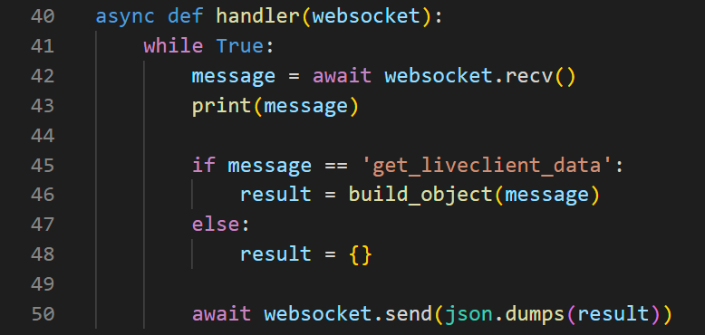
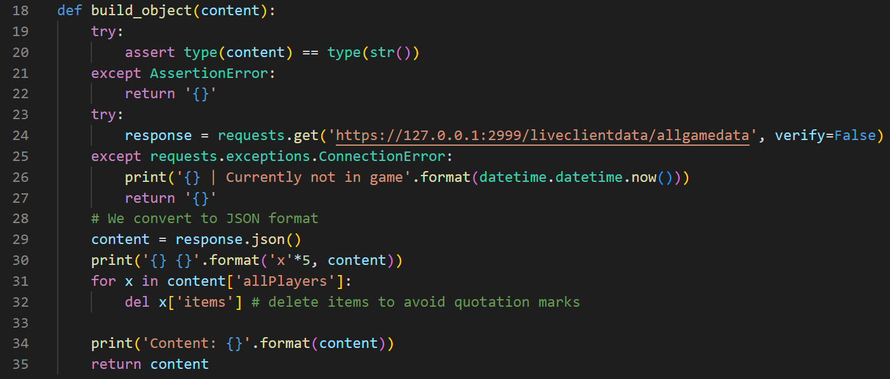
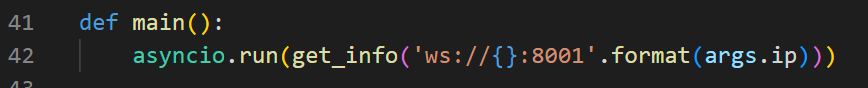
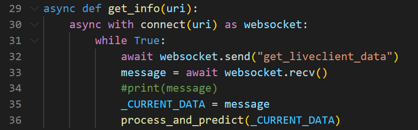
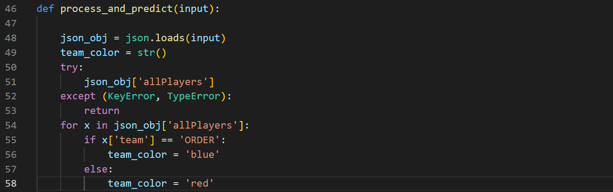
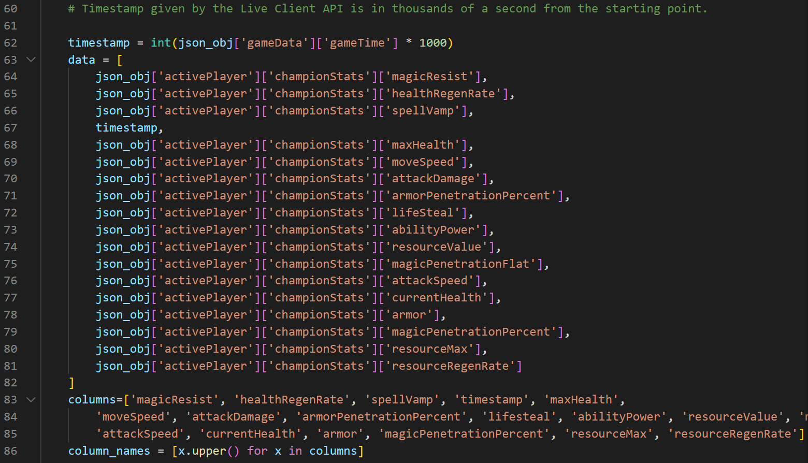
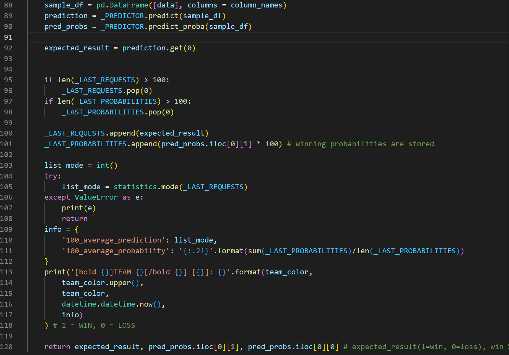
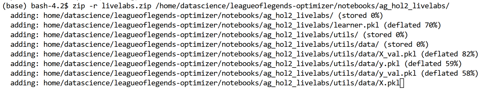
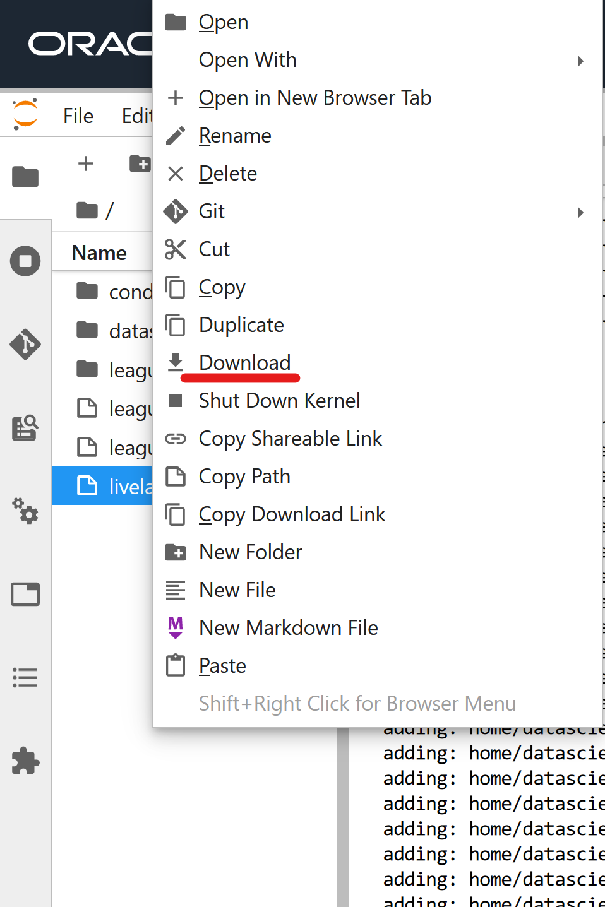

# Lab 4: Model Integration

## Introduction

In this workshop's final lab, we're going to explore some things that could be used as examples to put models into production. There's a significant number of Data Scientists and Data practitioners that create models to solve a problem, but don't make use of these models in the end. 

In our case, with this League of Legends project, I wanted to show that it's possible to put into use what we've learned in this workshop (and upcoming ones).

I've prepared some code [available in the GitHub repository](../../../src/). The idea is to put our model into use, so we're going to use the *previously-trained online model* and use it while we are in a League of Legends match.

> **Note**: the League of Legends Live Client API **only allows us to extract information from the same computer in which we are currently playing!** This means that we need to run the code - explained below - in our computer, where we'll play League.

We will use a producer-consumer architecture, combining this architecture with *web sockets*:



This code will use two components:
- Producer: the producer will obtain real-time data from the League Live Client API, and send it to the consumer. This code needs to be executed on the same machine as the one where we play League. Find the code [in this file.](../../../src/ws_producer.py)
- Consumer: the consumer will make requests to the producer for real-time data, feed it to our previously-trained ML model, and return prediction results. Find the code [in this file.](../../../src/ws_consumer.py)

### Objectives

The result of this chapter can be seen in this GIF:


Estimated Time: 30 minutes

### Prerequisites

* An Oracle Free Tier, Paid or LiveLabs Cloud Account
* Active Oracle Cloud Account with available credits to use for Data Science service.
* (Optional) Having completed [the first workshop](../../workshops/dataextraction/index.html)


## Task 1: Producer

The producer will:
- Create a web socket in port 8001, which can be listened to by the consumer
- Make requests to the League Live Client API in an infinite loop
- Send the requests' responses through the web socket so that the consumer can read them

First, we create the web socket:


Then, we create a handler that will run forever (inside an infinite _while_ loop), receive the request and process it:



Finally, we'll call the _`build_object()`_ function, responsible for making an HTTP request to the Live Client API endpoint, getting the response in JSON format, and returning the content:



## Task 2: Consumer

On the other hand, we'll have the consumer, which will send _`get_liveclient_data`_ requests through the web socket, and receive the response (which is the JSON object returned by the HTTP endpoint at that moment).

First, we run an _async_ task indefinitely, by connecting to the web socket's IP:port:



The corresponding _`get_info()`_ function connects asynchronously to the web socket and will make infinite requests to the consumer.



Upon each request, the _`process_and_predict()`_ function will use the data received from the producer, run it through the model and return the results. Additionally, we take the team color in which we are playing to pretty-print the results in real time:



We also take the opportunity to deserialize the JSON object and get the data that our ML model needs. 



We now load the best-performing online model that we had, load it in our _.py_ file, pass it the data and return the results:



The final result in real-time is this:


> **Note**: we have two metrics returned by the program: _`100_average_prediction`_ (represents the mode prediction for the last 100 requests made, 0 means that the model predicts you're losing) and _`100_average_probability`_, your 100-averaged winning probability (meaning, we take the last 100 requests, get their prediction probabilities like we've done in the past chapter, and return the average)

## Task 3 (Optional): Try this Hands-On

You need to set up a Python environment and install the dependencies found in [this file.](https://github.com/oracle-devrel/leagueoflegends-optimizer/blob/livelabs/src/requirements_autogluon.txt)

Afterward, you need to run two components: the producer and the consumer **at the same time**.

### Running the Producer

```
<copy>
python ws_producer.py --ip="localhost"
</copy>
```

### Running the Consumer

```
<copy>
python ws_consumer.py --p "H:\Downloads\livelabs" --ip="localhost"
</copy>
```

The _`--p`_ option determines the AutoGluon model's path. Since you're going to need it, let's download it from OCI Data Science. First, we open a Terminal and zip the directory that contains the model:



Then we can simply download it from the explorer into our computer (or wherever you're planning to play League of Legends):



And once we have it locally on our computer, **unzip** it and save the directory's path.

## Task 4: Observations and Conclusions

Having a look at the model and running it against a 'real' scenario is probably the most distressing part of the ML process; you're anxious to know whether your model is working well against **NEW** data (not in the training dataset nor the testing dataset). 

Surprisingly this model performs quite well and represents the *general direction* of the game, if you're getting destroyed the model will be severely pessimistic toward the game's future; and if you're destroying yourself, the model will also reflect that accurately. Specifically, this model struggles when people do things that aren't common, like:
- Buying items that are considered not optimal for the champion, causing the champion's statistics to deviate from the norm in a "weird" way
- Not recalling to the spawn to buy more items at the shop at the time that people usually do
- Playing an off-meta champion, which causes our dataset to not be well-populated with data from that champion

Just imagine what could be achieved by training a model with more data (not only 1.2M rows like the models we have created); changing the model's design to make it a regression-based model instead of a classifier: possibilities are infinite in ML.

We hope you've been able to learn from this workshop and got you excited about future projects that we will do at Oracle about Gaming, ML and Artificial Intelligence as a whole.

Stay tuned for the next events at [developer.oracle.com](https://developer.oracle.com/community/events.html)

You may now proceed to the next lab.

## Acknowledgements

* **Author** - Nacho Martinez, Data Science Advocate @ DevRel
* **Contributors** -  Victor Martin, Product Strategy Director
* **Last Updated By/Date** - February 21st, 2023