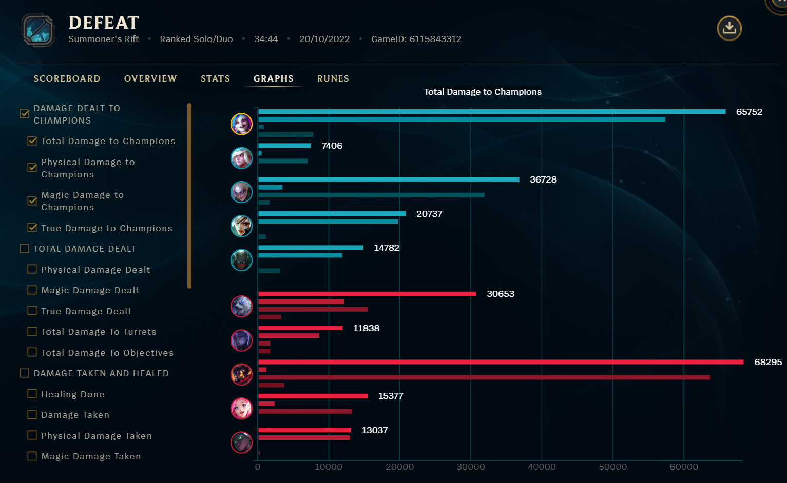
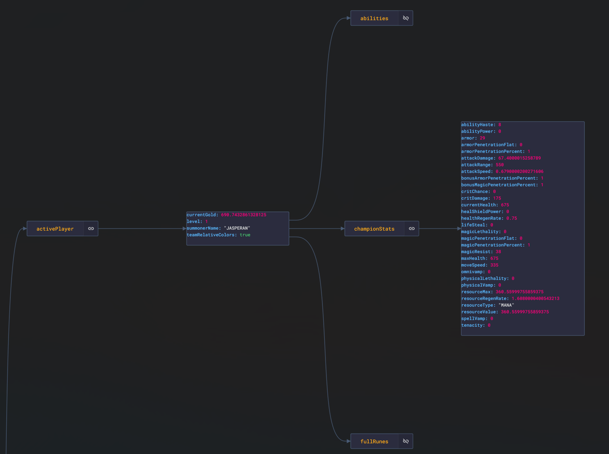

# Introduction

## Introduction

Estimated Time: 10 minutes

In the previous related workshop, we have done the following:
- Defined and **modeled** our problem, understanding the different steps in the drafting phase of the game
- **Explored** the various endpoints offered by Riot Games in their official API
- **Mined** data from the most skilled players around the world and built a data set of these players, which left us with a structure like this in our non-relational autonomous database
- **Created** data structures, such as the *matchup* structure, to represent the data we pulled from the API in an adversarial way: in this data structure (see [this dataset](https://www.kaggle.com/jasperan/league-of-legends-1v1-matchups-results)), we faced each lane in a game against the enemy and determined whether this player won or lost the game
- Created a **simple ML model** to explain basic concepts

After playing a League of Legends match, we're overwhelmed with detailed post-match statistics like these:

Through the data extraction techniques we have explained in the previous workshop, we can obtain this information and *transform* it, with the purpose to create an ML model capable of telling us how well we perform with great precision.

### Objectives

With this workshop, we aim to improve a previously-created primitive model in several ways. We will focus on improving the __accuracy__ and __usability__ of the model.

After considering this structure, we can create **two** new ML models:

1. **Offline Model**: this model will be able to make predictions based on historical data; it has no connection to the game when we play it. However, it will still be useful to help us in the champion selection/drafting process before joining games. 

    For each match, we have 5 matchups (5 players play against each other in different roles and different places on the map).
    
    

    > **Note**: This model needs to have a greater accuracy than 51% (making random predictions).

2. **Online Model**: this model will reproduce the data structure accessible from the Live Client API, and the idea is to connect the data streams to our model whilst we're playing, and return live predictions about how we're performing in the game. We will work with this kind of data structure:

### Prerequisites

* An Oracle Free Tier, Paid or LiveLabs Cloud Account
* Active Oracle Cloud Account with available credits to use for Data Science service.
* (Optional) Having completed [the first workshop](../../workshops/dataextraction/index.html)

## OCI Elements

This solution is designed to work with several OCI services, allowing you to quickly be up and running. You can read more about the services used in the lab here:

- [OCI Data Science](https://www.oracle.com/artificial-intelligence/data-science/)
- [OCI Cloud Shell](https://docs.oracle.com/en-us/iaas/Content/API/Concepts/cloudshellintro.htm)
- [OCI Compute](https://www.oracle.com/cloud/compute/)
- [OCI Autonomous JSON Database](https://www.oracle.com/autonomous-database/autonomous-json-database/)

You may now proceed to the next lab.

## Annex - Additional Resources
If you have extra time after this workshop and want to get to know more about League of Legends, we recommend reading these lists of articles to get a feel of everything that can be done in the ML + Gaming space:

1. [Article 1](https://github.com/oracle-devrel/leagueoflegends-optimizer/blob/livelabs/articles/article1.md): League of Legends Optimizer using Oracle Cloud Infrastructure: Data Extraction & Processing
2. [Article 2](https://github.com/oracle-devrel/leagueoflegends-optimizer/blob/livelabs/articles/article2.md): League of Legends Optimizer using Oracle Cloud Infrastructure: Data Extraction & Processing II
3. [Article 3](https://github.com/oracle-devrel/leagueoflegends-optimizer/blob/livelabs/articles/article3.md): League of Legends Optimizer using Oracle Cloud Infrastructure: Building an Adversarial League of Legends AI Model
4. [Article 4](https://github.com/oracle-devrel/leagueoflegends-optimizer/blob/livelabs/articles/article4.md): League of Legends Optimizer using Oracle Cloud Infrastructure: Real-Time predictions
5. [Article 5](https://github.com/oracle-devrel/leagueoflegends-optimizer/blob/livelabs/articles/article5.md): League of Legends Optimizer using Oracle Cloud Infrastructure: Real-Time predictions II

## Acknowledgements

* **Author** - Nacho Martinez, Data Science Advocate @ DevRel
* **Contributors** -  Victor Martin, Product Strategy Director
* **Last Updated By/Date** - February 21st, 2023