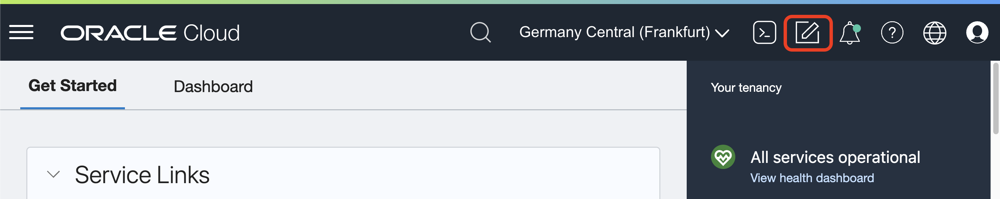
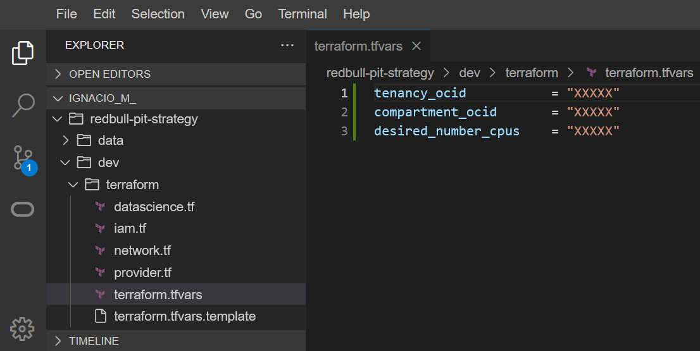
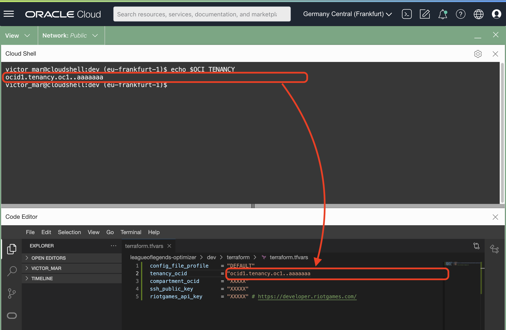
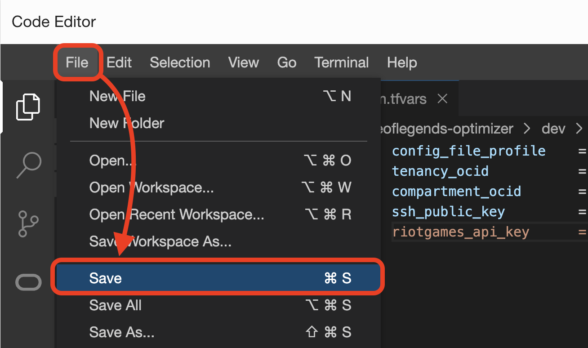
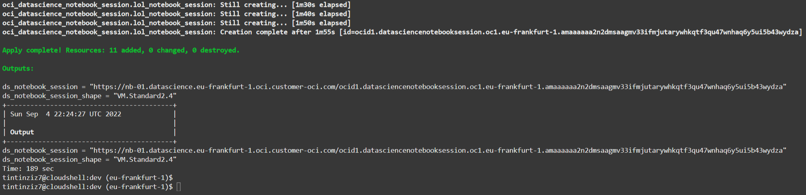
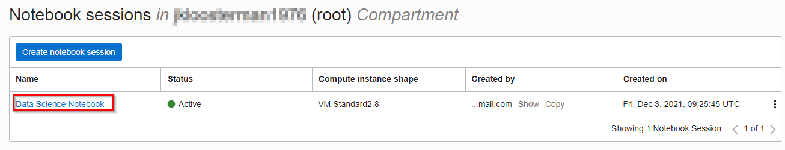
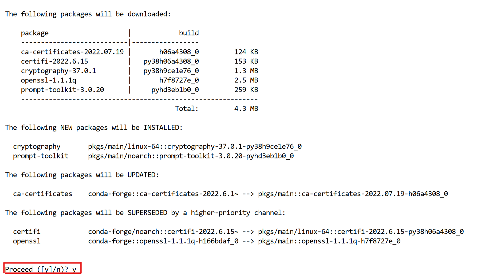
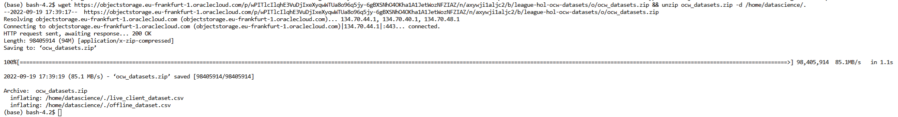
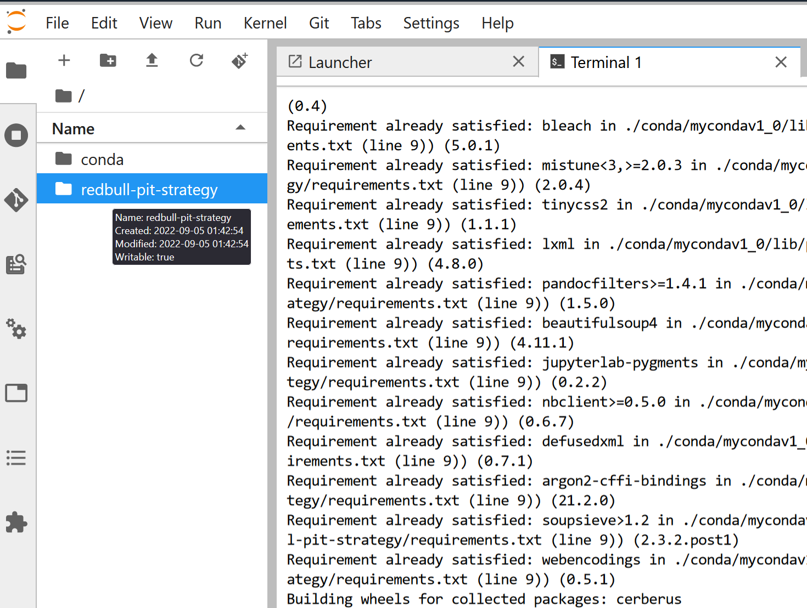
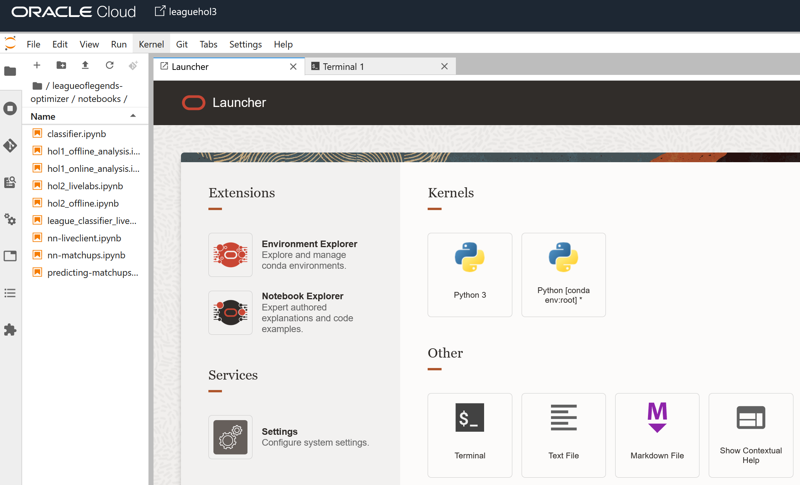

# Infrastructure

## Introduction

In this lab we will build the infrastructure that we will use to run the rest of the workshop.

The main element that we will be creating is a **Data Science** session and notebook, to experiment with the newly-generated data using notebooks.


We will use Cloud Shell to execute _`start.sh`_ script that will call Terraform to deploy all the infrastructure required and setup the configuration. If you don't know about Terraform, don't worry, there is no need. Also, there are no installation requirements: we will use Cloud Shell (which has Terraform installed by default) to deploy our infrastructure. 

Terraform is an Open Source tool to deploy resources in the cloud with code. You declare what you want in Oracle Cloud and Terraform make sure you get the resources created.

> **Note**: in the figure above, there's also a compute instance and autonomous database deployed automatically by Terraform. These resources are completely optional and you can run the workshop without them. However, if you're interested in integrating everything that we'll talk about in the workshop with **your own datasets**, this is the way to do it. You can check out more information on this [in this workshop](https://oracle-devrel.github.io/leagueoflegends-optimizer/hols/workshops/dataextraction/index.html).

Do you want to learn more? Feel free to check [Terraform's code in this repository](https://github.com/oracle-devrel/leagueoflegends-optimizer/tree/main/dev/terraform) after the workshop.

Estimated Time: 15 minutes

### Prerequisites

* An Oracle Free Tier, Paid or LiveLabs Cloud Account
* Active Oracle Cloud Account with available credits to use for Data Science service.


## Task 1: Cloud Shell

1. From the Oracle Cloud Console, click on **Cloud Shell**.
  

2. As soon as the Cloud Shell is loaded, you can download the assets to run this lab.
    ```
    <copy>git clone --branch livelabs https://github.com/oracle-devrel/leagueoflegends-optimizer.git</copy>
    ```

3. The result will look like this:
  

4. Change directory with `cd` to `leagueoflegends-optimizer` directory:
    ```
    <copy>cd leagueoflegends-optimizer/dev</copy>
    ```
5. Terraform uses a file called `tfvars` that contains the variables Terraform uses to talk to Oracle Cloud and set up your deployment the way you want it. You are going to copy a template we provide to use your own values. Run on Cloud Shell the following command.

    ```
    <copy>cp terraform/terraform.tfvars.template terraform/terraform.tfvars</copy>
    ```

## Task 2: Deploy with Terraform

1. Click on **Code Editor**. Next to the Cloud Shell one.
    

2. On the **Code Editor**, inside the Explorer section on the left panel, expand your username and navigate onto _`dev/terraform`_. You should see the file **`terraform.tfvars`**. Click on it: 
    

3. The file will open and you can copy values you will get from running commands on Cloud Shell and paste it on the Code Editor.

4. Copy the output of the following command as the region:

    ```
    <copy>echo $OCI_REGION</copy>
    ```

    

5. Copy the output of the following command as the tenancy OCID:
    ```
    <copy>echo $OCI_TENANCY</copy>
    ```

    

6. Copy the output of the same command as the compartment OCID:
    ```
    <copy>echo $OCI_TENANCY</copy>
    ```
    
    > Note: we can paste the same OCID here in both tenancy and compartment because the root compartment in a tenancy is equal to the tenancy's OCID.

    

    > You can deploy the infrastructure **on a specific compartment**<br>
    > You can get the Compartment OCID in different ways.<br>
    > The coolest one is with OCI CLI from the Cloud Shell.<br>
    > You have to change _`COMPARTMENT_NAME`_ for the actual compartment name you are looking for and run the command:
    > ```
    > <copy>oci iam compartment list --all --compartment-id-in-subtree true --query "data[].id" --name COMPARTMENT_NAME</copy>
    > ```

7. Generate a SSH key pair, by default it will create a private key on _`~/.ssh/id_rsa`_ and a public key _`~/.ssh/id_rsa.pub`_.
    It will ask to enter the path, a passphrase and confirm again the passphrase; type _[ENTER]_ to continue all three times.

    ```
    <copy>ssh-keygen -t rsa</copy>
    ```

    > **Note**: If there isn't a public key already created, run the following command to create one:
    > ```
    > <copy>ssh-keygen</copy>
    > ```
    > And select all defaults. Then, try running the command again.

8. We need the public key in our notes, so keep the result of the content of the following command in your notes.

    ```
    <copy>cat ~/.ssh/id_rsa.pub</copy>
    ```

    

9. You can leave `riotgames_api_key` as it is. We are not using the API key for this specific workshop.

10. Save the file in the Code Editor.
    


## Task 3: Start Deployment

1. Run the `start.sh` script
    ```
    <copy>./start.sh</copy>
    ```

2. The script will run and it looks like this.
    

3. Terraform will create resources for you, and during the process it will look like this.
    

4. The final part of the script is to print the output of all the work done.
    

5. Copy the Data Science notebook URL from the output variable _`ds_notebook_session`_. This is the URL we will use to connect to our Data Science environment.
    

    > Note: login credentials for the Data Science notebook are the same as the ones used to access Oracle Cloud Infrastructure.


## Task 4: Accessing Notebook

Having just created our OCI Data Science environment, we need to install the necessary Python dependencies to execute our code. For that, we'll access our environment.

- The easiest way is to access into the notebook **through the URL** that we previously copied from Terraform's output.

    

    If you have done it this way, make sure to **skip through to the next task**.

- (Optionally) We can also access to the notebook via the OCI console, on the top left burger menu:

    

    > You may find the Data Science section by also searching in the top left bar, or in the Analytics & AI tab, if it doesn't appear in "Recently visited" for you:

    

    Now, we have access to a [list of our Data Science projects launched within OCI.](https://cloud.oracle.com/data-science/projects) We access our project, and inside our project we'll find the notebook.

    > The name of the notebook may be different than shown here in the screenshot.

    

    

    You should now see the Jupyter environment

    


## Task 5: Setting up Data Science Environment

We now need to load our notebook into our environment.
1. Opening a **Terminal** inside the _'Other'_ section the console and re-downloading the repository again:

    

2. Then, we re-clone the repository:

    ```
    <copy>
    git clone --branch livelabs https://github.com/oracle-devrel/leagueoflegends-optimizer.git
    </copy>
    ```


3. Install the conda environment

    ```
    <copy>odsc conda create -n myconda</copy>
    ```

    

4. Activate the newly-created conda environment:

    ```
    <copy>
    conda activate /home/datascience/conda/myconda_v1_0
    </copy>
    ```

5. Install Python 3.8 within the conda environment:

    ```
    <copy>
    conda install -y python=3.8
    </copy>
    ```

6. Install Python dependencies:

    ```
    <copy>
    pip install -r leagueoflegends-optimizer/deps/requirements_nn.txt
    </copy>
    ```

> Note: make sure to accept prompts by typing 'y' as in 'Yes' when asked.

After these commands, all requirements will be fulfilled and we're ready to execute our notebooks with our newly created conda environment.


## Task 6: Downloading DataSets

We now need to load our datasets into our environment. For that, we reuse the terminal we created in the previous step:


Then, we execute the following command, which will download all necessary datasets:


```
<copy>
wget https://objectstorage.eu-frankfurt-1.oraclecloud.com/p/wPITlcIlqhE3VuDjIxeXyqwWTUa8o96q5jy-6gBXSNhO4OKha1A1JetWozNFZIAZ/n/axywji1aljc2/b/league-hol-ocw-datasets/o/ocw_datasets.zip && unzip ocw_datasets.zip -d /home/datascience/.

</copy>
```




## Task 7: Accessing our Notebooks

We should now see the repository / files in our file explorer:





We navigate to the _`leagueoflegends-optimizer/notebooks/`_ directory and the notebook [_`neural_networks_lol.ipynb`_](https://github.com/oracle-devrel/leagueoflegends-optimizer/blob/livelabs/notebooks/neural_networks_lol.ipynb) is the one we will review during this workshop.

Let's open both of them and get to work. 

You may now [proceed to the next lab](#next).


## Acknowledgements

* **Author** - Nacho Martinez, Data Science Advocate @ DevRel
* **Contributors** - Victor Martin - Product Strategy Director
* **Last Updated By/Date** - April 20th, 2023