# Lab 3: Build a Neural Network with fastai

## Introduction

In this lab, we're creating a Neural Network with the help of the open-source library called _fastai_. This library simplifies the development of Neural Networks greatly, and we will see why.

Estimated Lab Time: 45 minutes

### Prerequisites

* An Oracle Free Tier, Paid or LiveLabs Cloud Account
* Active Oracle Cloud Account with available credits to use for Data Science service.
* [Previously created](../infra/infra.md) OCI Data Science Environment

## Task 1: League of Legends DataSets

League of Legends fortunately has an API that allows us to extract huge amounts of data from games. These API endpoints cover several datasets, including:
- Player data: how good a player is, winrate (wins/losses), performance, number of minions killed, etc.
- Post-match data: analysis of a match after it's finished, including events that happened, kills, deaths, assists, vision score, baron and dragon kills, etc...
- Real-time in-match data: real-time data about a player's statistics.

We'll in turn create two models, one that focuses on **post-match** data (which we'll call "offline dataset") and another one that works in real-time (which we'll call "live client dataset").

> **Note**: API returns all data from a match in JSON format. For that, we've used OCI Autonomous JSON Database to store all data events directly, without applying any transformation during data ingestion.

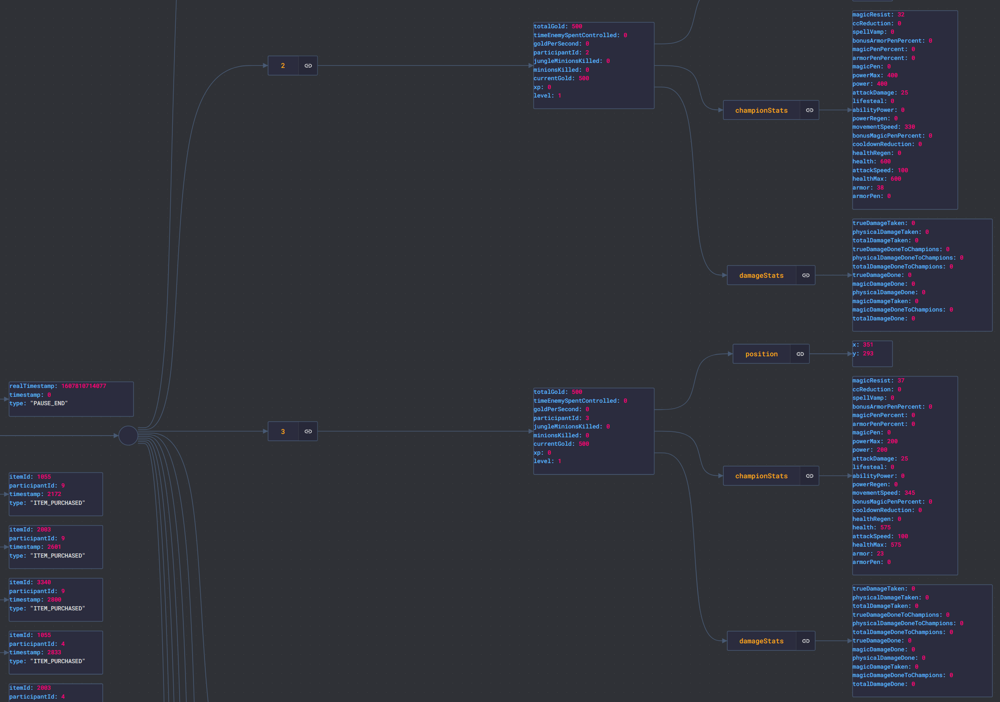

As we can see, the level of information we have from any match, from any player, is very detailed. From this data, we've chosen (in a previous workshop about data extraction) the data structure specifically similar to what can be found using Riot Games' API. This way, we ensure that our model will be consistent with what's available in the API:

We'll want to predict the _`win`_ variable (a binary variable).

For each match, we have 5 matchups (5 players play against each other in different roles and different places on the map).

On the contrary, live client data has a different structure:

After some internal processing using the [_`league.py`_](https://github.com/oracle-devrel/leagueoflegends-optimizer/blob/livelabs/src/league.py) file, we transform this data to the kind of data extractable from the Live Client API:

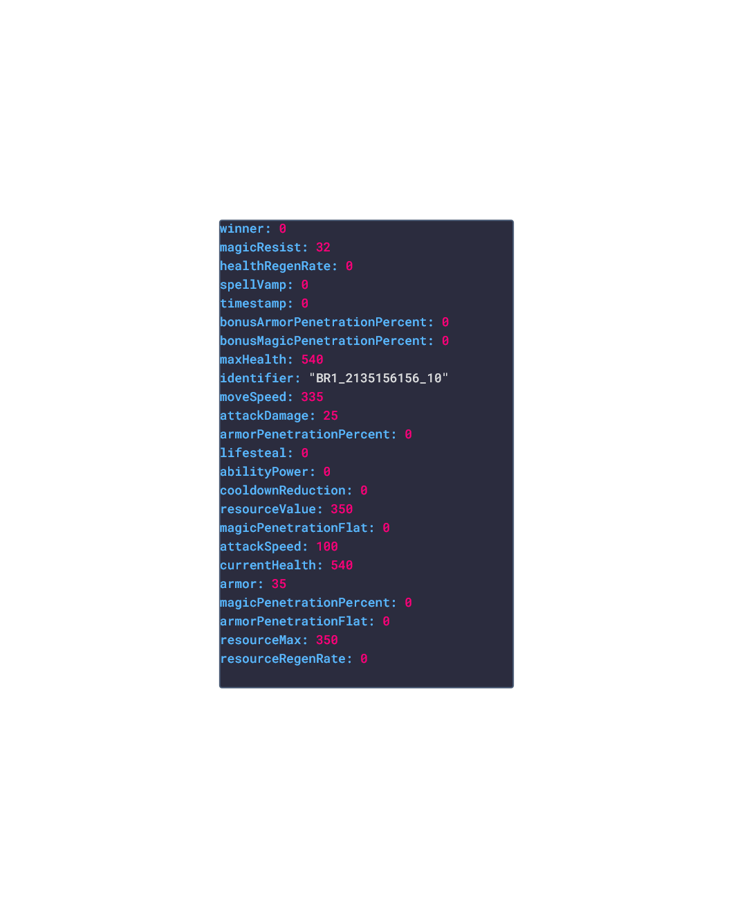

These will be the features of our live client model. We'll want to predict the _`winner`_ variable (another binary variable). Therefore, for this workshop, we'll create two classifier models.

## Task 2: Build the "Offline" Neural Network

Now that we have the most basic concepts about Neural Networks, it's time to build one. We want our NN to predict whether a player has won or lost given their post-match statistics.

Before you proceed, make sure you select the correct environment on the right. Select the `conda` environment and click **Select**.

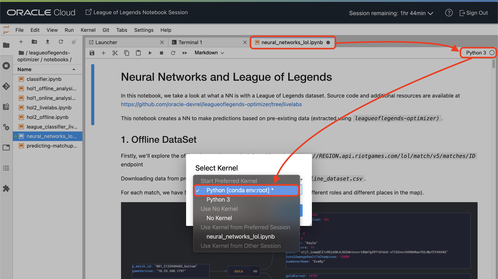

First, we read the dataset:

We have a total of 11 columns, 10 of which are features and the _`win`_ variable will be the target feature.

### Variable Selection and Manipulation

It's important to consider that Neural Networks, just like any other Machine Learning model, learn by using _numbers_. So, we must convert all categorical (string) variables to numbers, in one way or another.

We detect that our model has some categorical variables with this easy trick:

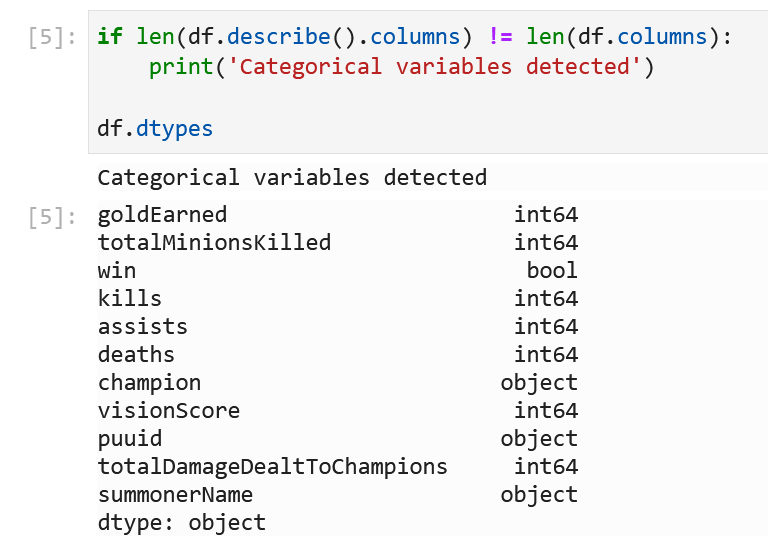

And we find three categorical variables: champion, puuid, and summonerName. The PUUID (player unique identifier) and summonerName (in-game name) are both identifying variables, and will therefore vary in almost every match. As they are identifying variables with a high variance (almost every row will be different) we can remove these variables safely, they won't add anything to the model, as no other variable will be remotely correlated with them:

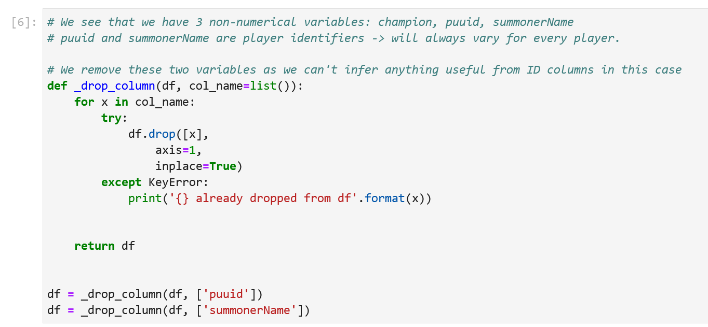

### Train-test Splitting

We split our initial dataset into a percentage for training (80% in this case) and 20% for testing the model's performance:

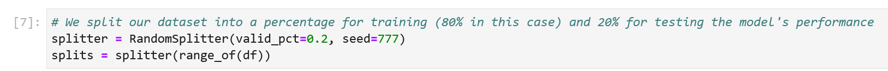

> **Note**: This is the first thing that _fastai_ helps us to do in a very easy way, through the _`RandomSplitter()`_ function.

We can also create an auxiliary function to split the dataset with a seed number and additional logical conditions (e.g. split between even and odd numbers in percentages), if we want to:

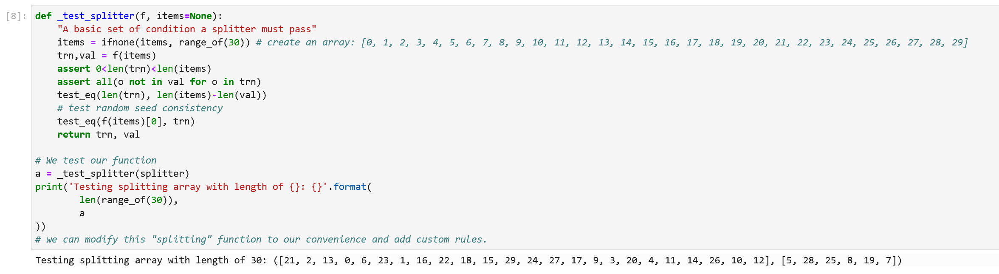

### Building Data Loader

Once we have our dataframe, we just have to mention:
1. Which variables are categorical (strings) and numerical (values), through the variables `_cat_names`_, _`cont_names`_.
2. Which process do we want to apply to these variables: through _`procs`_, we'll tell _fastai_ to make transformations to these variables:
    First, [Categorify](https://fastai1.fast.ai/tabular.transform.html#Categorify) will encode categorical variables to numerical-encoded variables.
    Then, [FillMissing](https://fastai1.fast.ai/tabular.transform.html#FillMissing) will look for missing values and fill them with the median of that column (by default, this behavior can be modified).
    Finally, we'll normalize all numerical variables (by default, normalization is achieved using a column's mean and standard deviation, and using the following formula:

    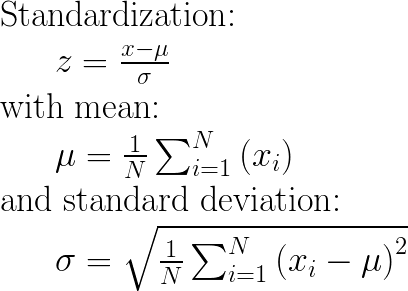

    > **Note**: typically, this process is called **standardization**, not normalization; they are both different techniques that are often confused for each other.

3. Target feature to predict, through the variable _`y_names`_. This is _`win`_ in our case.
4. Type of problem (regression/classification): we'll do this through the parameter _`y_block`_. We'll specify a _`CategoryBlock()`_ which tells _fastai_ that we're working with a classification problem
5. (Optional) Batch size (for multiprocessing/concurrency) -> will load 'bs' number of rows at the same time

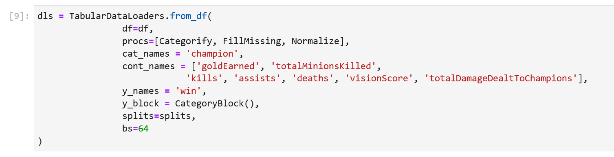

Now, we can observe the dataloader and the final shape of our data, ready for our NN to come and learn from it:

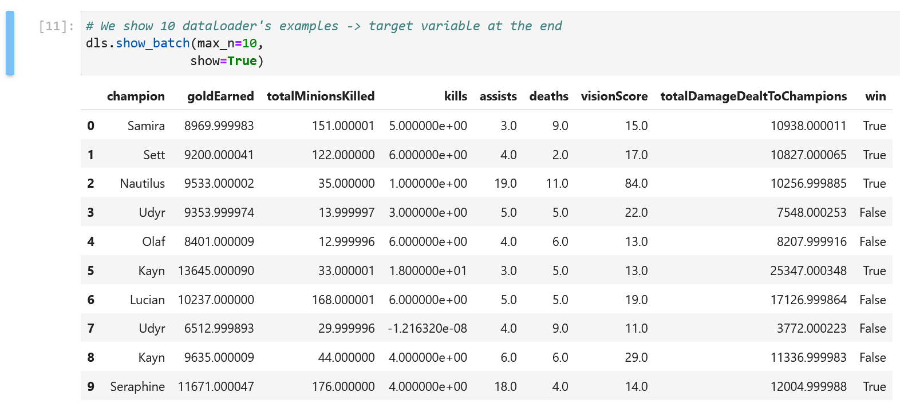

### Neural Network Learner - Learning Rate Finder

Another very positive aspect of _`fastai`_ is that it uses a _`tabular_learner`_ object, which has several automatic processes that simplifies a Data Scientist's life.

One of these automatic processes is an **automatic learning rate optimizer**: as we've seen before, choosing a correct learning rate is very important for our model; as choosing a low learning rate will cause the model to learn "too slowly", and choosing a high learning rate will cause the model to train poorly. Thanks to _fastai_, the optimal learning rate is found automatically.

> **Note**: If you're particularly interested in how this is implemented, [check out this article.](https://arxiv.org/abs/1803.09820)

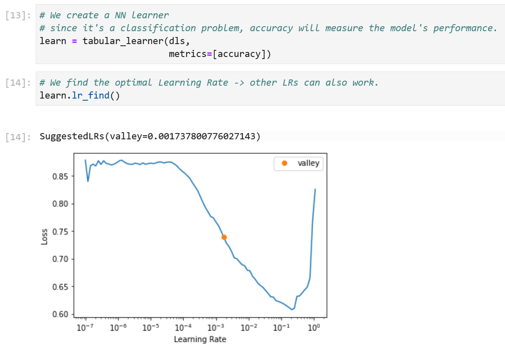

### Train the Model

We create a tabular learner object, specifying _accuracy_ as the metric to define the model's performance.

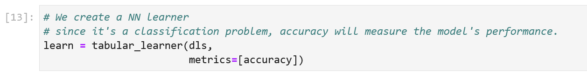

> **Note**: in this case, we haven't specified the architecture (number of parameters of each layer, number of deep layers), of the Neural Network. It's possible to do so and we'll do that in the second part of this notebook.

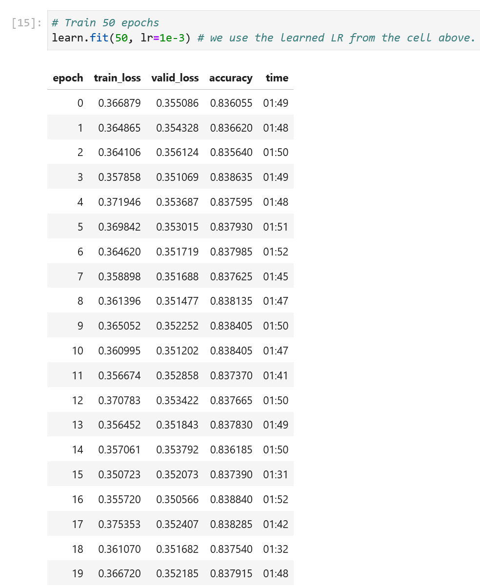

Each epoch takes a bit less than 2 minutes using *4 OCPUs*; with a graphics card (available in OCI) these calculations could be achieved in a matter of seconds or less.

> **Note**: if you wish to improve the model's performance on your own, you can also test with your own computer's graphics card and see a huge difference that can be achieved.

We achieve an **83% accuracy** in 50 epochs. It's also important to consider that we've specified a learning rate of 0.001. You may also experiment on your own with a higher learning rate [0.01, 0.1] to see faster improvement in the model's accuracy. In this specific case, 83% accuracy is pretty good, so we won't dwell on this topic anymore.

We plot the observed loss:

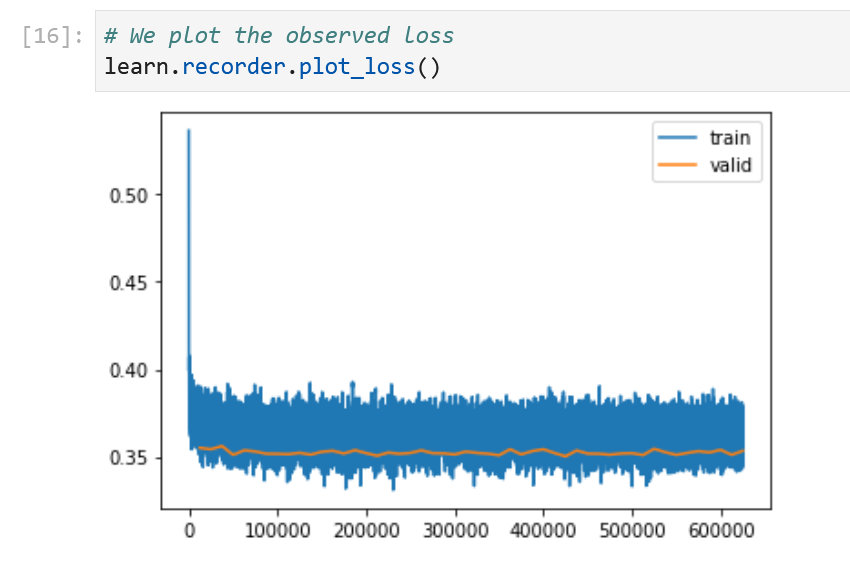

We observe that, after testing the loss against the dataset, the model's loss decreases exponentially at the beginning and then stays almost constant, with an extremely slight downtrend. This means that our model may always encounter some noise (as we're operating with "real-life / videogame" data). Understandably, models that are *biased* by the human factor (humans make mistakes) may have some intrinsic noise that we have to account for. 

### Check Predictions

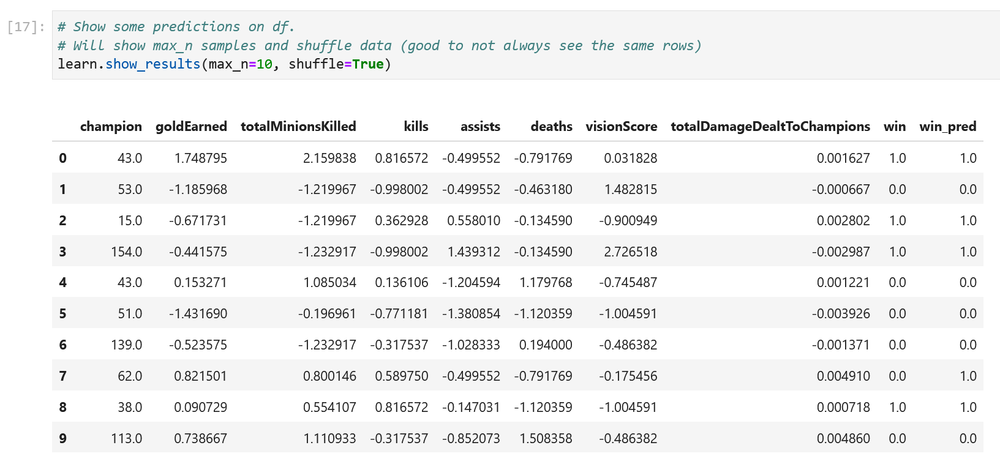

We can also print the probabilities predicted for each class (in %):

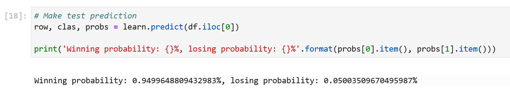

## Task 3: Build the "Live Client" Neural Network

For this second part of the notebook, we'll focus on what we can achieve using the Live Client dataset.

We read the CSV file containing the data:

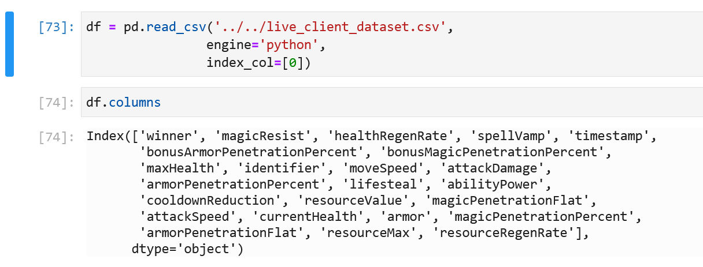

We have a total of 24 columns, 23 of which are features and the _`winner`_ variable will be the target feature.

### Variable Selection and Manipulation

First, we explore the new dataset. As a rule of thumb, we want to encode or convert categorical variables to numerical ones. However, in this case, we only have one categorical variable:

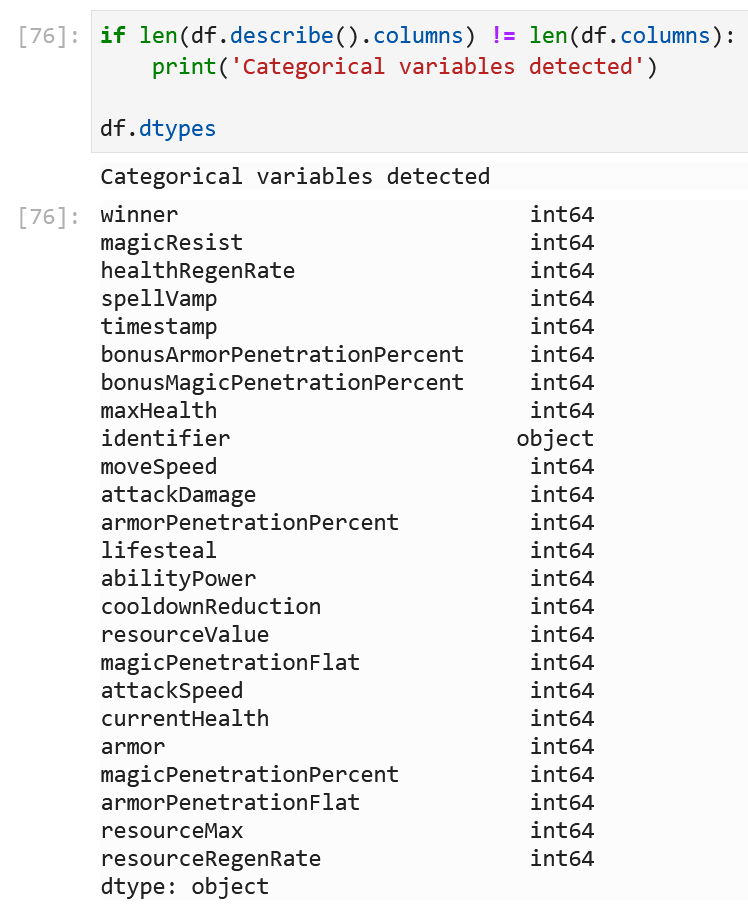

The only categorical variable present is _identifier_. As we've said, identifying / row number columns have no use to Machine Learning models in general, so we'll drop it.

Additionally, we can observe statistics about the dataframe:

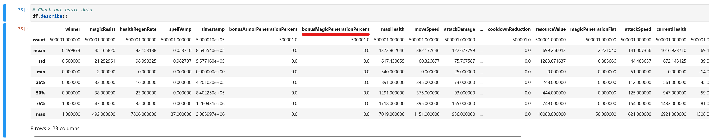

> **Note**: the describe() function only displays numerical variables; categorical variables need to be converted to numbers first if we want them to appear in the output of this function.

By having a look at the standard deviation, min, and max values for each column, we quickly spot that there are some variables like _`bonusArmorPenetrationPercent`_ where the mean is 0, the standard deviation is 0 and the minimum and maximum values are 0. This means that the whole column contains zeros, indicating that this variable is a **constant**. We also need to avoid constant variables to have as inputs to our Neural Network.

> **Note**: in reality, the model / NN will learn that this variable represents nothing and will learn to ignore these variables after some epochs; however it's always a good practice to remove them at the beginning.

We remove the four constant variables found:

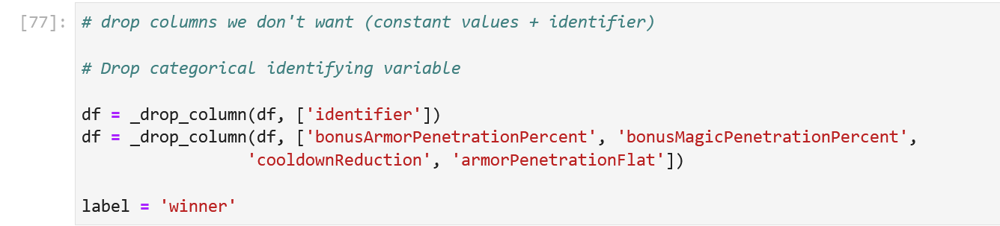

### Train-test Splitting

We perform the same 80-20% train-test split as in the last model. This is typically a good proportion to use.

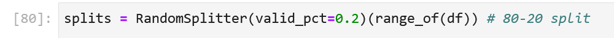

### Building Data Loader

We create the data loader the same way we did before:

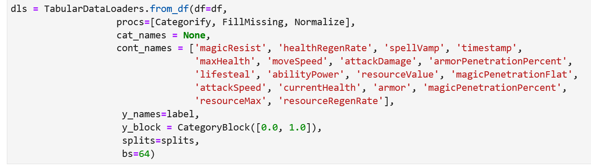

We observe the dataloader and the final shape of our data:

### Neural Network Learner - Learning Rate Finder

We find the optimal learning rate and choose the valley indicated by _fastai_, although you're welcome to choose other values:

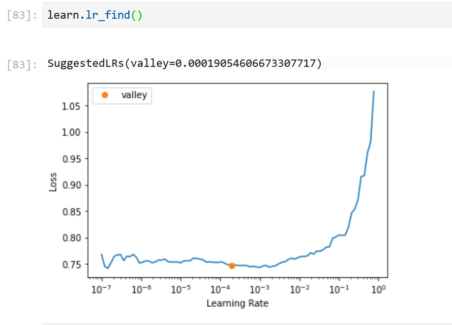

### Train the Model

We create the tabular learner object, this time specifying three **deep layer blocks**.

> **Note**: a deep layer block is a group of NN layers that have been proven to work well together. e.g. a linear layer, followed by a ReLU activation layer, followed by a batch normalization layer.

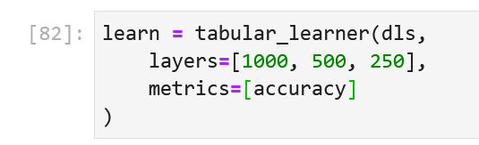

Before fitting the model to our data, we print the model's structure using the _`.summary()`_ function:

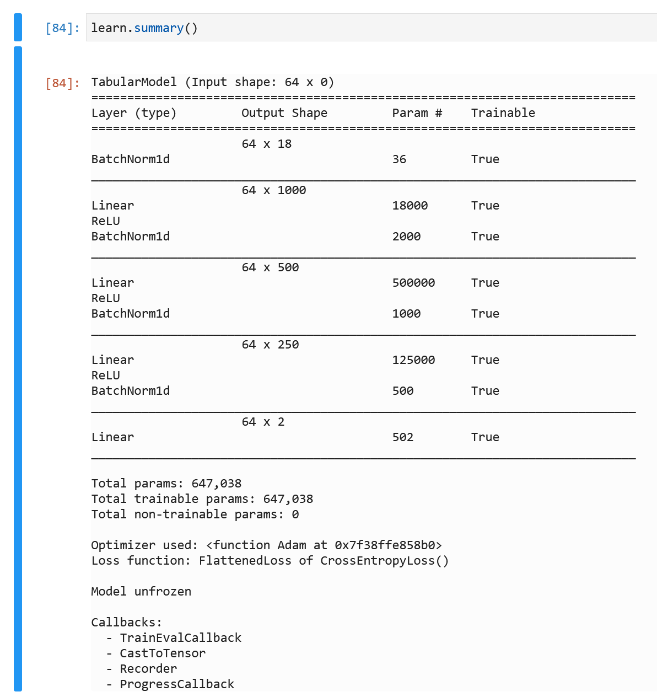

> **Note**: just by giving _fastai_ three parameters, it's been able to create a robust NN with more than 600.000 parameters.

Now, we train the model for some epochs in the same way as before, specifying the optimal learning rate that we found using the automatic learning rate finder.

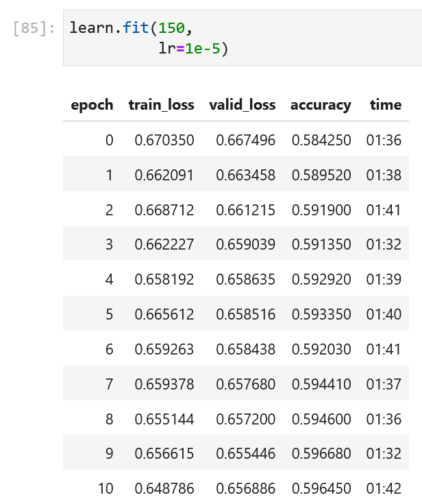

The model's accuracy is *58%* at the beginning and the accuracy converges at **~70%** accuracy when trained extensively for thousands of epochs. If you want to test with CPUs, you may also try to increase the learning rate and see if results improve without having the model make nonsensical predictions.

We plot the observed loss:

We observe that, after testing the loss against the dataset, the model's loss decreases exponentially at the beginning and stays in a slight downtrend.

This means that the model hasn't been "fully trained" yet, as the loss keeps decreasing over time; which means that, with more CPU / GPU resources, this model *can keep improving* until the loss converges!

### Adding Model Robustness

The last thing we need to do is to *adjust* the NN to work with time series data. As you might have noticed, we're working with _timestamped_ data, because the model depends on this variable to let the NN know that we're in a time series environment. If we didn't have this variable, the model wouldn't learn anything; as we would have statistics from all moments of a match bundled together into the same event; and the model wouldn't be able to differentiate between an event that's happened 10 minutes into the game or 40.

Also, if you're having a bad game, it's very likely enemies will be able to capitalize on your mistakes and gain even more advantage; meaning that subsequent data extracted from that match will depend on previous rows of data from that same match.

There are several ways to work with time series data (like ours). We suggest creating a **sliding window**:

And if we were to deploy this in real-time, it'd be best if we made predictions in batches of **n**, being n the size of the sliding window. This will introduce *time* as a dimension to the NN and will give us more consistent results in the long run.

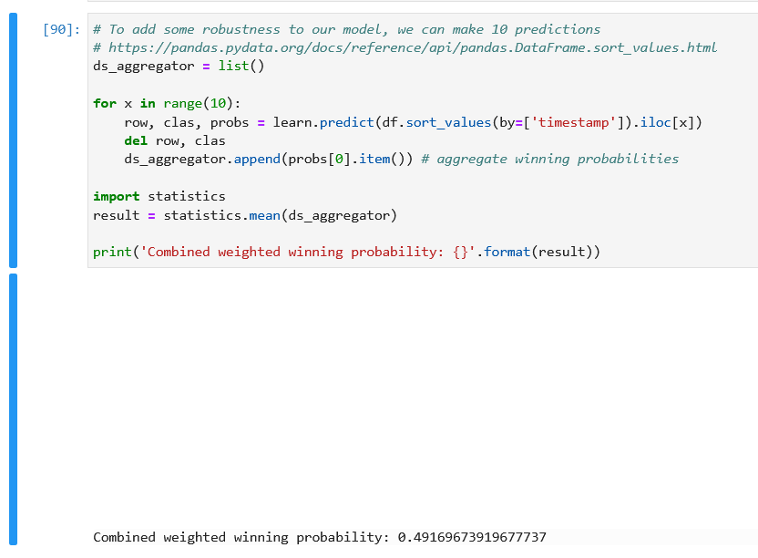

## Task 4: Model Inference

### Export / Import Model

We export the model so that we can re-use it in the future and re-import it to show that it's  possible to work with models after model training:

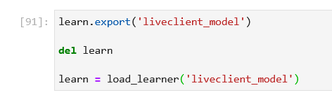

### Make Test Predictions 

We make some example predictions. The result will be a tuple of two tensors:
- Tensor #1 contains predicted probabilities
- Tensor #2 contains predicted labels

### Permutation Importance

Permutation importance is a technique in which we shuffle each column in a dataframe and analyze how changing a particular column affected our y values.

The more that the model was affected by this _shuffle_, the more important" we can (generally) call a variable in our neural network.

We build a Python class that achieves this:

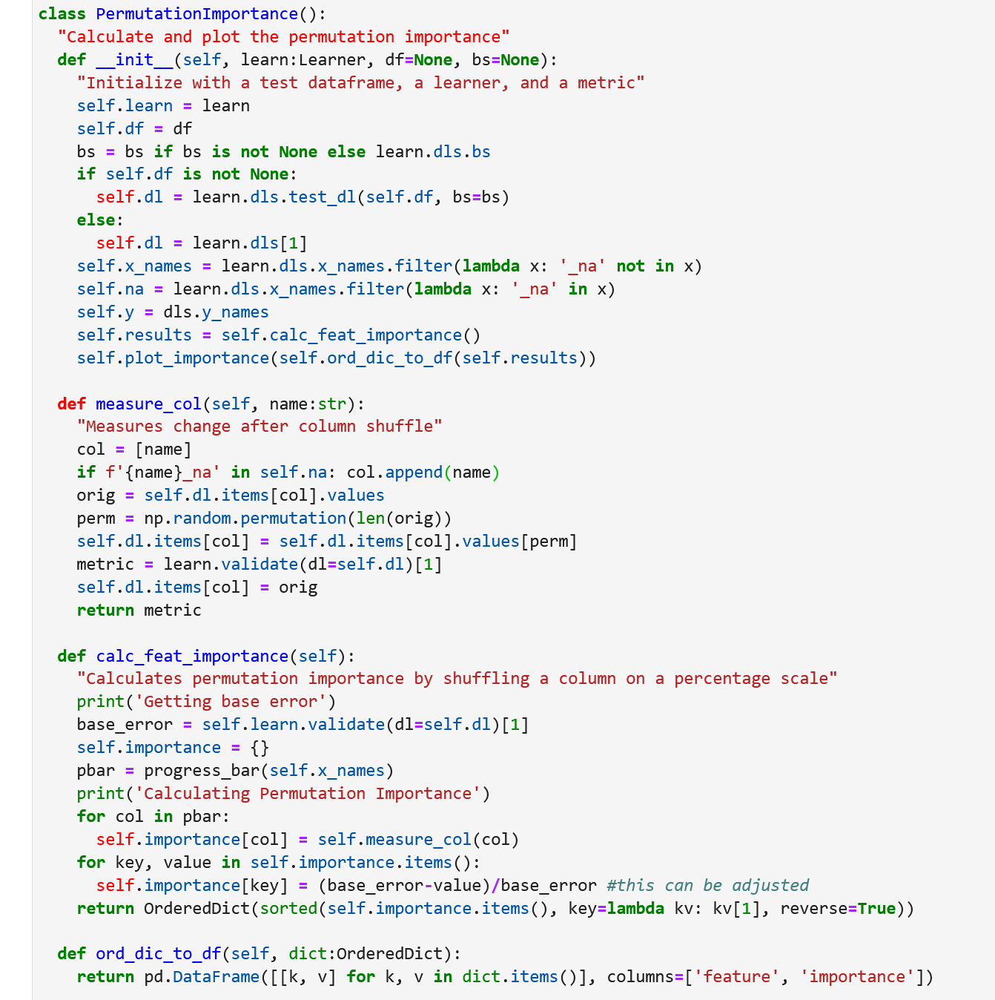

And we compute the permutation importance for our Neural Network:

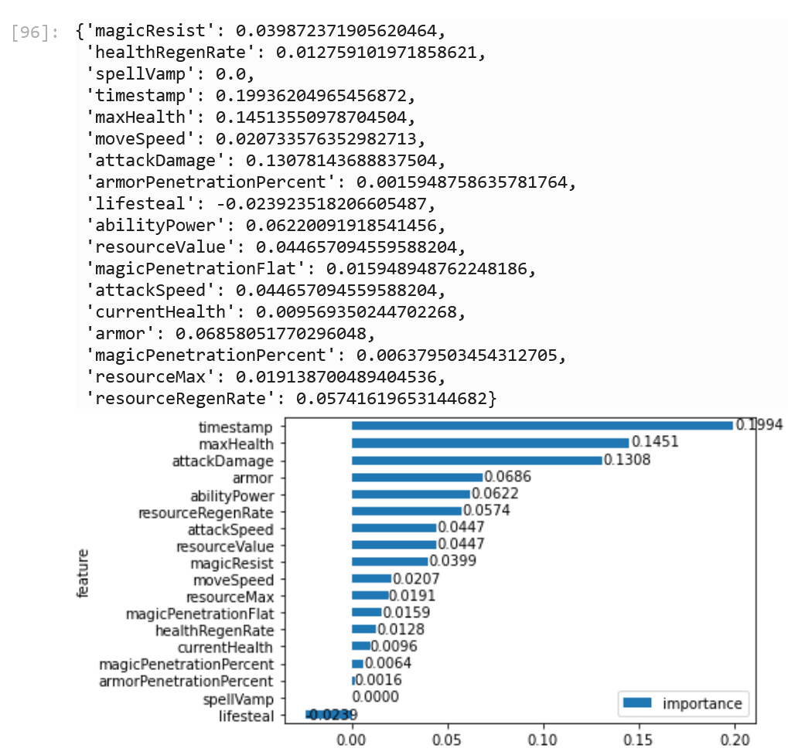

We observe that the model's most important variables are:
- Timestamp, as we had expected
- Maximum health, an indicator that you have an advantage over other enemies if combined properly with other statistics
- Attack damage, as more damage will mean a higher chance of killing enemies

## Conclusions

In this chapter, we have learned how to build a Neural Network from scratch and how to deploy it to make real-time predictions.

Congratulations, you have completed the Workshop! 

A recap of what we've learned:

- &check; How to provision resources in OCI for Data Science purposes
- &check; How to create an architecture for our specific use case
- &check; What Neural Networks are and their most vital components
- &check; How to build and structure the data
- &check; How to load data, preprocess it, visualize the dataset
- &check; How to create a NN
- &check; How to _deploy_ this NN, and make real-time predictions with it from new data

In the next workshop (this is part 2 of a 3-part-series workshop), we'll learn how to use other AutoML tools to extend, visualize and improve the NN (and other models).

Stay tuned...

### How can I get started on OCI?

Remember that you can always sign up for free with OCI! Your Oracle Cloud account provides several Always Free services and a Free Trial with US$300 of free credit to use on all eligible OCI services for up to 30 days. These Always Free services are available for an **unlimited** period. The Free Trial services may be used until your US$300 of free credits are consumed or the 30 days have expired, whichever comes first. You can [sign up here for free](https://signup.cloud.oracle.com/?language=en&sourceType=:ow:de:te::::&intcmp=:ow:de:te::::).

### Join the conversation!

If you’re curious about the goings-on of Oracle Developers in their natural habitat, come [join us on our public Slack channel](https://bit.ly/devrel_slack)! We don’t mind being your fish bowl 🐠

## Acknowledgements

* **Author** - Nacho Martinez, Data Science Advocate @ DevRel
* **Contributors** - Victor Martin, Product Strategy Director
* **Last Updated By/Date** - October 6th, 2022
