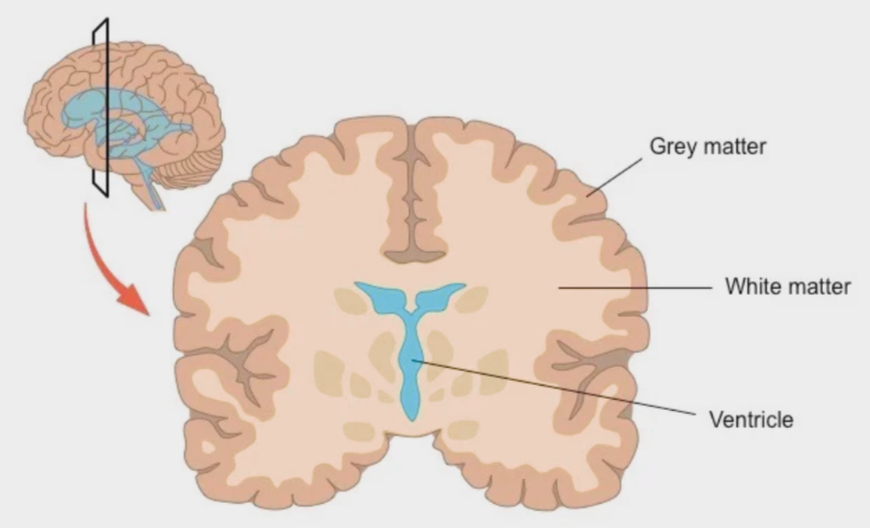
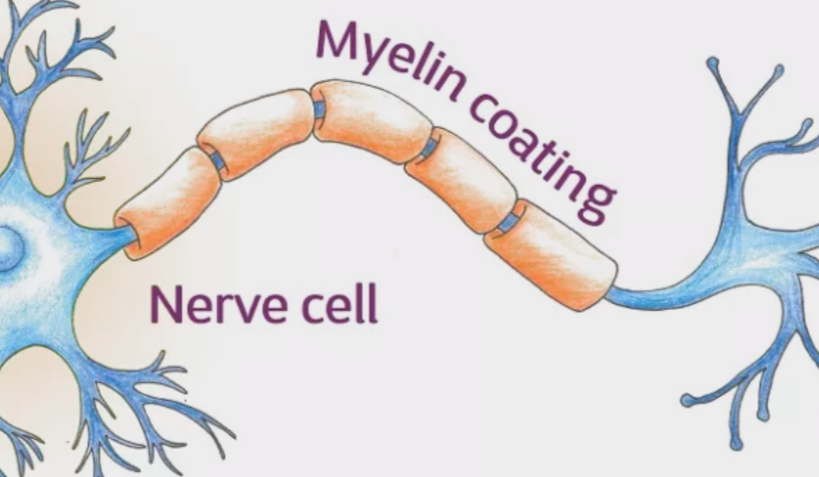
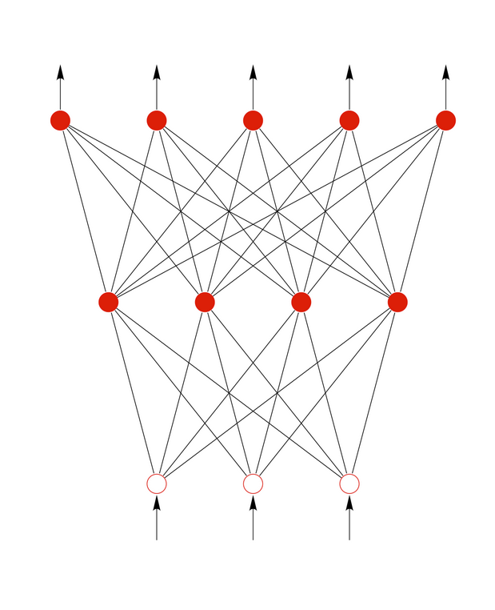
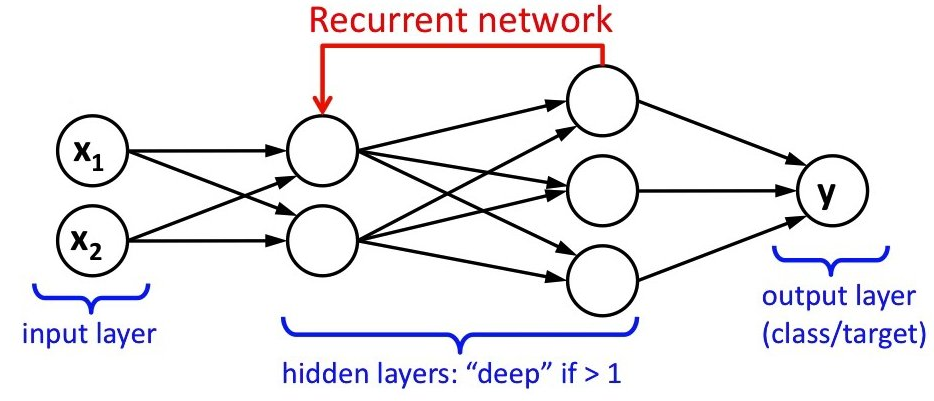
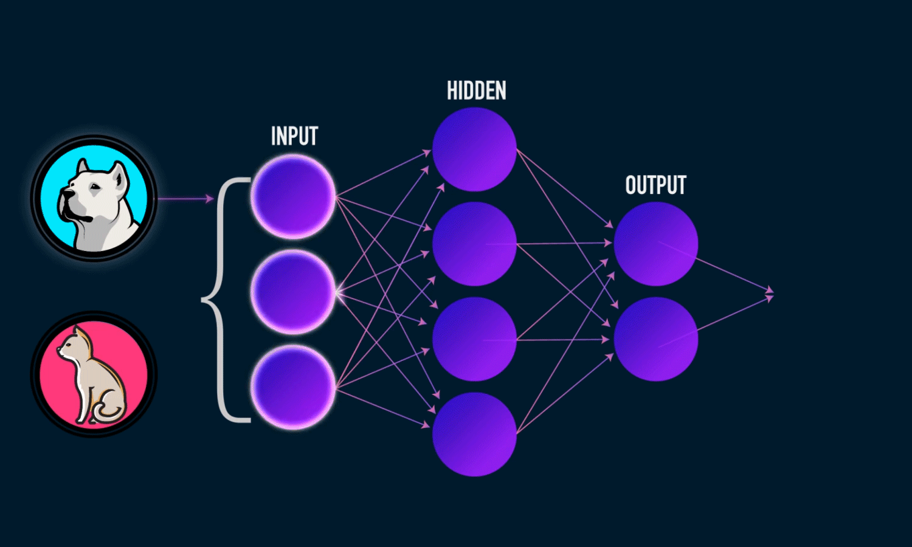
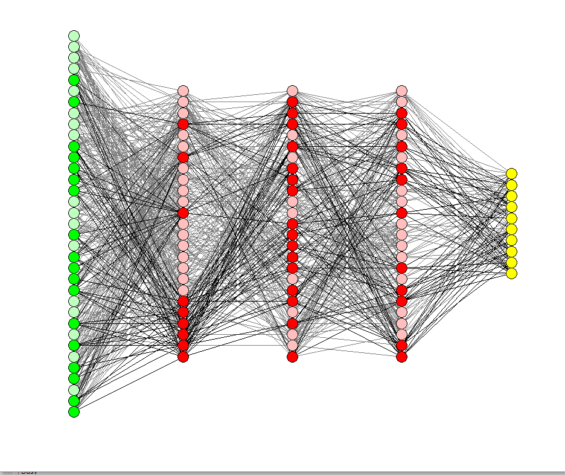
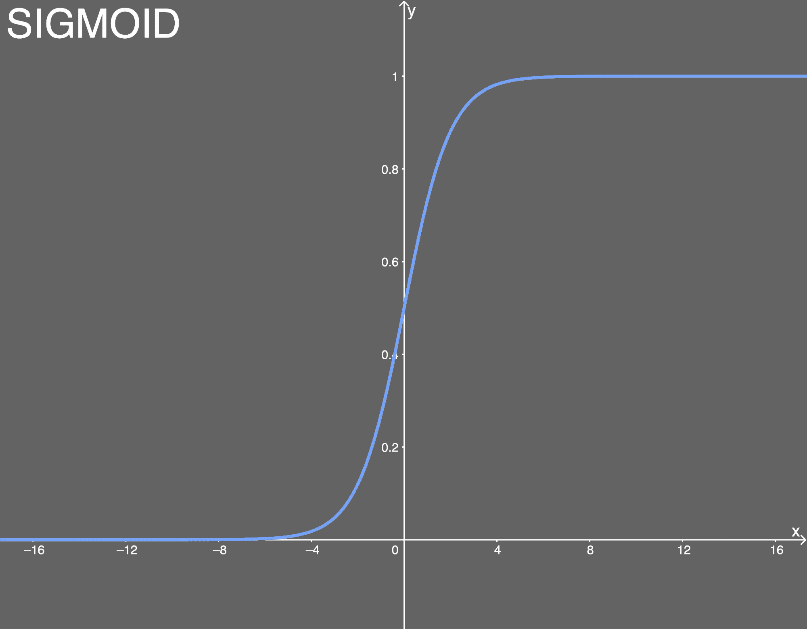
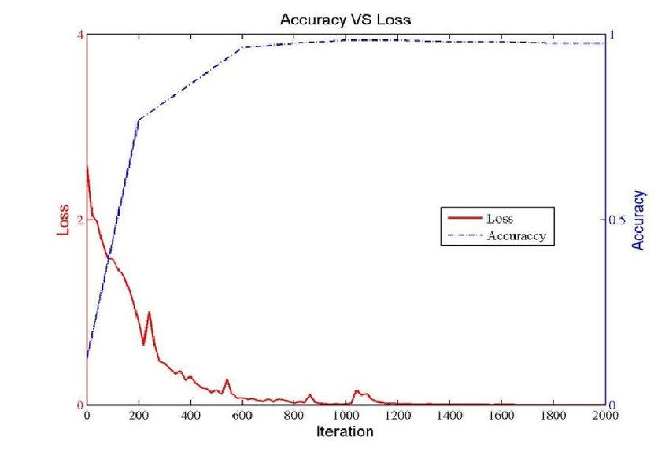

# Lab 2: Understand Neural Networks

## Introduction

In this lab, we're going to take a look at how neural networks work and their characteristics.

Estimated Time: 20 minutes

## Task 0: What are Neurons

Just to explain what's happening in the brain briefly, we just need to need a little vocabulary to go with that.

In short, our brain is composed of two types of matter: grey matter and white matter.

Our brains are made up of neurons. They look grey. And as we grow up, more of those neurons get wrapped in this white stuff, called **myelin**.

With myelin, neurons can talk to each other about **3000 times faster!** (like upgrading to fiber optic internet).

This is a huge renovation that happens in your brain.

- This process begins at the back of the brain before we're even born.
- By the time we're teens it's gone a long way, but it hasn't finished.
- And the part of the brain that's considered to develop last (up until 25 years old) is the very front, whith happens to be the part of the brain that sort of makes us human.

The frontal cortex is a part of your brain that controls rational thought and reasoning

So, when a teenager is confronted with a decision, this rational area is slower at communicating with other parts of their brain.
 So those other parts end up taking the lead. Especially the amygdala.

## Task 1: What is a Neural Network

A neural network is a method in Machine Learning that *simulates* the human brain's way of thinking, and teaches computers how to process data in a way that *looks* human.

A neural network's (NN) implementation works just like a neuron in the human brain:

- We have artificial neurons called perceptrons
- A perceptron, just like a neuron would, connects with other neurons through axons (which in NNs are called **configurations**) to transmit data bilaterally
- Each neuron will transmit information and, as we grow older, neurons will form stronger paths based on personal experiences. The concept of "learning", in Neural Networks, can be called **back propagation**.

In NNs, perceptrons are composed of a series of inputs to produce an output. So we'll always have one input layer and one output layer; it's up to us programmers to decide how these layers communicate and in which order.

There are two types of neural networks:

- *Feedforward* NNs: data moves from an input layer to an output layer, and by the time data reaches the output layer, the NN has completed its job.
- *Recurrent* NNs: data doesn't stop at the output layer. Rather than doing so, it feeds the results of a layer *backwards* into previously-traversed layers over and over, performing a specified number of cycles called *epochs*.

It's important to note that NNs base their calculations (gradients) upon  [the chain rule](https://tutorial.math.lamar.edu/classes/calcI/ChainRule.aspx), which requires a bit of background in advanced mathematics. At the beginning of Machine Learning history, people had to calculate their gradients. Nowadays, most modern libraries like TensorFlow have implemented their own *automatic gradient calculator* that does these calculations for us, which does most of the mathematical work automatically.

> **Note**: this technique is called [automatic differentiation](https://blog.paperspace.com/pytorch-101-understanding-graphs-and-automatic-differentiation/).

Here's an image of a feedforward NN, where we see only forward steps from the inputs (below) towards the outputs (above):

And here's an image of a recurrent NN. Note that if we have more than one hidden layer, we can call the NN a **deep NN**.

## Task 2: Visualize a Neural Network

TensorFlow has created an [open-source playground](https://playground.tensorflow.org/) to allow anybody to try NNs visually.

We'll also take a look at [another open-source tool](https://poloclub.github.io/cnn-explainer/) for visualizing one type of Neural Networks called CNNs or Convolutional Neural Networks

The example that we can see in this Neural Network is very simple and only has one input layer, one hidden layer, and one output layer. 

In cases like text or image analysis, things get a bit more complicated, and usually, several pre-built layers (groups of layers that work very well together) are used to analyze this kind of data (image, text):

> **Note**: the hidden layer in the middle usually has pre-trained blocks of layers that have been proven to work very well for a specific problem, so it's more realistic to find something with many layers, resulting in the Neural Network being very complex:

In this workshop, we're going to work specifically with an open-source library called **fastai** which simplifies the process of creating Neural Networks from scratch.

## Task 3: Neural Networks Characteristics: Hyperparameters

Neural Networks are *customizable* in a way: we can train our NN to have specific behaviors. This is achieved through **hyperparameters**. There are different types of ways to customize a NN:

- *Activation function*: this decides whether a neuron should be activated (work) or not.

    Typically, choosing the right activation function requires some knowledge. For example, there are some activation functions like the hyperbolic tangent or the sigmoid function (see the below figure for the most common modern activation functions) where depending on the problem and dataset, you may suffer from issues like the *vanishing gradients problem*. This means that only *some* activation functions are good for specific problems.

    In this figure, we have a visualization of the most common modern activation functions.

    

    > **Note**: if you're particularly interested in checking out all activation functions (even variants) check out [this website](https://dashee87.github.io/deep%20learning/visualising-activation-functions-in-neural-networks/). Credit goes to [David Sheenan](https://github.com/dashee87)

- *Loss Optimizers*: these are algorithms/functions that control how a Neural Network decides in the end, by changing its attributes (like the weights of each layer, or the speed at which the NN learns).

    In the following figure, we see 5 of the most used optimization functions nowadays:

    

    > **Note**: The loss is the amount of error present in the NN. The smaller this number, the better accuracy the model has. It's the inverse of a NN's precision:

    

- Learning rate: this controls how quickly the model adapts to the problem. The higher the learning rate, the faster the loss will drop, but the model may suffer from inaccurate predictions. The ideal loss isn't too high or too low.

Now that we have a basic understanding of what composes a Neural Network and its characteristics, we'll talk about how this relates to League of Legends (the videogame) and how we can use a Neural Network to help us with decision-making within the game.

You may now [proceed to the next lab](#next).

## Acknowledgements

- **Author** - Nacho Martinez, Data Science Advocate @ DevRel
- **Contributors** - Victor Martin - Product Strategy Director
- **Last Updated By/Date** - May 29th, 2023
