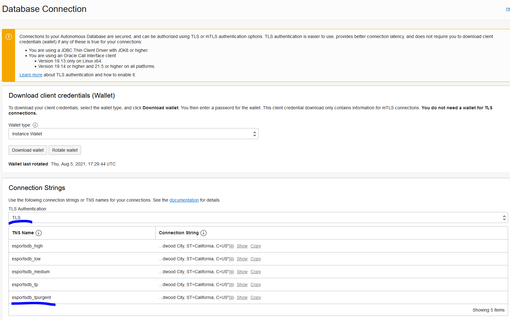
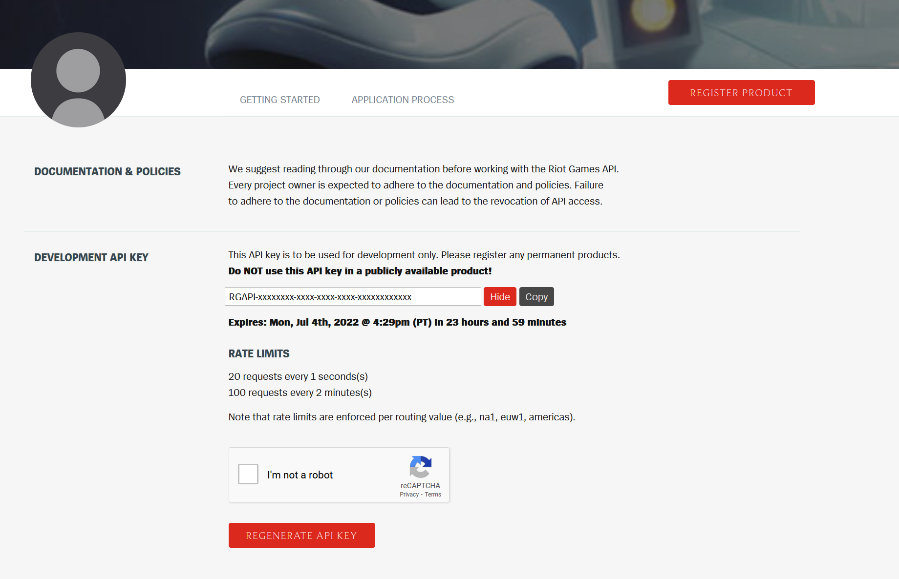
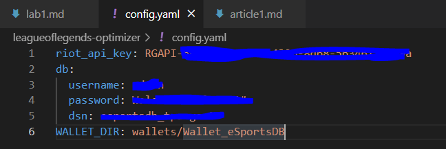

# League of Legends Machine Learning with Oracle - Hands-On Lab

## Introduction

Welcome to this hands-on lab, where we'll talk about how we can leverage the power of AI into League of Legends into a unique an innovative way. We'll do a deep dive into the data that we can extract from the game's API, as well as how to structure this data and how to use it in a Machine Learning model.

TODO IMG

The above image represents the final functionality of [this repository](https://github.com/oracle-devrel/leagueoflegends-optimizer), where we're able to use our already-trained ML model to make real-time predictions about our in-game performances. 

In this Hands-On Lab (HOL), we'll start from the assumption that people know about how League of Legends' matchmaking system works. If you have time and don't know a lot about League of Legends, I recommended reading these lists of articles (included in the repository as well) to get a feel of what we'll talk about in the HOL:
- [Article 1](https://github.com/oracle-devrel/leagueoflegends-optimizer/blob/main/articles/article1.md): League of Legends Optimizer using Oracle Cloud Infrastructure: Data Extraction & Processing
- [Article 2](https://github.com/oracle-devrel/leagueoflegends-optimizer/blob/main/articles/article2.md): League of Legends Optimizer using Oracle Cloud Infrastructure: Data Extraction & Processing II
- [Article 3](https://github.com/oracle-devrel/leagueoflegends-optimizer/blob/main/articles/article3.md): League of Legends Optimizer using Oracle Cloud Infrastructure: Building an Adversarial League of Legends AI Model
- [Article 4](https://github.com/oracle-devrel/leagueoflegends-optimizer/blob/main/articles/article4.md): League of Legends Optimizer using Oracle Cloud Infrastructure: Real-Time predictions
- [Article 5](https://github.com/oracle-devrel/leagueoflegends-optimizer/blob/main/articles/article5.md): League of Legends Optimizer using Oracle Cloud Infrastructure: Real-Time predictions II


## Prerequisites

You'll need an OCI free trial account to develop some of the things we will talk about in this lab (<a href="https://signup.cloud.oracle.com/?sourceType=_ref_coc-asset-opcSignIn&language=en_US" target="_blank" title="Sign up for free trial">click here to sign up</a>).

Registered lab participants should have received $300 in credits to use for Data Science operations.

### SSH Key for Compute Instance

You'll also need an SSH key pair to access the OCI Compute Instance we're going to create. For Mac/Linux systems, you can [use `ssh-keygen`](https://docs.oracle.com/en-us/iaas/Content/Compute/Tasks/managingkeypairs.htm#ariaid-title4). On Windows, you'll [use PuTTY Key Generator](https://docs.oracle.com/en-us/iaas/Content/Compute/Tasks/managingkeypairs.htm#ariaid-title5). 

To summarize Mac/Linux:

    ssh-keygen -t rsa -N "" -b 2048 -C "<key_name>" -f <path/root_name> 

For Windows, and step-by-step instructions for Mac/Linux, please see the [Oracle Docs on Managing Key Pairs](https://docs.oracle.com/en-us/iaas/Content/Compute/Tasks/managingkeypairs.htm#Managing_Key_Pairs_on_Linux_Instances).

### Autonomous Database

We'll also need to create an autonomous database. We'll use it as our storage for our generated datasets and access points as a whole.

To create an autonomous database, [follow the steps in this video](https://www.youtube.com/watch?v=JOcmoXE1zqY).

After creating the autonomous database, you should have access to this panel in OCI:


At the panel, we're going to modify a couple of network settings to allow us to connect using TLS instead of m-TLS (mutual TLS). Long story short, using TLS instead of mTLS will make the task of connecting to the database easier (and additionally, it makes it possible to connect and use the __python-oracledb__ thin client if we want to, instead of only using the Thick client). Note that activating TLS as the authentication mechanism doesn't restrict us from connecting using mTLS still, it just expands our possibilities of connecting
    Note: mTLS will use port 1522 by default and TLS will use port 1521. If you're in a machine with firewall activated, make sure that ingress/egress packets are possible for those ports.

So, we will need to modify the Access Control List (ACL) to allow our own IP address to connect to the database (or whichever IP you want). In my case, I've added the most unrestrictive CIDR block, so that anyone can make a request with the proper username/password/connection string, by adding the CIDR block 0.0.0.0/0 (all IPs):


And finally, disable the parameter that "requires" us to connect through mTLS, and make TLS authentication also possible:


Finally, after the database has finished updating, we can access the "DB Connection" section on top, and get our connection strings:


Note that we want our TLS connection strings (not mTLS connection strings) as they are different.



You can use any of the connection strings available, just note that the __tpurgent__ connection strings supports parallel calls and many more operations per second compared to all other connection strings. It's reserved for urgent operations, but since we're the only ones who are going to use the database, and just for this use case, let's not worry about prioritizing our tasks for now.

So, in my case, an example connection string would be:

```bash
(description= (retry_count=20)(retry_delay=3)(address=(protocol=tcps)(port=1521)(host=XXXXXXXXXXXX))(connect_data=(service_name=XXXXXXXXXXXXXXXX))(security=(ssl_server_dn_match=yes)(ssl_server_cert_dn="CN=XXXXXXXXXXXXX, OU=XXXXX, O=XXXXX XXXXXX, L=Redwood XXXXX, ST=XXXX, C=XXXX")))
```
Let's make note of this as well, as we'll need to add this to our configuration file as well.

### Downloading Instant Client

As we're going to want to connect to our newly created Autonomous Database, we also need to consider the supporting Oracle packages required to support this connection. This is facilitated by Oracle Instant Client, which we'll need to install. 

Depending on the Operating System where you are, you'll need to download your respective binary files from [this link](https://www.oracle.com/database/technologies/instant-client/downloads.html). After installing instant client, we'll need to unzip into a directory (and remember this directory, we'll need to use it as a configuration parameter). 

In the end, your installation should look something like this:


And, in my case, my path to my instant client installation is:

```bash
D:\Programs\instantclient
```
Which is what we'll use in our configuration file soon.

### Downloading Wallet

After setting up the Autonomous Database, we need to download the client credentials (required by design for mTLS connections). 

After downloading it, we'll copy all the contents that we found inside our Instant Client installation folder.

Recalling the directory:

```bash
D:\Programs\instantclient
```

So, in my case, I'd paste the contents of the wallet into:

```bash
D:\Programs\instantclient\network\admin\
```

Finally, I'll modify the contents of **sqlnet.ora** to make sure that the Python thick client can find the files it needs to connect through mTLS. 

By default, the file has these contents:

```bash
WALLET_LOCATION = (SOURCE = (METHOD = file) (METHOD_DATA = (DIRECTORY="?/network/admin")))
SSL_SERVER_DN_MATCH=yes
```

I'll replace this with the specified directory where my wallet has been placed, and leave no place for error:

```bash
WALLET_LOCATION = (SOURCE = (METHOD = file) (METHOD_DATA = (DIRECTORY="D:/Programs/instantclient/network/admin")))
SSL_SERVER_DN_MATCH=yes
```

## Getting Started

1. We'll also need to obtain a Riot Games API key [from the official Riot Games Developer website.](https://developer.riotgames.com/) For that, you need to create a League of Legends account (if you don't have one already) and ask for a development API key. Note that if you're planning to develop a League of Legends project out of this repository, you can also apply for a production API key which has a longer expiration date, as well as more requests per minute.


2. After creating the account, we [access the development website](https://developer.riotgames.com/) and get our development API key. Note that by default, the development API key expires every 24 hours. So, if you're planning to generate a dataset for more than 24 hours at a time, in the end you'll start getting HTTP unauthorized errors. To fix this, just regenerate the API key and use the new one.



3. After having the API key, we need to create a hidden file in the repository called config.yaml. This file shall contain configuration variables like our API key. This is the format that's been configured in the YAML file in order to be properly parsed inside [the main code of this repository](../src/league.py):


This file considers that we're using the latest __python-oracledb__ thin/thick Python client to connect to the Autonomous Database. [Here's the link to the official documentation.](https://python-oracledb.readthedocs.io/en/latest/user_guide/installation.html#quickstart)

4. To check the validity of our YAML file settings, we can run [a sample program](../src/test_newclient.py) against the database, to check whether we can connect to it successfully or not.

```bash
cd src/
python test_newclient.py 
# this will return the current date if you were able to successfully connect to the database.
>>> (datetime.datetime(2022, 6, 1, 21, 11, 40)) # when I executed it.
```

5. After checking that we can successfully connect to the database, it's time to get started with the cool stuff.

## Interacting with leagueoflegends-optimizer

If we want to build an AI/ML model, we need data. For that, Riot Games has provided us with several HTTPs endpoints to make requests and obtain this data. Through the [league.py](../src/league.py) file, we'll be able to make all the kinds of requests we want. This Python file has been programmed to allow input parameters and determine the execution mode. 

At the time of writing, the following execution modes are available:
- player_list: gets the top players from a region and adds them automatically to our database. This includes players above master's elo in League of Legends (really good players), which is the kind of data we want if we're going to build a reliable ML model.
- match_list: from all users already present in the database, extract their last 999 matches (capped at 999 by Riot Games), or get as many as there are, with the IDs from each one of the games.
- match_download_standard: for every ID in the __match__ collection, get some information about them. This yields data useful to make a 1v1 predictor.
- match_download_detail: for every ID in the __match__ collection, get some global information. This yields data useful to make a 5v5 predictor. It inserts the new data into the __match_detail__ collection.
- process_predictor: uses the __match_detail__ collection and processes the data to build a pandas-friendly object. Aims to predict a win(1) or a loss(0)
- process_predictor_liveclient: similar to process_predictor, but it has the same column names as the ones we can find in the LiveClient API (what gives us **real-time data**, which means, what we'll be able to use in the end to make real-time predictions)
- process_regressor: similar to process_predictor, but instead of trying to create a classifier model, it attempts to predict winning probability [0,1].
- process_regressor_liveclient: similar to process_regressor, but with LiveClient API-compatible names.
- Default mode, which basically performs: player_list -> match_list -> match_download_standard -> match_download_detail.

## Extracting Data / Generating Dataset

To extract player data, we can run:

```bash
λ python league.py --mode "player_list"
>>> Connection successful.
>>> Region: br1 | Tier: CHALLENGER | Queue: RANKED_SOLO_5x5 | Total Players: 200
>>> Region: br1 | Tier: GRANDMASTER | Queue: RANKED_SOLO_5x5 | Total Players: 500
>>> Region: br1 | Tier: MASTER | Queue: RANKED_SOLO_5x5 | Total Players: 3733 
```
This execution mode will iteratively look for League of Legends leaderboards in every region in the world, and insert these players' information into our database. If the user has already been inserted, it will prevent re-insertion. 
    Note: if a user changes their in-game name, the next time the code runs, their new name will be updated in the database. (This is achieved by using their PUUID, a very long identifier instead of their in-game name to identify every player).

To extract match data from our pool of players in the database, we can do this:

```bash

```


### Obtaining Player Data

### Obtain Players' Match History Data

